# System Design — Video Meeting App (Microservices)

> Reference architecture document. Everything downstream (folder structure, actual code) maps directly to this design.

---

## Table of Contents

1. [High-Level Architecture](#1-high-level-architecture)
2. [Database-per-Service Ownership](#2-database-per-service-ownership)
3. [Flow 1 — Signup → Login](#3-flow-1--signup--login)
4. [Flow 2 — Create Room &amp; Join](#4-flow-2--create-room--join)
5. [Flow 3 — Call Setup (Core Real-Time Flow)](#5-flow-3--call-setup-core-real-time-flow)
6. [Flow 4 — Group Calls (SFU, Phase 9+)](#6-flow-4--group-calls-sfu-phase-9)
7. [API Contracts (REST)](#7-api-contracts-rest)
8. [Socket.io Event Contracts](#8-socketio-event-contracts)
9. [Data Models](#9-data-models)
10. [Security Boundaries](#10-security-boundaries)
11. [Scaling Points](#11-scaling-points)
12. [Next Steps](#12-next-steps)

---

## 1. High-Level Architecture

Two planes are **always kept separate**:

- **Control plane** — REST + WebSocket signaling. Small JSON messages. Goes through your services.
- **Media plane** — actual audio/video. UDP/SRTP. Goes browser-to-browser or browser-to-SFU **directly** — never touches Mongo, Redis, or business logic.

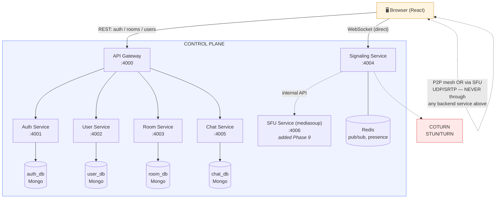

**The one deliberate exception:** the browser connects to the **Signaling Service** directly over WebSocket, bypassing the API Gateway.

---

## 2. Database-per-Service Ownership

Each service owns its data exclusively. No service reaches into another service's database — they always go through that service's API.

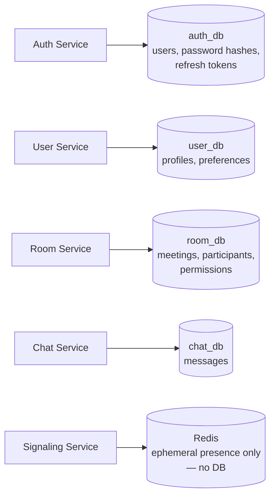

| Service           | Owns DB                                                             | Never accessed by                                   |
| ----------------- | ------------------------------------------------------------------- | --------------------------------------------------- |
| Auth Service      | `auth_db` (users, password hashes, refresh tokens)                | Every other service — they call Auth's API instead |
| User Service      | `user_db` (profiles, preferences)                                 | Auth, Room, Chat                                    |
| Room Service      | `room_db` (meetings, participants, permissions)                   | Others — they call Room's API                      |
| Chat Service      | `chat_db` (messages)                                              | Others                                              |
| Signaling Service | No DB — uses**Redis** for ephemeral room-presence state only | —                                                  |

> Cross-service links are stored as **plain IDs** (e.g. Room Service stores `hostId: "abc123"` as a plain string, not a real Mongo reference — because it points to a document in a *different* database).

---

## 3. Flow 1 — Signup → Login

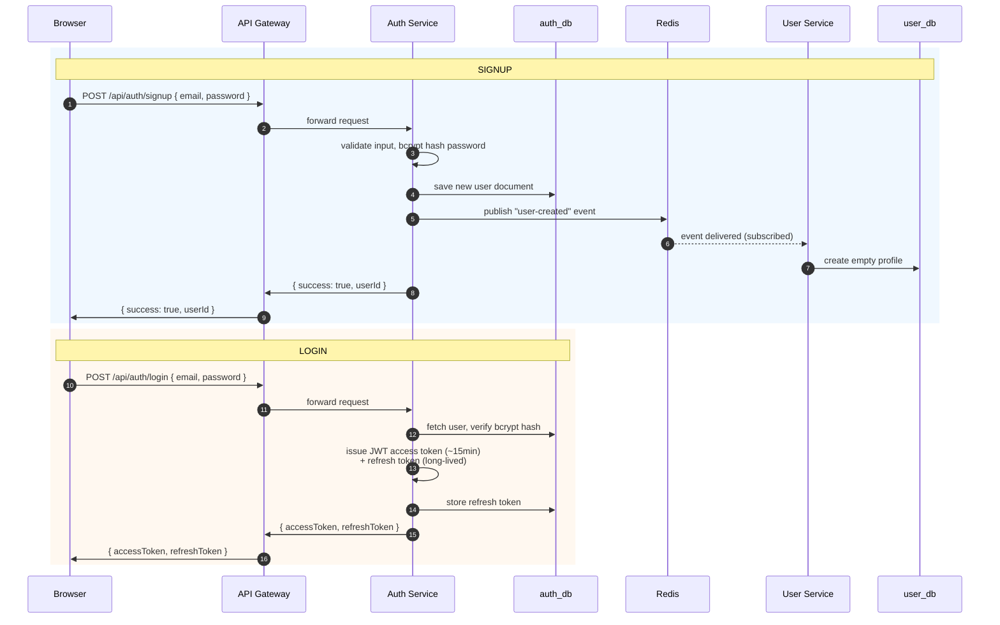

---

## 4. Flow 2 — Create Room & Join

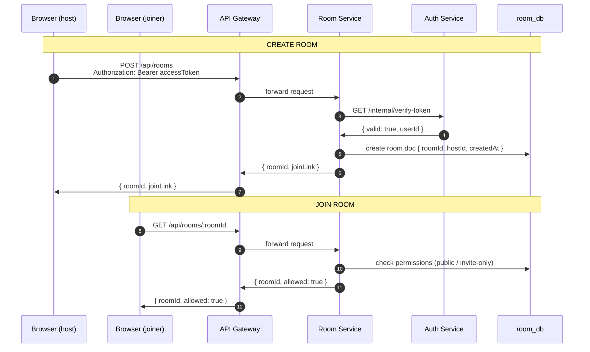

---

## 5. Flow 3 — Call Setup (Core Real-Time Flow)

Both browsers connect **directly** to the Signaling Service via WebSocket — this bypasses the API Gateway entirely (the one deliberate exception noted in §1).

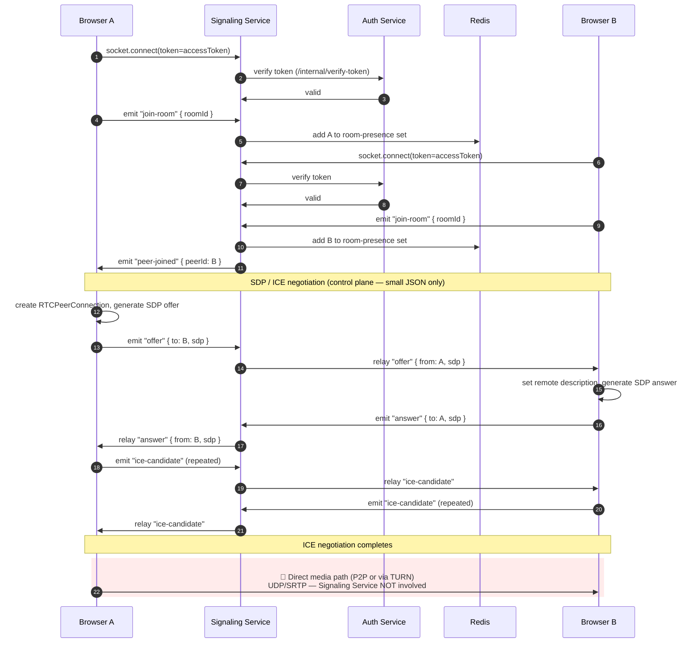

**Key point:** steps 1–11 are small JSON control-plane messages. The final media exchange completely bypasses the backend.

---

## 6. Flow 4 — Group Calls (SFU, Phase 9+)

Instead of a full mesh (Browser A connecting directly to B, C, D), every browser connects to **one SFU** instead.

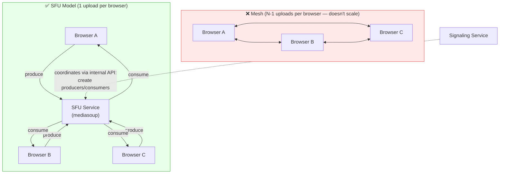

**Sequence:**

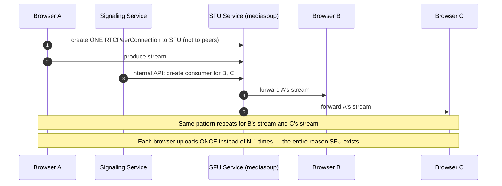

---

## 7. API Contracts (REST)

All requests go through the **API Gateway**, except the one WebSocket exception noted above.

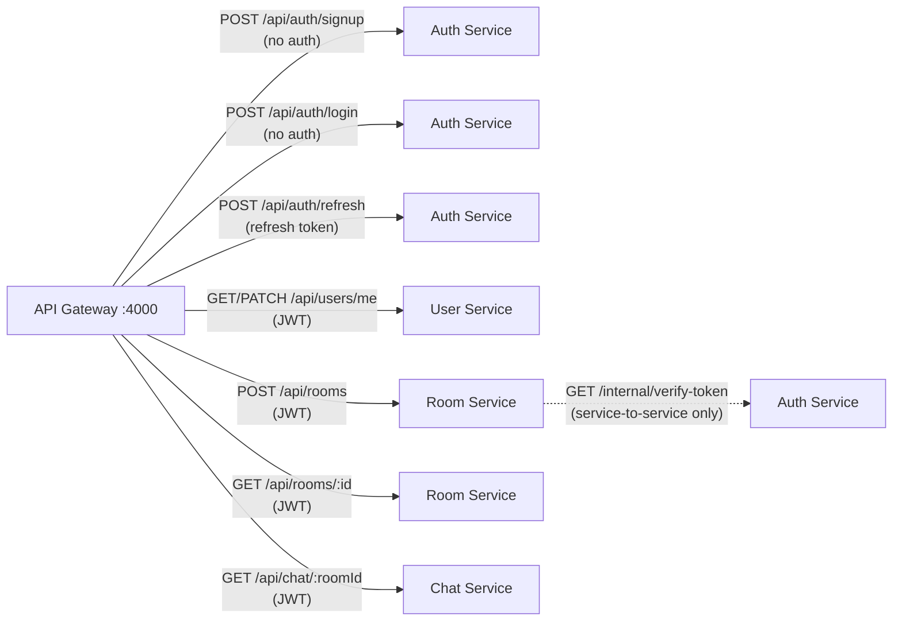

| Method | Endpoint                   | Service | Auth Required                                           |
| ------ | -------------------------- | ------- | ------------------------------------------------------- |
| POST   | `/api/auth/signup`       | Auth    | No                                                      |
| POST   | `/api/auth/login`        | Auth    | No                                                      |
| POST   | `/api/auth/refresh`      | Auth    | Refresh token                                           |
| GET    | `/api/users/me`          | User    | Yes                                                     |
| PATCH  | `/api/users/me`          | User    | Yes                                                     |
| POST   | `/api/rooms`             | Room    | Yes                                                     |
| GET    | `/api/rooms/:id`         | Room    | Yes                                                     |
| GET    | `/api/chat/:roomId`      | Chat    | Yes                                                     |
| GET    | `/internal/verify-token` | Auth    | Service-to-service (internal only, not gateway-exposed) |

> **Internal-only endpoints** like `/internal/verify-token` are not reachable from the public gateway — restricted via Docker network isolation (services on an internal Docker network; only the gateway is exposed publicly).

---

## 8. Socket.io Event Contracts

Signaling Service handles these events over the direct WebSocket connection:

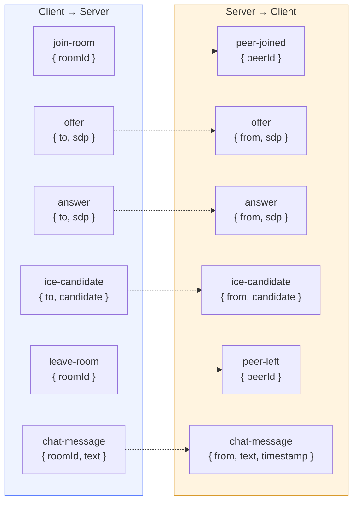

| Event (client → server) | Payload               | Event (server → client) | Payload                       |
| ------------------------ | --------------------- | ------------------------ | ----------------------------- |
| `join-room`            | `{ roomId }`        | `peer-joined`          | `{ peerId }`                |
| `offer`                | `{ to, sdp }`       | `offer`                | `{ from, sdp }`             |
| `answer`               | `{ to, sdp }`       | `answer`               | `{ from, sdp }`             |
| `ice-candidate`        | `{ to, candidate }` | `ice-candidate`        | `{ from, candidate }`       |
| `leave-room`           | `{ roomId }`        | `peer-left`            | `{ peerId }`                |
| `chat-message`         | `{ roomId, text }`  | `chat-message`         | `{ from, text, timestamp }` |

---

## 9. Data Models

Entity-relationship view across services. Note the **dashed lines** — these are *not* real foreign keys, just plain string IDs referencing documents in a different database.

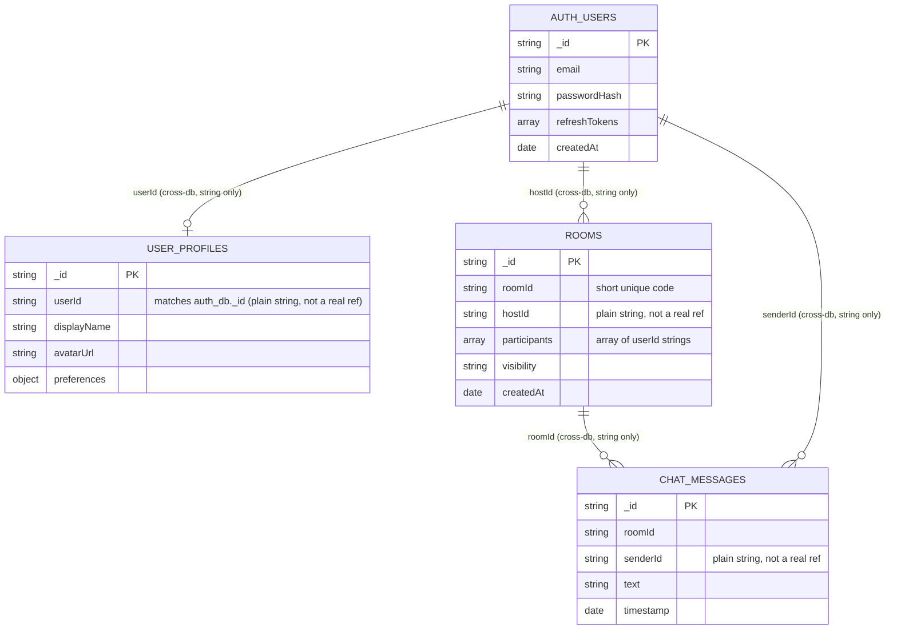

**Redis keys (Signaling Service — no persistent DB):**

```
room:{roomId}:members   → Set of socketIds/userIds currently in the room
token:blacklist:{token} → for logout/revoked token checks
```

---

## 10. Security Boundaries

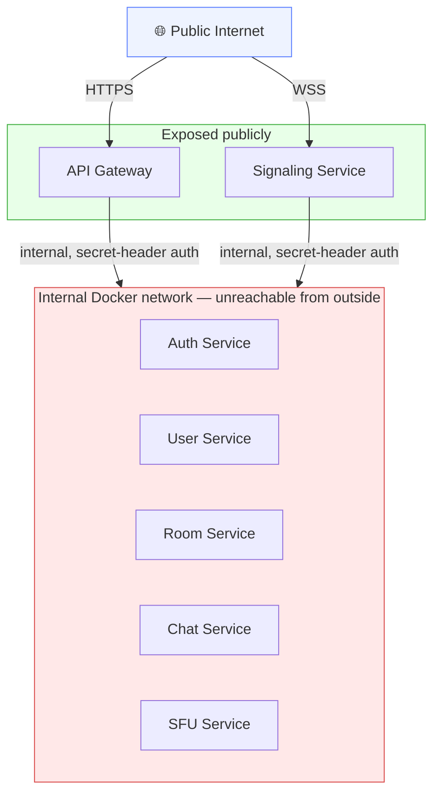

- Only **API Gateway** and **Signaling Service** are exposed to the public internet; every other service sits on an internal Docker network, unreachable directly.
- `/internal/*` routes require a shared **internal service-secret header**, not user JWTs.
- **TURN credentials** are short-lived (HMAC-signed, expire in minutes) — issued by Auth Service, never static.
- **Rate limiting** at the Gateway (per-IP and per-user) to prevent signup/login abuse.
- All service-to-service and client-to-service traffic runs over **HTTPS/WSS**, even internally in production.

---

## 11. Scaling Points

Where bottlenecks will actually appear, and how each component scales:

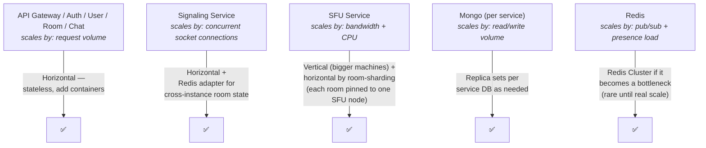

| Component                               | Scales by                       | How                                                                                         |
| --------------------------------------- | ------------------------------- | ------------------------------------------------------------------------------------------- |
| API Gateway / Auth / User / Room / Chat | Request volume                  | Horizontal — stateless, add more containers                                                |
| Signaling Service                       | Concurrent socket connections   | Horizontal + Redis adapter for cross-instance room state                                    |
| SFU Service                             | Bandwidth + CPU (media routing) | Vertical (bigger machines) + horizontal by room-sharding (each room pinned to one SFU node) |
| Mongo (per service)                     | Read/write volume               | Replica sets per service DB as needed                                                       |
| Redis                                   | Pub/sub + presence load         | Redis Cluster if it becomes a bottleneck (rare until real scale)                            |

---

## 12. Next Steps

This is the reference design — everything downstream (folder structure, actual code) maps directly to this blueprint.

**Ready to start Phase 0 + Phase 1** (skeleton + API Gateway) in actual code, using this design as the reference.
