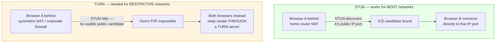
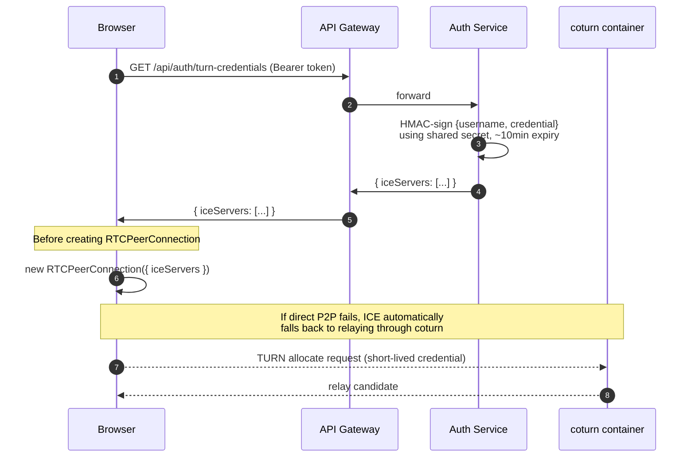


# Phase 7 — TURN/STUN (NAT Traversal) — Detailed Build Plan

> **Where you are:** Signaling Service (Phase 5) is fully verified — real SDP offer/answer/ICE relay confirmed working end-to-end on localhost, `RTCPeerConnection state → connected`, video/audio both flowing.
>
> **Branch:** `phase-7-turn-stun`
>
> **Why this phase exists:** everything proven so far works because both browser tabs are on the **same machine, same network** — ICE candidates found each other directly with zero obstacles. The moment two real users are on different WiFi networks, behind mobile carrier NAT, or behind a restrictive corporate firewall, direct P2P connection **fails silently** unless a TURN server is available as a fallback relay. This phase is what makes the app work for actual users, not just your own two browser tabs.

---

## Table of Contents

- [1. The Concept — Why STUN Isn&#39;t Always Enough](#1-the-concept--why-stun-isnt-always-enough)
- [2. What You&#39;re Actually Building](#2-what-youre-actually-building)
- [3. Step 1 — Branch](#3-step-1--branch)
- [4. Step 2 — Add coturn to docker-compose.yml](#4-step-2--add-coturn-to-docker-composeyml)
- [5. Step 3 — coturn Config File](#5-step-3--coturn-config-file)
- [6. Step 4 — Where TURN Credentials Get Issued](#6-step-4--where-turn-credentials-get-issued)
- [7. Step 5 — turnController.ts](#7-step-5--turncontrollerts)
- [8. Step 6 — Wire the Route](#8-step-6--wire-the-route)
- [9. Step 7 — Frontend: Fetch Credentials, Pass to RTCPeerConnection](#9-step-7--frontend-fetch-credentials-pass-to-rtcpeerconnection)
- [10. Step 8 — Testing Plan](#10-step-8--testing-plan)
- [11. Status Checklist](#11-status-checklist)

---

## 1. The Concept — Why STUN Isn't Always Enough

**Why:** understanding the failure mode is what makes the fix make sense, rather than just copy-pasting a coturn config.



- **STUN** (already implicitly available via public servers like Google's) just tells a browser *"here's your public IP and port, as seen from outside your network."* Works when NAT behavior is simple/predictable — most home networks.
- **TURN** is a fallback: when direct connection genuinely can't be established (symmetric NAT, strict corporate firewalls, some mobile carrier networks), **both browsers send their media to the TURN server, which relays it between them.** Slower and costs bandwidth on your server, but it's the only thing that works in these cases — real production video-call apps (Meet, Zoom) all fall back to TURN relay for a meaningful percentage of real-world calls.

**coturn** is the open-source STUN+TURN server you're adding as its own container — it does both jobs.

---

## 2. What You're Actually Building



**Four pieces, in order:**

1. `coturn` running as a container (the actual TURN server)
2. Auth Service gets a new endpoint that generates **short-lived, HMAC-signed** credentials (never static/hardcoded — a leaked static credential would let anyone use your relay bandwidth indefinitely)
3. Gateway proxies that endpoint like everything else
4. Frontend fetches those credentials **before** creating each `RTCPeerConnection`, passes them as `iceServers`

---

## 3. Step 1 — Branch

**Why:** same convention as every phase so far — isolate this work until it's tested.

**How:**

```powershell
cd C:\Users\swaru\OneDrive\Desktop\PROJECT\GOOGLE_MEET
git checkout main
git checkout -b phase-7-turn-stun
```

**Note:** this phase touches **two existing services** (`auth-service` for the credential endpoint, `api-gateway` for the proxy route) plus the root `docker-compose.yml` — it's not a new standalone service like Phase 3/4/5 were, so there's no new `services/` folder to create.

---

## 4. Step 2 — Add coturn to `docker-compose.yml`

**Why:** coturn needs a wide UDP port range (for actual relayed media, not just signaling) — this is different from every other service so far, which only needed one TCP port.

**How:** add this block to the root `docker-compose.yml`.

**Code:**

```yaml
coturn:
  image: coturn/coturn:latest
  container_name: coturn
  restart: unless-stopped
  network_mode: host
  volumes:
    - ./infra/coturn/turnserver.conf:/etc/coturn/turnserver.conf
```

**Why `network_mode: host` instead of the usual port mapping:** coturn needs a large range of UDP ports (typically 49152–65535, the standard ephemeral port range) for actual relayed media streams. Mapping thousands of individual ports through Docker's normal port-publishing (`ports: - "49152-65535:49152-65535/udp"`) is technically possible but adds real overhead and complexity per-port. `network_mode: host` gives the container direct access to the host's network stack — the standard, documented approach for running coturn in Docker, and specifically what the official coturn image's own documentation recommends.

**Trade-off worth knowing:** `network_mode: host` only works cleanly on Linux hosts (including inside Docker Desktop's Linux VM on Windows/Mac, so local development is fine) — it becomes a real consideration later at Phase 15 (Kubernetes), where it doesn't map cleanly and coturn typically becomes its own dedicated node with a stable public IP instead.

---

## 5. Step 3 — coturn Config File

**Why:** coturn needs to know its own public-facing identity (`realm`) and the shared secret it'll use to validate the HMAC-signed credentials Auth Service generates — these two systems (coturn and Auth Service) never talk to each other directly; they just both know the same secret.

**How:** create the file at `infra/coturn/turnserver.conf` (new folder at the repo root, alongside `docker-compose.yml`).

**Code:**

```conf
listening-port=3478
fingerprint
lt-cred-mech
use-auth-secret
static-auth-secret=REPLACE_WITH_A_LONG_RANDOM_SECRET
realm=videomeet.local
total-quota=100
stale-nonce=600
no-multicast-peers
```

**Key lines explained:**

- `use-auth-secret` + `static-auth-secret` — this is what enables the HMAC scheme: coturn doesn't store a list of usernames/passwords, it validates any `username:credential` pair that's correctly HMAC-signed with this shared secret. This is exactly why Auth Service can generate valid, time-limited credentials on the fly without ever registering them with coturn ahead of time.
- `realm` — a namespace identifier, included in the HMAC signing on both sides — must match between this config and what Auth Service uses when signing.
- `stale-nonce=600` — rejects authentication attempts using a nonce older than 10 minutes, an additional replay-protection layer.

**The `REPLACE_WITH_A_LONG_RANDOM_SECRET` value must be the exact same value Auth Service uses** — this is the shared-secret pattern you've already used for `JWT_ACCESS_SECRET` across services, applied here to a different purpose.

---

## 6. Step 4 — Where TURN Credentials Get Issued

**Why here, specifically:** the plan calls for this in Auth Service, not a new service — TURN credentials are fundamentally an **authorization decision** ("is this logged-in user allowed to use our relay bandwidth"), which is exactly the kind of decision Auth Service already makes for everything else. No new service needed for one small, related endpoint.

**How:** add a new controller + route inside the existing `auth-service`, protected by the same `authGuard` already in place.

**New env var needed** — add to `auth-service/.env`, `.env.docker`, and `.env.example`:

```
TURN_SECRET=REPLACE_WITH_THE_SAME_LONG_RANDOM_SECRET_AS_COTURN_CONFIG
TURN_REALM=videomeet.local
```

---

## 7. Step 5 — `turnController.ts`

**Why the specific algorithm:** this is the standard coturn REST API credential scheme (documented by coturn itself) — a `username` that's just an expiry timestamp, and a `credential` that's an HMAC-SHA1 of that username, base64-encoded. coturn independently recomputes this same HMAC when a client tries to authenticate — if they match, and the timestamp hasn't passed, access is granted.

**How:** create `auth-service/src/controllers/turnController.ts`.

**Code:**

```typescript
import { Request, Response, NextFunction } from 'express';
import crypto from 'crypto';
import { TURN_SECRET, TURN_REALM } from '../config/env.js';
import { successResponse } from '../utils/response.js';

/**
 * Generates short-lived TURN credentials (coturn's REST API auth scheme).
 * username = expiry timestamp; credential = HMAC-SHA1(username, sharedSecret).
 * coturn independently recomputes this to validate — no credential is
 * ever stored or registered ahead of time.
 */
export const getTurnCredentials = (req: Request, res: Response, next: NextFunction) => {
  try {
    const ttlSeconds = 600; // 10 minutes
    const expiry = Math.floor(Date.now() / 1000) + ttlSeconds;
    const username = `${expiry}:${req.userId}`;

    const hmac = crypto.createHmac('sha1', TURN_SECRET);
    hmac.update(username);
    const credential = hmac.digest('base64');

    successResponse(res, {
      iceServers: [
        { urls: 'stun:localhost:3478' },
        {
          urls: 'turn:localhost:3478',
          username,
          credential,
        },
      ],
    });
  } catch (err) {
    next(err);
  }
};
```

**Why `username` includes `req.userId`:** this is optional per the coturn spec (the timestamp alone is enough for expiry), but including the user ID means coturn's own logs can be traced back to a specific user later if you ever need to debug relay abuse — a small but genuinely useful addition, not required for the mechanism to work.

**Note on `localhost` in the URLs:** for local testing this is correct. For a deployed environment, this becomes your server's real public IP or domain — flag this as a config value to revisit, not something to hardcode differently right now.

---

## 8. Step 6 — Wire the Route

**Why protected by `authGuard`:** anyone with a valid login token can request credentials for themselves — but no one should be able to mint TURN credentials without being authenticated, or your relay becomes free bandwidth for the entire internet.

**How:** add to `auth-service/src/routes/authRoutes.ts`.

**Code:**

```typescript
import { getTurnCredentials } from '../controllers/turnController.js';

router.get('/turn-credentials', authGuard, getTurnCredentials);
```

**Then in the Gateway** — this route needs to reach the client, so confirm it's covered by the existing protected-auth proxy block from the Gateway auth work (Section 5 of the earlier Gateway auth file) — add `/auth/turn-credentials` to that `pathFilter` array alongside `/auth/logout` and `/auth/me`.

---

## 9. Step 7 — Frontend: Fetch Credentials, Pass to `RTCPeerConnection`

**Why this has to happen *before* `RTCPeerConnection` is created, every single time:** `iceServers` is a constructor option, not something you can attach afterward — and since credentials expire after 10 minutes, this fetch needs to happen fresh for each new call, not cached indefinitely.

**How (Next.js, client component):**

**Code:**

```typescript
async function getIceServers(accessToken: string) {
  const res = await fetch('http://localhost:4000/api/auth/turn-credentials', {
    headers: { Authorization: `Bearer ${accessToken}` },
  });
  const { data } = await res.json();
  return data.iceServers;
}

// Right before creating the connection, in your useWebRTC hook:
const iceServers = await getIceServers(accessToken);
const pc = new RTCPeerConnection({ iceServers });
```

**No change needed anywhere else in the WebRTC flow** — everything you already proved working in Phase 5/6 (offer/answer/ICE relay through Signaling Service) stays identical. `iceServers` only affects *how* ICE candidate gathering happens internally in the browser; the signaling exchange around it is untouched.

---

## 10. Step 8 — Testing Plan

| # | Test                               | How                                                                                               | Expected                                                                                                                                              |
| - | ---------------------------------- | ------------------------------------------------------------------------------------------------- | ----------------------------------------------------------------------------------------------------------------------------------------------------- |
| 1 | coturn container starts            | `docker compose up -d coturn` → `docker logs coturn`                                         | No fatal errors, listening on port 3478                                                                                                               |
| 2 | Credential endpoint works          | `GET /api/auth/turn-credentials` with a real token                                              | `200` with `iceServers` array containing both a `stun:` and `turn:` entry                                                                     |
| 3 | No token → rejected               | Same request, no`Authorization` header                                                          | `401`                                                                                                                                               |
| 4 | Same-network call still works      | Two browser tabs, same machine, same test as Phase 5/6                                            | Still connects — confirms adding TURN didn't break the existing STUN/direct path                                                                     |
| 5 | Forced-relay test (the real proof) | Chrome flag`chrome://webrtc-internals` during a call — inspect the selected ICE candidate pair | On localhost this will likely still show a direct/host candidate — genuine cross-network testing (test 6) is what actually proves TURN relay is used |
| 6 | Real cross-network test            | One device on home WiFi, one on mobile data (WiFi off)                                            | Call still connects — this is the actual Phase 7 deliverable per the original plan                                                                   |

**Why test 6 is the one that matters most:** localhost testing (tests 1–5) proves the *plumbing* is correct (credentials generate, coturn runs, nothing broke) — but it cannot prove TURN relay actually works, because on localhost, direct connection never fails in the first place, so ICE never needs the TURN fallback. Test 6 is the only test that puts the browser in a situation where STUN alone would fail.

---

## 11. Status Checklist

```
1. Branch: phase-7-turn-stun            [░░░░░░░░░░]  0%
2. coturn added to docker-compose.yml   [░░░░░░░░░░]  0%
3. infra/coturn/turnserver.conf         [░░░░░░░░░░]  0%
4. TURN_SECRET / TURN_REALM env vars    [░░░░░░░░░░]  0%
5. turnController.ts                    [░░░░░░░░░░]  0%
6. Route wired + Gateway pathFilter     [░░░░░░░░░░]  0%
7. Frontend fetches iceServers          [░░░░░░░░░░]  0%
8. Test 1–4 (local plumbing)            [░░░░░░░░░░]  0%
9. Test 6 (real cross-network)          [░░░░░░░░░░]  0%
```

**Immediate next action:** Step 2 — add the `coturn` block to `docker-compose.yml`, then Step 3's config file, before touching any application code.
