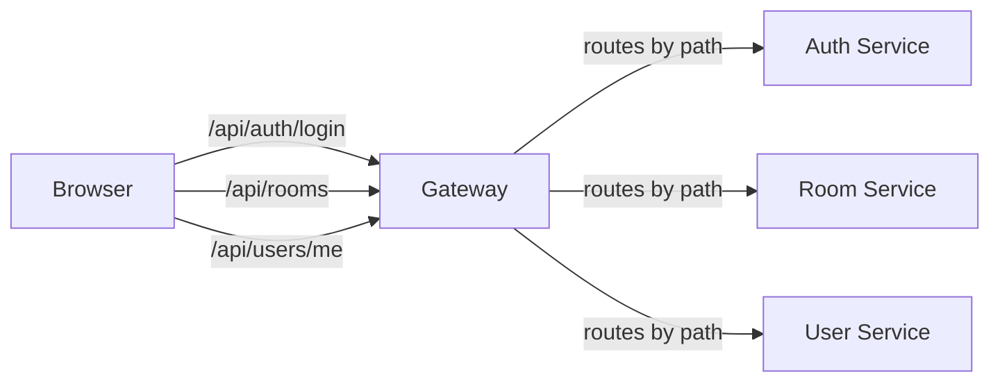
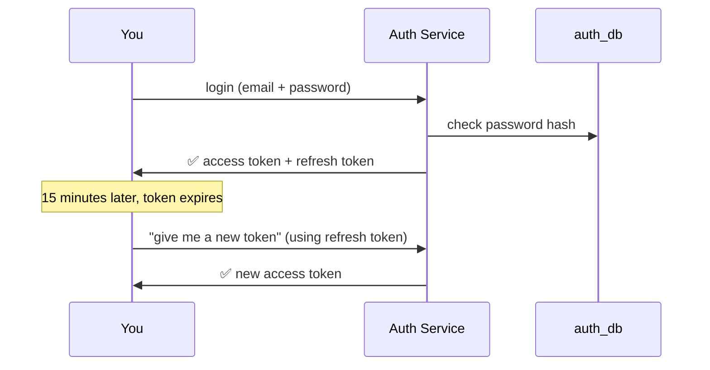
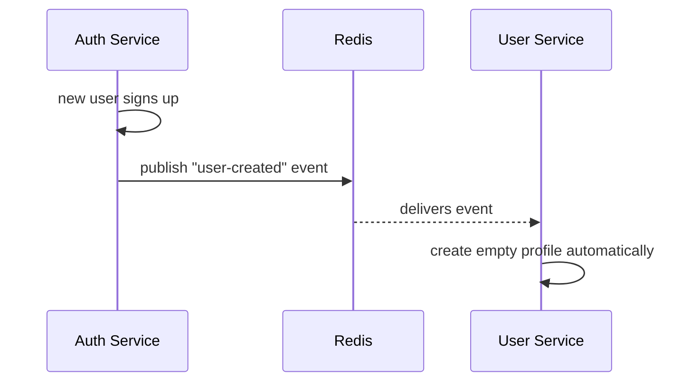
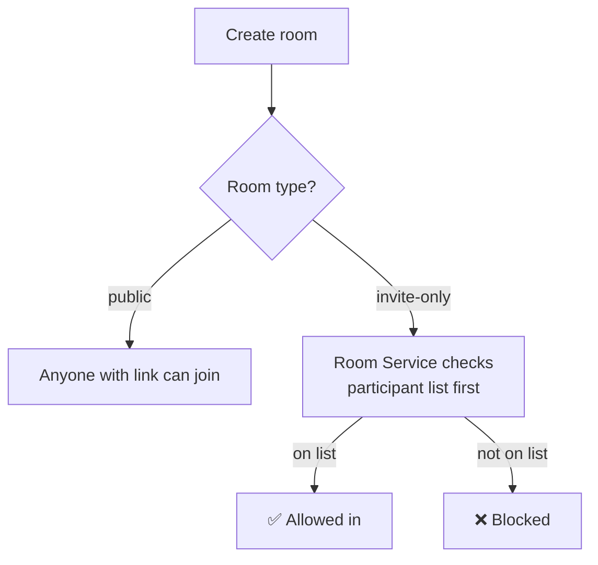
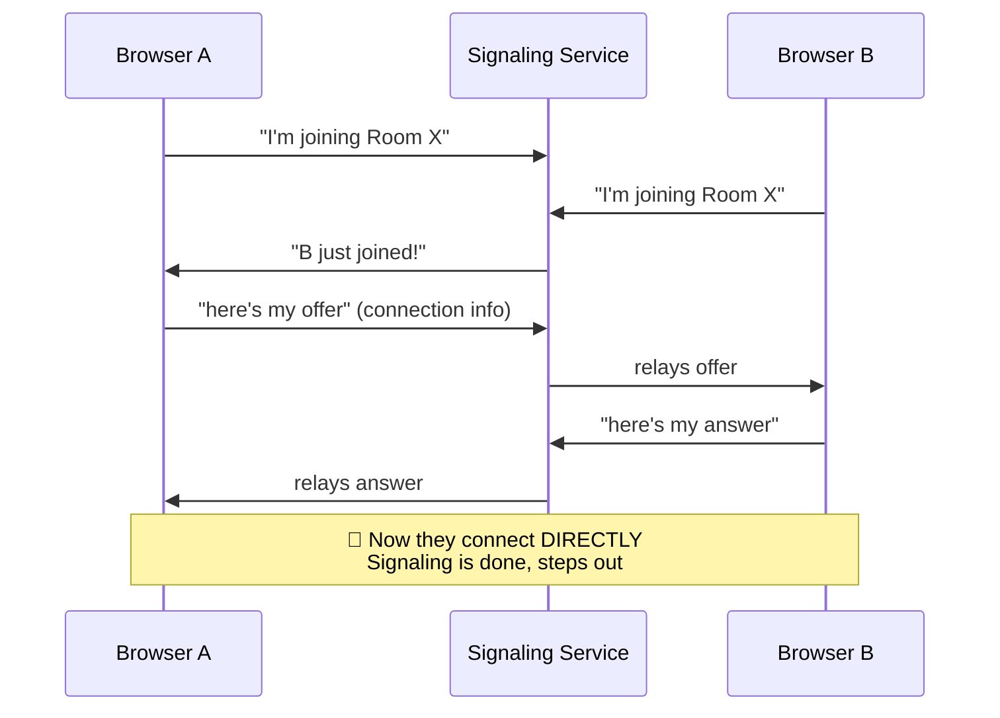
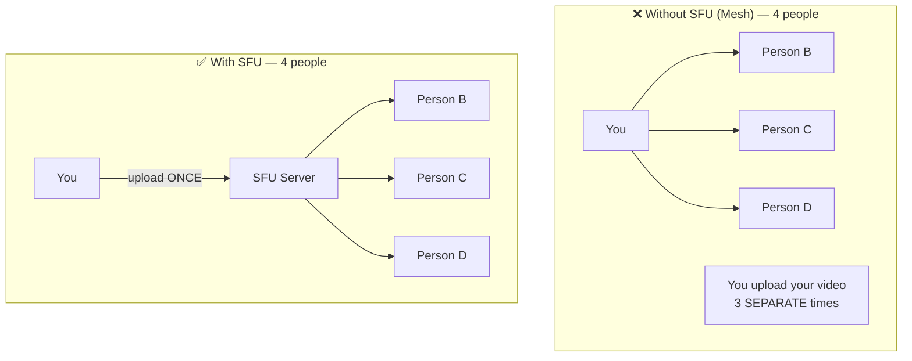
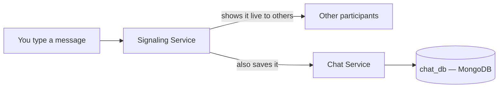
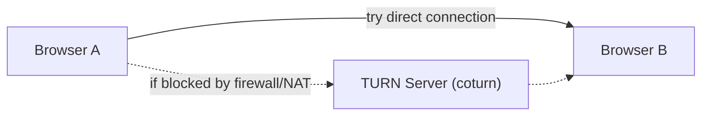
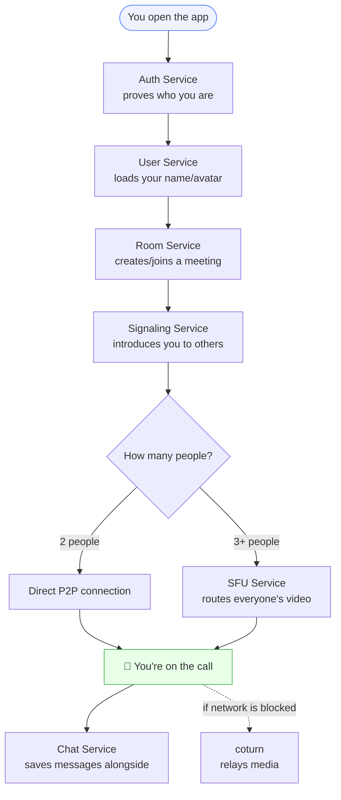

# Beginner FAQ — Video Meet App Services Explained

> Common questions a beginner would naturally ask about each service, answered simply, with diagrams. Read this before touching any code.

---

## Table of Contents

1. [API Gateway](#1-api-gateway)
2. [Auth Service](#2-auth-service)
3. [User Service](#3-user-service)
4. [Room Service](#4-room-service)
5. [Signaling Service](#5-signaling-service)
6. [SFU Service (mediasoup)](#6-sfu-service-mediasoup)
7. [Chat Service](#7-chat-service)
8. [Redis](#8-redis)
9. [PostgreSQL vs MongoDB](#9-postgresql-vs-mongodb)
10. [coturn (STUN/TURN)](#10-coturn-stunturn)
11. [How It All Connects](#11-how-it-all-connects)

---

## 1. API Gateway

**Q: Why can't the browser just talk to each service directly?**
It could — but then the browser needs to know 6 different addresses (auth:4001, rooms:4003, etc.), and if you move a service to a new server, every client breaks. The Gateway is one fixed address that quietly redirects traffic behind the scenes.

**Q: Is the Gateway itself a "smart" service?**
No — mostly it's a traffic director (proxy). It doesn't know what a "user" or "room" is; it just reads the URL path and forwards the request.

**Q: What happens if the Gateway goes down?**
Nothing works — it's the single front door. This is why later phases add things like health checks and eventually multiple Gateway instances behind a load balancer.

---

## 2. Auth Service

**Q: Why can't every service just check passwords itself?**
Then you'd have password-checking logic copy-pasted 6 times, and 6 places that could each have a security bug. One service, one place to get it right.

**Q: What's the difference between the access token and refresh token?**

- **Access token** — short-lived (~15 min), used on every request, proves "I'm logged in right now."
- **Refresh token** — long-lived, used only to get a *new* access token when the old one expires, so you don't get logged out every 15 minutes.

**Q: Why hash the password with bcrypt instead of just storing it?**
If your database ever leaks, plain passwords = every user's account compromised everywhere (people reuse passwords). A bcrypt hash can't be reversed back into the original password.

**Q: How does Room Service know I'm logged in if it has no login data of its own?**
It asks Auth Service directly: "is this token valid?" Auth replies yes/no + your user ID. Room never sees your password.

---

## 3. User Service

**Q: Isn't a "profile" basically the same as "auth"? Why 2 services?**
Auth = security data (password, tokens) — rarely touched, high-risk if leaked.
User = display data (name, avatar) — touched constantly, low-risk if leaked.
Splitting them means a bug in "update my avatar" can never accidentally expose passwords.

**Q: How does my profile get created automatically when I sign up?**
Auth Service doesn't create it directly — it shouts "a user was just created!" (an event), and User Service, which is listening, creates a blank profile in response. This is called an **event**, and it's how services talk without being tightly wired together.

**Q: What if User Service is down when I sign up — do I lose my profile forever?**
In this simple setup, yes, that event would be missed (this is a known limitation of basic pub/sub — more advanced systems use a queue that retries). Good thing to know as a "later improvement," not a day-1 blocker.

---

## 4. Room Service

**Q: What actually IS a "room" in the database — is it the video itself?**
No — a room is just a *record*: an ID, who's the host, who's allowed in, when it was created. The actual video never touches this service at all.

**Q: Why does Room Service need to "call" Auth Service instead of just trusting the request?**
Because anyone could fake a request claiming "I'm user123." Room Service asks Auth to confirm the token is real and untampered, every time.

**Q: What's the difference between "public" and "invite-only" rooms in practice?**
Public = anyone with the link can join. Invite-only = Room Service checks a participant list before letting someone in. Same service, just different logic branch.

---

## 5. Signaling Service

**This is the one that feels most "new" — so more questions here on purpose.**

**Q: What does "signaling" even mean in plain English?**
It's the introduction step before a call. Like two people exchanging phone numbers before actually calling each other. Signaling doesn't carry your video — it just helps two browsers agree "here's how to reach each other directly."

**Q: If Signaling doesn't carry video, what does it carry?**
Small text messages: "I want to join Room X," "here's my connection info (SDP offer)," "here's my network address (ICE candidate)." All just JSON, not media.

**Q: Why WebSocket instead of normal REST API calls?**
REST = you ask, server answers, connection closes. Signaling needs an **open, ongoing connection** so the server can push messages to you instantly ("hey, someone just joined!") without you having to keep asking "anyone new yet? anyone new yet?"

**Q: Why does Signaling bypass the API Gateway?**
WebSocket connections behave differently from normal HTTP requests, and routing them through a proxy adds complexity for little benefit. It's a well-known, accepted exception even in real production systems.

**Q: What's an "offer" and "answer" — sounds like a negotiation?**
It kind of is! Browser A says "here's what video/audio formats I support, here's how to reach me" (offer). Browser B replies "okay, here's what I support back" (answer). Once they agree, they connect directly.

**Q: After the offer/answer, does Signaling still do anything?**
No — once both sides have exchanged enough info to connect directly, Signaling steps out. The actual video from that point never touches your backend again.

---

## 6. SFU Service (mediasoup)

**Q: If two people can already connect directly (Signaling), why do I need this at all?**
Direct connection (mesh) works fine for 2 people. For 5 people, EACH person would need to send their video 4 separate times (once per other person) — your upload speed can't handle that. SFU means you upload ONCE, and the server copies it out to everyone else.

**Q: Does the SFU "watch" or "process" my video content?**
No — it just forwards raw video packets. It doesn't understand or store what's in the video; think of it as a really fast, really dumb copy-machine.

**Q: Why is SFU its own separate service, not part of Signaling?**
SFU is extremely CPU/bandwidth hungry (it's literally moving video data). If it were bundled with Signaling, a busy call could slow down basic things like "join room" for everyone. Separating them means you can give SFU a beefy server while Signaling stays light.

---

## 7. Chat Service

**Q: Why not just send chat messages through Signaling since it's already connected?**
You could technically — but Signaling is meant to be lightweight and focused on call setup. Splitting Chat out means a chat bug (or chat going down) can never break your video call.

**Q: How does a chat message actually get saved?**
You type a message → it goes out over the existing WebSocket connection → Signaling relays it to the room AND separately tells Chat Service to save it, so it survives a page refresh.

**Q: Why MongoDB for chat and not the same database as everything else?**
Chat messages are simple ("who said what, when") and there are a LOT of them. MongoDB handles "store fast, retrieve by room" really well without needing strict rules like Postgres has.

---

## 8. Redis

**Q: Isn't Redis just... another database? Why not use Postgres for everything?**
Redis is more like short-term memory than a real filing cabinet. It's built to be read/written thousands of times per second and forgets things easily — perfect for "who's online right now," terrible for "store this forever."

**Q: What actually breaks if I DON'T use Redis and just use Postgres for presence?**
It would technically work, but every "is user X still online?" check would hit a heavier database — slow and wasteful for something that changes every second.

**Q: Is it a problem that Redis data disappears if the server restarts?**
No — that's actually *correct behavior* here. If Signaling restarts, "who's currently in a call" genuinely resets (people would need to reconnect anyway).

---

## 9. PostgreSQL vs MongoDB

**Q: Why does this app use BOTH types of database instead of picking one?**
Different data has different shapes. Postgres = strict, connected data (a room has exactly one host, an email must be unique). Mongo = loose, high-volume data (chat messages don't need strict rules, just fast storage).

**Q: Give me the simplest possible way to remember which is which.**

- **Postgres** = spreadsheet with strict rules (Auth, User, Room)
- **Mongo** = big flexible notebook (Chat)

**Q: Can Postgres and Mongo "talk" to each other directly?**
No — and that's intentional. Each service can only be reached through its own API. A Room (Postgres) never directly reads a Chat message (Mongo); if it needs that info, it asks Chat Service for it.

---

## 10. coturn (STUN/TURN)

**Q: If two browsers already exchange connection info via Signaling, why is this needed too?**
Most people are behind a router/firewall that hides their real network address. STUN helps discover your *actual* reachable address. TURN is the backup plan if a direct connection is impossible — it relays the video through a middle server instead.

**Q: Does TURN mean my video goes through Anthropic-style servers instead of directly to my friend?**
In TURN mode specifically, yes — the video passes through the TURN server. This only kicks in when direct connection fails (common on strict corporate networks or some mobile carriers). Most calls use direct P2P and never need it.

**Q: Why do TURN credentials need to be short-lived?**
So if someone steals a TURN credential, it stops working within minutes instead of being usable forever.

---

## 11. How It All Connects

The full picture, one more time, with the "why" baked in:

**One-line summary of the whole system:**
*Auth proves you → User shows you → Room hosts the meeting → Signaling connects the browsers → SFU handles the video traffic for groups → Chat saves the text → Redis remembers who's online right now → Postgres/Mongo store the permanent stuff → coturn fixes network problems → Gateway is the front door tying it all together.*
