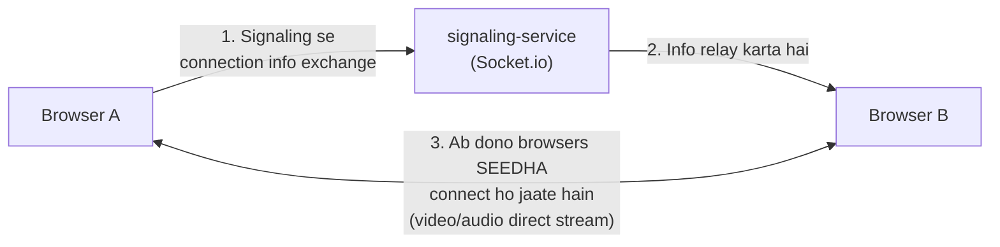

Bhai dekh liya screenshot — yaha 6 services dikh rahe hain:

```
api-gateway
auth-service
chat-service
room-service
signaling-service
user-service
```

## Answer — `signaling-service` Video Calling Handle Karta Hai

**`signaling-service`** hi wo service hai jo **actual video/audio call ka setup** handle karta hai — Phase 5 jo doc mein tha.

## Kyun — Samjho

| Service                         | Kaam                                                                                                                                                                                    |
| ------------------------------- | --------------------------------------------------------------------------------------------------------------------------------------------------------------------------------------- |
| `auth-service`                | Login/signup — sirf identity                                                                                                                                                           |
| `user-service`                | Profile data                                                                                                                                                                            |
| `room-service`                | "Meeting room" ka concept — kaun room bana sakta hai, kaun join kar sakta hai (reception desk jaisa)                                                                                   |
| **`signaling-service`** | **Do browsers ko ek dusre se "connect" karwana** — WebRTC handshake (offer/answer/ICE candidates exchange karna), taaki unke beech **direct** video/audio stream chal sake |
| `chat-service`                | Call ke saath text chat                                                                                                                                                                 |

## Important Concept — Signaling Khud Video Nahi Bhejta

Ye common confusion hoti hai — **`signaling-service` khud video data transfer nahi karta**. Uska kaam sirf **"introduction karwana"** hai:



**Analogy:** Socho `signaling-service` ek **matchmaker** hai — do logon ko ek dusre ka phone number de deta hai ("yaha milo"), lekin actual **baat-cheet** (video call) dono log **seedha** karte hain, matchmaker beech mein nahi rehta.

Isiliye document ke Phase 5 mein likha tha: *"pure relay, no processing, no storage"* — signaling sirf messages **forward** karta hai, video data khud nahi handle karta.

Tumhara current progress dekh ke — `room-service` abhi tak complete hua hai, agla natural step yahi `signaling-service` hai (Phase 5), jisme Socket.io aur WebRTC concepts aayenge.
