# Video Meet App — Production Microservices Build Plan

> **Goal:** Real production app, real users.
> **Approach:** True microservices from day 1 (separate services, separate DBs, own deployables) — built in phases so you're never learning 10 new things at once. If you don't know something yet, that's fine — each phase names exactly what to learn and why.

---

## Table of Contents

1. [Core Principles](#1-core-principles)
2. [Tech Stack](#2-tech-stack)
3. [High-Level Architecture](#3-high-level-architecture)
4. [Repo Structure](#4-repo-structure)
5. [Communication Patterns](#5-communication-patterns)
6. [Database-per-Service](#6-database-per-service)
7. [Build Roadmap (Phases 0–16)](#7-build-roadmap-phases-016)
8. [Core Flows — Sequence Diagrams](#8-core-flows--sequence-diagrams)
9. [Data Models (ERD)](#9-data-models-erd)
10. [Standards Kept at Every Service](#10-standards-kept-at-every-service)
11. [Security Boundaries](#11-security-boundaries)
12. [Scaling Points](#12-scaling-points)
13. [The First Real Microservices Lesson](#13-the-first-real-microservices-lesson)
14. [Suggested Priority Order If Time-Boxed](#14-suggested-priority-order-if-time-boxed)
15. [Immediate Next Step](#15-immediate-next-step)

---

## 1. Core Principles

These rules don't change as the app grows — they're what keeps this a real microservices system instead of a monolith wearing a costume:

- **Each service = its own folder, own `package.json`, own `server.js`, own port, own Dockerfile.** Can be started, stopped, and deployed independently.
- **Services never import each other's code, and never touch each other's database directly.** They talk only over the network (REST) or through events (Redis pub/sub, later Kafka).
- **Database-per-service.** Each service owns its own database — and each service picks the DB engine that actually fits its data, not one engine forced everywhere. Cross-service references are plain IDs (strings/UUIDs), never real foreign keys — because they point into a *different* database, sometimes a *different kind* of database.
- **Every service ships with the same standards** — validation, auth checks, error handling, logging — no service is "the simple one."
- **Learn-as-you-go is fine.** Each phase below names the new concept it introduces and why it exists, so you pick up Docker/Postgres/Redis/JWT/mediasoup/Kubernetes exactly when you need them, not all at once.

---

## 2. Tech Stack

| Layer                      | Tool                    | Notes                                                                                                                                  |
| -------------------------- | ----------------------- | -------------------------------------------------------------------------------------------------------------------------------------- |
| Frontend                   | React                   | Talks to Gateway (REST) + Signaling Service (WebSocket) directly                                                                       |
| Backend framework          | Node.js + Express       | One per service                                                                                                                        |
| Relational DB              | **PostgreSQL**    | Auth Service + User Service + Room Service — strict schemas, relations, transactions (users, sessions, meetings, participants, roles) |
| Document DB                | MongoDB                 | Chat Service — flexible schema, high write volume, easy to shard by`roomId`                                                         |
| Real-time                  | Socket.io               | Signaling Service, standalone                                                                                                          |
| Fast ephemeral store       | Redis                   | Presence, pub/sub events, token blacklist, later Socket.io scaling                                                                     |
| Media (1:1 first)          | WebRTC (browser-native) | Peer-to-peer, mesh                                                                                                                     |
| Media (group calls)        | mediasoup (SFU)         | Introduced once mesh calls hit their ceiling — its own service                                                                        |
| NAT traversal              | coturn                  | STUN/TURN, own container                                                                                                               |
| Inter-service sync calls   | REST (axios/fetch)      | Simplest to debug — no gRPC needed yet                                                                                                |
| Inter-service async events | Redis Pub/Sub           | Reuses infra you already have — no Kafka needed yet                                                                                   |
| Containers                 | Docker + docker-compose | One command brings up the whole stack locally                                                                                          |
| Later: message broker      | Kafka / RabbitMQ        | Only once async volume (recording, notifications) outgrows Redis pub/sub                                                               |
| Later: orchestration       | Kubernetes              | Only once you need real autoscaling / multi-node deployment                                                                            |

**Why Postgres for some services and Mongo for one:**

- **Auth, User, Room → PostgreSQL.** This data is genuinely relational and benefits from strict schemas: a user has one auth record, a room has a host and a fixed set of participant roles, and you want real transactions (e.g. "create room + add host as participant" either both succeed or both fail). Postgres also gives you proper constraints (unique email, foreign keys *within* a service's own DB) that catch bugs early.
- **Chat → MongoDB.** Chat messages are high-volume, schema-light, append-mostly, and naturally shard by `roomId`. A document store fits that shape better than relational tables, and you don't need cross-message transactions.
- **Signaling → Redis only, no persistent DB.** Presence is ephemeral by definition — if it's gone when the service restarts, that's *correct* behavior, not data loss.

> **Important:** "database-per-service" does not mean "same database engine everywhere." Each service choosing its own engine is normal, real-world microservices practice (this is sometimes called *polyglot persistence*) — the isolation rule that matters is that no other service reaches into that database, not that every database looks the same.

---

## 3. High-Level Architecture

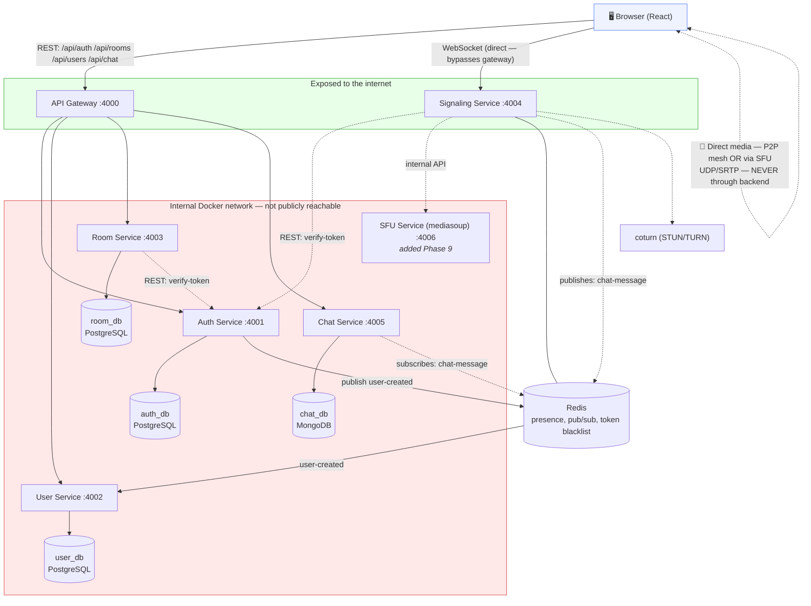

**Two planes, always kept separate:**

- **Control plane** — REST + signaling. Small JSON. Goes through your services.
- **Media plane** — actual audio/video. UDP/SRTP. Goes browser-to-browser or browser-to-SFU directly. Never touches Postgres/Mongo/Redis/your business logic.

---

## 4. Repo Structure

Monorepo — one Git repo, many independently-runnable services.

```
/video-meet-app
  /services
    /api-gateway          → port 4000, entry point, routes to all others
    /auth-service          → port 4001, own PostgreSQL DB "auth_db"
    /user-service           → port 4002, own PostgreSQL DB "user_db"
    /room-service            → port 4003, own PostgreSQL DB "room_db"
    /signaling-service      → port 4004, Socket.io, Redis (no persistent DB)
    /chat-service             → port 4005, own MongoDB DB "chat_db"
    /sfu-service               → port 4006, mediasoup (added Phase 9)
  /docker-compose.yml       → runs everything together with ONE command
  /shared                    → tiny shared package: error format, logger config
                                (published as local npm package — NEVER a shared DB model)
```

Each service under `/services/*` looks like this internally. Postgres-backed services use an ORM/query builder (Prisma or Knex — Prisma recommended for migrations + type safety); the Mongo-backed Chat service uses Mongoose as before:

```
/auth-service                    /chat-service
  /src                             /src
    /routes                         /routes
    /controllers                    /controllers
    /models      (Mongoose schema)  /models      (Prisma schema / migrations)
    /middleware                     /middleware
    /config                         /config
    server.js                       server.js
  package.json                    package.json
  Dockerfile                      Dockerfile
  .env                            .env
```

> **Golden rule:** `/shared` only contains truly generic, stateless utilities (logger format, error class, response formatter). The moment two services share a database model — or even a database engine's client library configured with cross-service knowledge — they're not really separate services anymore.

---

## 5. Communication Patterns

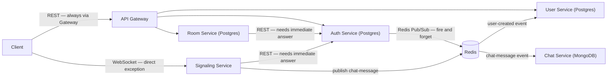

| Interaction                                 | Method                            | Why                                                                                   |
| ------------------------------------------- | --------------------------------- | ------------------------------------------------------------------------------------- |
| Client → any service                       | Through**API Gateway** only | Client never calls services directly                                                  |
| Client ↔ Signaling Service                 | Direct WebSocket                  | Common real-world exception — Socket.io + HTTP proxying gets messy through a gateway |
| Service → service (needs immediate answer) | Plain REST (axios/fetch)          | Simplest to understand and debug — no gRPC needed yet                                |
| Service → service (fire-and-forget)        | Redis Pub/Sub                     | You already have Redis for signaling — reuse it instead of learning Kafka on day 1   |
| Client ↔ SFU (media)                       | Direct WebRTC/UDP                 | Never touches your backend once signaling sets it up                                  |

**Why not gRPC or Kafka from day 1:** they're the "more correct at scale" choice, but each adds a whole new thing to learn (protobuf, broker ops) on top of microservices itself. REST + Redis pub/sub gets ~90% of the architectural benefit with tools you can pick up fast.

---

## 6. Database-per-Service

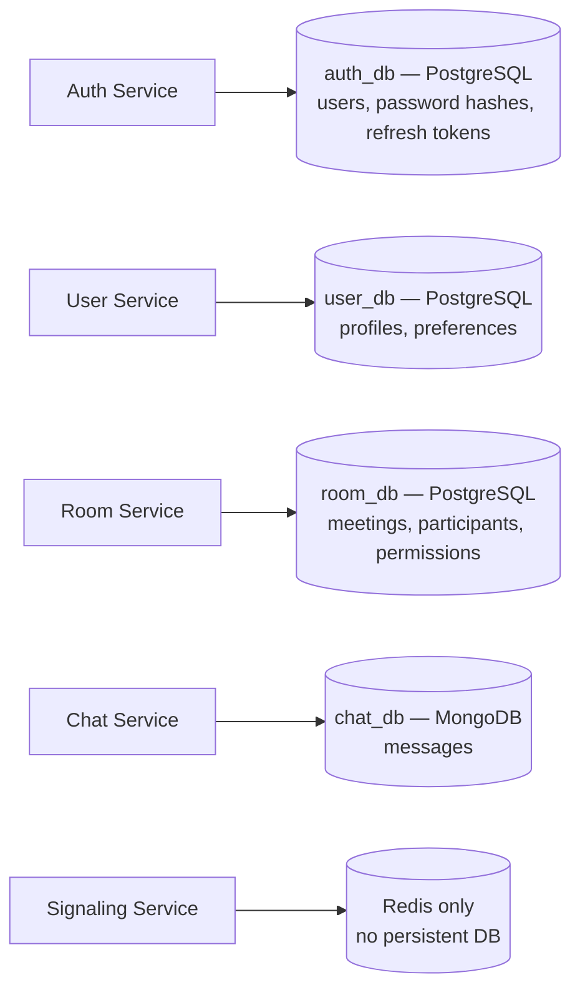

| Service           | Owns DB                                              | Engine     | Never accessed by                                   |
| ----------------- | ---------------------------------------------------- | ---------- | --------------------------------------------------- |
| Auth Service      | `auth_db` (users, password hashes, refresh tokens) | PostgreSQL | Every other service — they call Auth's API instead |
| User Service      | `user_db` (profiles, preferences)                  | PostgreSQL | Auth, Room, Chat                                    |
| Room Service      | `room_db` (meetings, participants, permissions)    | PostgreSQL | Others — they call Room's API                      |
| Chat Service      | `chat_db` (messages)                               | MongoDB    | Others                                              |
| Signaling Service | No DB — Redis for ephemeral presence only           | Redis      | —                                                  |

Cross-service links are stored as **plain IDs** (e.g. Room Service stores `hostId` as a UUID string, not a real foreign key — it points to a row in a *different database*, on a *different engine*, so a DB-level foreign key isn't even possible).

**One extra Postgres-specific habit to keep:** each Postgres-backed service manages its own migrations (Prisma Migrate or a Knex migration folder) inside its own service folder. No service ever runs a migration against another service's database.

---

## 7. Build Roadmap (Phases 0–16)

The full journey, from empty repo to a monitored production launch. Phases 0–8 are your **core build** (get a real call working). Phases 9–16 are **production hardening** — pull these in only when you actually need them, not preemptively.

```mermaid
flowchart TD
    P0["Phase 0<br/>Infra Skeleton"] --> P1["Phase 1<br/>API Gateway"]
    P1 --> P2["Phase 2<br/>Auth Service (Postgres)"]
    P2 --> P3["Phase 3<br/>User Service (Postgres)<br/><i>first cross-DB event</i>"]
    P3 --> P4["Phase 4<br/>Room Service (Postgres)"]
    P4 --> P5["Phase 5<br/>Signaling Service<br/><i>first real call</i>"]
    P5 --> P6["Phase 6<br/>React Frontend"]
    P6 --> P7["Phase 7<br/>TURN/STUN"]
    P7 --> P8["Phase 8<br/>Chat Service (MongoDB)"]
    P8 --> P9["Phase 9<br/>Group Calls → SFU"]
    P9 --> P10["Phase 10<br/>Recording Service"]
    P10 --> P11["Phase 11<br/>Notification Service"]
    P11 --> P12["Phase 12<br/>Gateway Hardening"]
    P12 --> P13["Phase 13<br/>Observability"]
    P13 --> P14["Phase 14<br/>CI/CD"]
    P14 --> P15["Phase 15<br/>Kubernetes Deployment"]
    P15 --> P16["Phase 16<br/>Load Testing & Security"]
    P16 --> Launch(["🚀 Production Launch"])

    style P0 fill:#eef3ff,stroke:#5b7fff
    style P1 fill:#eef3ff,stroke:#5b7fff
    style P2 fill:#eef3ff,stroke:#5b7fff
    style P3 fill:#eef3ff,stroke:#5b7fff
    style P4 fill:#eef3ff,stroke:#5b7fff
    style P5 fill:#eef3ff,stroke:#5b7fff
    style P6 fill:#eef3ff,stroke:#5b7fff
    style P7 fill:#eef3ff,stroke:#5b7fff
    style P8 fill:#eef3ff,stroke:#5b7fff
    style P9 fill:#fff4e0,stroke:#d99a2b
    style P10 fill:#fff4e0,stroke:#d99a2b
    style P11 fill:#fff4e0,stroke:#d99a2b
    style P12 fill:#fff4e0,stroke:#d99a2b
    style P13 fill:#fff4e0,stroke:#d99a2b
    style P14 fill:#fff4e0,stroke:#d99a2b
    style P15 fill:#fff4e0,stroke:#d99a2b
    style P16 fill:#fff4e0,stroke:#d99a2b
    style Launch fill:#e8ffe8,stroke:#3fae3f
```

Blue = core build (working call app). Orange = production hardening (do these once the core is solid).

### Phase 0 — Infra Skeleton

**New concept to learn:** Docker Compose (running multiple containers together with one command).

- Create the folder structure from §4
- `docker-compose.yml` with `postgres`, `mongo`, `redis`, and a placeholder container for each service
  - Recommended: **one Postgres container, multiple databases inside it** (`auth_db`, `user_db`, `room_db`) — simplest way to enforce "no service touches another's data" without running three separate Postgres instances
- Each service gets a minimal `server.js` that responds `{ status: "ok" }` on `/health`
- **Deliverable:** `docker-compose up` starts all empty services, each `/health` responds, Postgres + Mongo + Redis all reachable

### Phase 1 — API Gateway

**New concept to learn:** reverse proxying (`http-proxy-middleware`).

- Express app proxies: `/api/auth/*` → auth-service, `/api/users/*` → user-service, `/api/rooms/*` → room-service, `/api/chat/*` → chat-service
- **Deliverable:** hitting `gateway:4000/api/auth/health` returns auth-service's response

### Phase 2 — Auth Service

**New concepts to learn:** bcrypt password hashing, JWT access + refresh tokens, Joi/Zod validation, **Prisma (or Knex) against Postgres**.

- Own PostgreSQL DB (`auth_db`), own `User` table (via Prisma schema + migration) — only this service ever touches raw passwords
- `POST /signup`, `POST /login`, `POST /refresh` — bcrypt + JWT
- `authGuard` middleware to protect routes elsewhere
- **Deliverable:** through the gateway — signup → login → access a protected route; `auth_db` has a real `users` table with a unique constraint on `email`

### Phase 3 — User Service

**New concept to learn:** Redis Pub/Sub for cross-service events (same pattern, now bridging a Postgres writer to a Postgres reader in a *different* database).

- Own PostgreSQL DB (`user_db`), own `Profile` table — separate from Auth's `users` table, linked only by `userId` (UUID string, no real foreign key across databases)
- Auth Service publishes a `user-created` event on signup → User Service listens and auto-creates a matching profile row
- **This is your first real inter-service event** — understand it fully before moving on
- **Deliverable:** signup via Auth triggers a profile row automatically appearing in `user_db`

### Phase 4 — Room Service

**New concept to learn:** service-to-service REST auth (no shared session).

- Own PostgreSQL DB (`room_db`), own `Room` + `Participant` tables — this is where Postgres relations genuinely help (a room has many participants, each with a role)
- Calls Auth Service's `/internal/verify-token` endpoint to check the JWT, since Room Service holds no user data itself
- Unique room ID/link generation (nanoid/uuid), permission logic (public / invite-only)
- **Deliverable:** authenticated user (verified via a network call to Auth) creates a room, gets a shareable link; `room_db` has `rooms` and `participants` tables with a real foreign key *within* that same database

### Phase 5 — Signaling Service (core real-time piece)

**New concepts to learn:** Socket.io, WebRTC signaling (offer/answer/ICE), Redis for presence.

- Standalone Socket.io server, port 4004 — bypasses the Gateway (the one deliberate exception)
- Verifies JWT on socket handshake by calling Auth Service's `/internal/verify-token`
- Events: `join-room`, `offer`, `answer`, `ice-candidate`, `leave-room`
- Room presence stored in **Redis**, not memory or Postgres — this is what makes scaling possible later without a rewrite
- **Deliverable:** two clients connect directly to Signaling (not through the gateway) and exchange offer/answer/ICE

### Phase 6 — React Frontend

**New concept to learn:** `getUserMedia()` + `RTCPeerConnection`.

- Talks to API Gateway for REST (auth/rooms/users)
- Talks directly to Signaling Service for WebSocket
- Basic UI: video tiles, mute/camera toggle
- **Deliverable:** real working 1:1 video call in the browser (mesh, no SFU yet)

### Phase 7 — TURN/STUN

**New concept to learn:** NAT traversal, HMAC-signed short-lived credentials.

- coturn as its own container in docker-compose
- Auth Service (or a small dedicated endpoint) issues short-lived TURN credentials
- **Deliverable:** calls succeed across restrictive NAT/mobile networks, not just localhost

### Phase 8 — Chat Service

**New concept to learn:** Mongoose against MongoDB (your one non-relational service).

- Own MongoDB DB (`chat_db`) — chosen here specifically because chat messages are high-volume, schema-light, and naturally shard by `roomId`
- Listens to Signaling Service's `chat-message` events via Redis pub/sub, persists them
- **Deliverable:** chat sidebar during calls; history survives page refresh, pulled via the Gateway

### Phase 9 — Group Calls → SFU

**New concept to learn:** mediasoup (Router, Producer, Consumer, Transport).

- Once mesh calls feel limited (3–4 people, bandwidth ceiling), introduce `sfu-service` as its own service
- Signaling Service talks to SFU's internal API to create/manage producers/consumers per participant
- **Deliverable:** 5+ participants in one call without each client uploading 5 separate streams

### Phase 10 — Recording Service

- Triggered via message queue (host clicks "record")
- Worker pulls the SFU stream (mediasoup's `PlainTransport`), encodes with FFmpeg
- Upload to S3/Blob storage, store metadata — either its own small Postgres table or a Mongo collection, whichever this service prefers, since it owns its own DB too
- **Deliverable:** downloadable recording after a call

### Phase 11 — Notification Service

- Email invites, meeting reminders via queue-triggered jobs
- **Deliverable:** user gets an email when invited to a scheduled meeting

### Phase 12 — API Gateway Hardening

- Rate limiting, request validation, centralized auth middleware
- Correctly route WebSocket upgrade requests to Signaling Service
- **Deliverable:** single hardened entry point (e.g. `api.yourapp.com`) for all clients

### Phase 13 — Observability

**New concept to learn:** centralized logging + metrics + tracing.

- Centralized logging (ELK stack or Loki)
- Metrics (Prometheus + Grafana) — active calls, SFU CPU/bandwidth, socket connections, **plus Postgres connection-pool usage per service**
- Distributed tracing (Jaeger/OpenTelemetry) across services
- **Deliverable:** dashboard showing live call count, error rates, SFU load, DB query latency

### Phase 14 — CI/CD

- Per-service Dockerfiles (already have these from Phase 0)
- GitHub Actions/GitLab CI: build, test, run Prisma migrations, push image per service on merge
- **Deliverable:** push to main → auto-deploy to staging, migrations applied automatically for Postgres-backed services

### Phase 15 — Kubernetes Deployment

**New concept to learn:** Deployments, Services, HPA, Ingress, StatefulSets.

- Each microservice as its own Deployment + Service
- Horizontal Pod Autoscaler for SFU and Signaling based on CPU/connections
- Ingress for HTTP/WSS routing
- **StatefulSet consideration for both coturn (stable public IP) and Postgres (if not using a managed DB — RDS/Cloud SQL is strongly preferred over self-hosting Postgres in k8s)**
- **Deliverable:** full stack running on a managed k8s cluster (EKS/GKE/DigitalOcean)

### Phase 16 — Load Testing & Security Hardening

- Simulate concurrent calls (Artillery for signaling, custom scripts for SFU load)
- HTTPS/WSS everywhere, CORS lockdown, input validation, TURN credential rotation
- Postgres connection pooling under load (PgBouncer) so signup/login spikes don't exhaust connections
- Penetration-test auth flows and room access control
- **Deliverable:** known capacity numbers (e.g. "500 concurrent 1:1 calls, 50 rooms of 10")

---

## 8. Core Flows — Sequence Diagrams

### 8.1 Signup → Login (Phases 2–3)

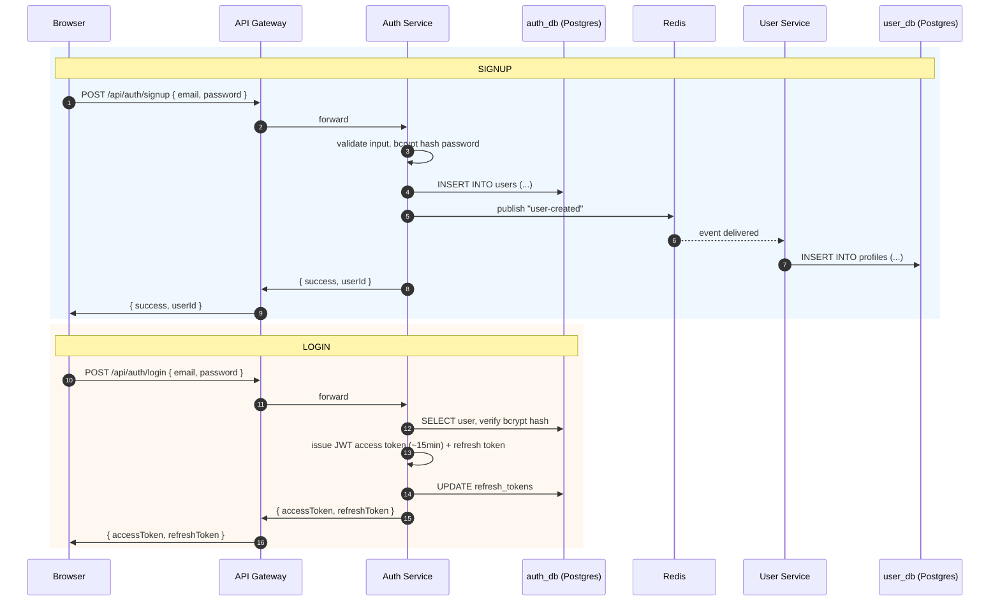

### 8.2 Create Room & Join (Phase 4)

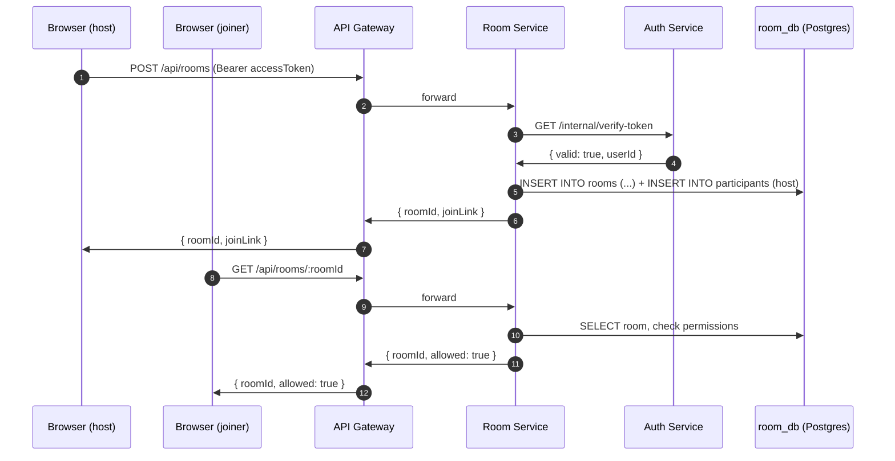

### 8.3 Call Setup — Mesh (Phase 5)

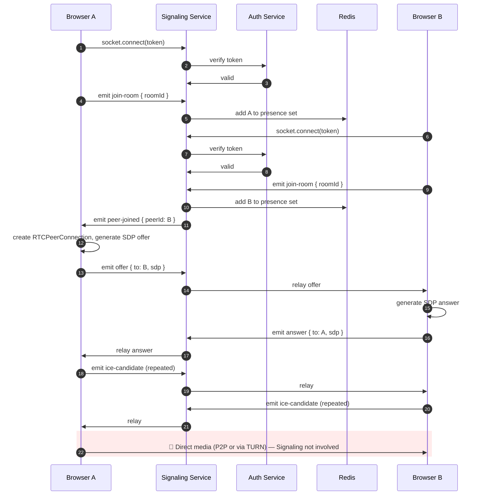

### 8.4 Group Calls via SFU (Phase 9)

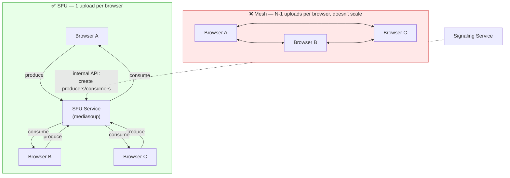

---

## 9. Data Models (ERD)

Two engines here: Postgres tables for Auth/User/Room (with a real foreign key *inside* room_db between `rooms` and `participants`), and a Mongo collection for Chat. Cross-database links are always plain IDs, never enforced foreign keys.

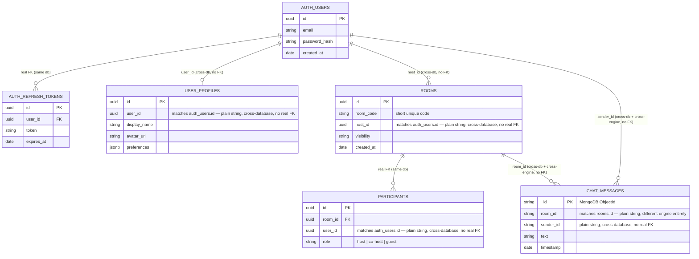

**Redis keys (Signaling Service):**

```
room:{roomId}:members   → Set of socketIds/userIds currently in the room
token:blacklist:{token} → for logout/revoked token checks
```

---

## 10. Standards Kept at Every Service

Non-negotiable — same at every phase, every service, regardless of DB engine:

- ✅ bcrypt password hashing (Auth Service only — no other service ever sees a raw password)
- ✅ JWT verified centrally — Auth Service is the single source of truth for "is this token valid"
- ✅ Input validation (Joi/Zod) inside **every** service, not just the Gateway
- ✅ Own error-handling middleware per service — never assume the Gateway catches everything
- ✅ Own `.env` per service — no shared secrets file, no shared DB connection string
- ✅ Own logger per service, tagged with service name — logs traceable across services
- ✅ Consistent `{ success, data, error }` response shape across all services
- ✅ Postgres-backed services own their migrations (Prisma Migrate/Knex) — never hand-edited schema drift
- ✅ Real transactions used inside a service where it matters (e.g. Room Service: create room + add host participant, both-or-neither)

---

## 11. Security Boundaries

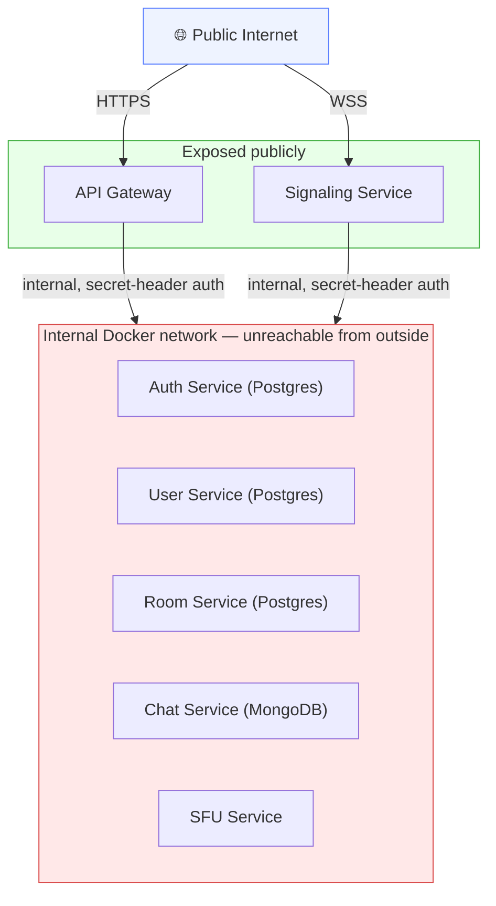

- Only **API Gateway** and **Signaling Service** are exposed to the public internet — everything else, including both Postgres and MongoDB, sits on an internal Docker network
- `/internal/*` routes require a shared internal service-secret header, not user JWTs
- TURN credentials are short-lived (HMAC-signed, expire in minutes) — issued by Auth Service, never static
- Rate limiting at the Gateway (per-IP and per-user) to prevent signup/login abuse
- Database credentials are per-service — Auth Service's Postgres user can only touch `auth_db`, not `user_db` or `room_db`, even though they may live in the same Postgres instance
- All traffic — service-to-service and client-to-service — over HTTPS/WSS, even internally in production

---

## 12. Scaling Points

| Component                               | Scales by                           | How                                                                                         |
| --------------------------------------- | ----------------------------------- | ------------------------------------------------------------------------------------------- |
| API Gateway / Auth / User / Room / Chat | Request volume                      | Horizontal — stateless, add more containers                                                |
| Signaling Service                       | Concurrent socket connections       | Horizontal + Redis adapter for cross-instance room state                                    |
| SFU Service                             | Bandwidth + CPU (media routing)     | Vertical (bigger machines) + horizontal by room-sharding (each room pinned to one SFU node) |
| Postgres (Auth/User/Room)               | Read/write volume, connection count | Read replicas per service DB; PgBouncer for connection pooling under load                   |
| MongoDB (Chat)                          | Write volume, document count        | Sharding by`roomId` if/when a single replica set isn't enough                             |
| Redis                                   | Pub/sub + presence load             | Redis Cluster if it becomes a bottleneck (rare until real scale)                            |

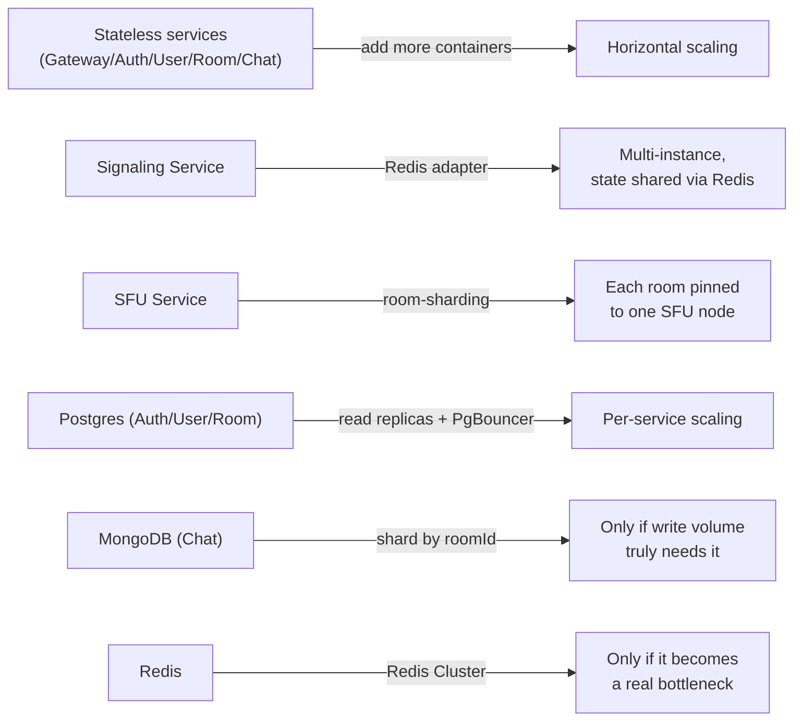

---

## 13. The First Real Microservices Lesson

In **Phase 3 (User Service)**, you'll hit something monolith development never forces you to deal with: you can't do a SQL `JOIN` across `auth_db` and `user_db` — they're not just different tables, they're **physically separate Postgres databases** (and later, Chat's data lives on a completely different engine). This is intentional — it's the exact tradeoff of microservices (isolation) vs monolith (convenience). Two ways to solve it:

- An **event** (`user-created`) that copies just the needed fields over, or
- A **live REST call** when you need fresh data

This one problem — "how do services get data from each other without a shared DB, sometimes without even a shared DB *engine*" — is most of what makes microservices feel different from what you're used to. Better to feel it early, in Phase 3, than discover it later under production pressure.

---

## 14. Suggested Priority Order If Time-Boxed

The minimum path to a genuinely working demo, if you need to move fast:

1. **Phase 0–1** (skeleton + gateway) — foundation
2. **Phase 2, 4, 5** (auth, rooms, signaling) — get a call working at all
3. **Phase 7** (TURN) — make it actually work on real networks, not just localhost
4. **Phase 9** (SFU) — the "production-grade" differentiator vs a toy demo
5. **Phase 12–15** — only once the core works, wrap it for real deployment

Everything else (chat, recording, notifications) is additive and can come after the core call pipeline is solid.

---

## 15. Immediate Next Step

Start with **Phase 0 (infra skeleton) + Phase 1 (API Gateway)** — the empty scaffold, Postgres + Mongo + Redis all wired up, all services talking to each other via the Gateway, before any real logic exists.

Ready for the actual code and file structure for these two phases?
