# Video Meet App — Detailed File-by-File Build Steps

> This is the execution checklist. Every phase is broken into small steps: **which file to create, what goes in it, why, and how to verify it worked** before moving to the next step. Nothing here assumes you already know the tool — each new concept is named the moment it shows up.

---

## Table of Contents

- [Phase 0 — Infra Skeleton](#phase-0--infra-skeleton)
- [Phase 1 — API Gateway](#phase-1--api-gateway)
- [Phase 2 — Auth Service](#phase-2--auth-service)
- [Phase 3 — User Service](#phase-3--user-service)
- [Phase 4 — Room Service](#phase-4--room-service)
- [Phase 5 — Signaling Service](#phase-5--signaling-service)
- [Phase 6 — React Frontend](#phase-6--react-frontend)
- [Phase 7 — TURN/STUN](#phase-7--turnstun)
- [Phase 8 — Chat Service](#phase-8--chat-service)
- [Phase 9 — SFU Service (Group Calls)](#phase-9--sfu-service-group-calls)
- [Phase 10 — Recording Service](#phase-10--recording-service)
- [Phase 11 — Notification Service](#phase-11--notification-service)
- [Phase 12 — Gateway Hardening](#phase-12--gateway-hardening)
- [Phase 13 — Observability](#phase-13--observability)
- [Phase 14 — CI/CD](#phase-14--cicd)
- [Phase 15 — Kubernetes Deployment](#phase-15--kubernetes-deployment)
- [Phase 16 — Load Testing &amp; Security](#phase-16--load-testing--security)
- [Full Build Order — One Diagram](#full-build-order--one-diagram)

---

## Phase 0 — Infra Skeleton

**Goal:** Empty services that boot, connected to real databases, before any actual feature exists.
**New concept:** Docker Compose — running many containers with one command.

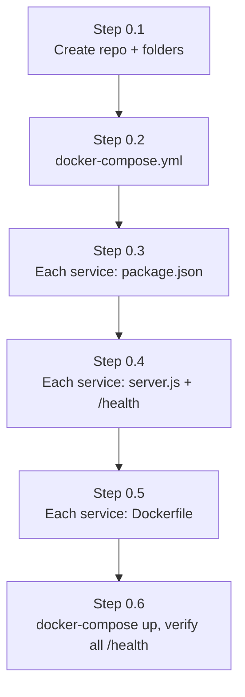

### Step 0.1 — Create the repo and folder skeleton

```
/video-meet-app
  /services
    /api-gateway
    /auth-service
    /user-service
    /room-service
    /signaling-service
    /chat-service
  /shared
  docker-compose.yml
  .gitignore
```

- `git init`, first commit with just the empty folders and a root `README.md`
- `.gitignore`: `node_modules/`, `.env`, `dist/`

### Step 0.2 — Write `docker-compose.yml`

- Defines 3 infra containers: `postgres`, `mongo`, `redis`
- Defines 6 placeholder service containers (build from each service's future Dockerfile)
- Postgres gets **one container, three databases** inside it (`auth_db`, `user_db`, `room_db`) — set via an init script or created manually after first boot
- Mongo gets one database (`chat_db`)
- **Checkpoint:** `docker-compose config` runs with no syntax errors

### Step 0.3 — `package.json` per service

- Inside each `/services/<name>`, run `npm init -y`
- Add `express` to every service
- Add `pg` (Postgres client) to auth/user/room; add `mongoose` to chat; add `socket.io` + `ioredis` to signaling

### Step 0.4 — Minimal `server.js` per service

Each service gets the same skeleton, only the port number changes:

```js
const express = require('express');
const app = express();
app.get('/health', (req, res) => res.json({ status: 'ok' }));
app.listen(process.env.PORT || 4001);
```

- **Checkpoint:** running one service locally with `node server.js` and hitting `/health` in the browser returns `{ status: "ok" }`

### Step 0.5 — `Dockerfile` per service

```dockerfile
FROM node:20-alpine
WORKDIR /app
COPY package*.json ./
RUN npm install
COPY . .
CMD ["node", "server.js"]
```

- Same file, copy-pasted into all 6 service folders (only exposed port differs)

### Step 0.6 — Bring the whole stack up

- `docker-compose up --build`
- **Deliverable / Checkpoint:** all 6 services + postgres + mongo + redis show "healthy"/running, and every service's `/health` responds through its own port

---

## Phase 1 — API Gateway

**Goal:** One address the browser talks to; it silently forwards to the right service.
**New concept:** Reverse proxying.

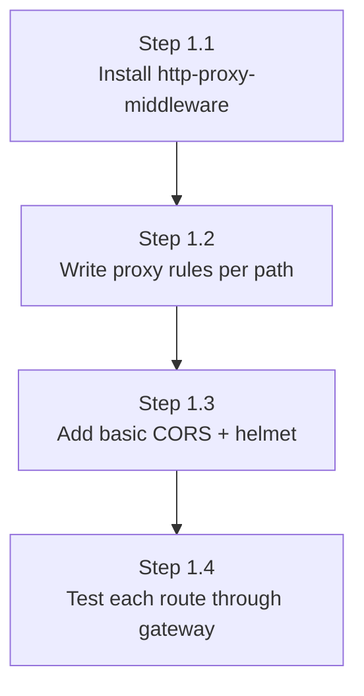

### Step 1.1 — Install dependencies in `api-gateway`

- `npm install express http-proxy-middleware cors helmet`

### Step 1.2 — Create `/services/api-gateway/src/routes/proxyRoutes.js`

- One `createProxyMiddleware` block per target service:
  - `/api/auth` → `http://auth-service:4001`
  - `/api/users` → `http://user-service:4002`
  - `/api/rooms` → `http://room-service:4003`
  - `/api/chat` → `http://chat-service:4005`
- Mount all of them in `server.js` before any other route

### Step 1.3 — Add security middleware in `server.js`

- `app.use(helmet())`
- `app.use(cors({ origin: process.env.FRONTEND_URL }))`

### Step 1.4 — Test

- `curl localhost:4000/api/auth/health` → should return auth-service's `/health` response
- Repeat for `/api/users/health`, `/api/rooms/health`, `/api/chat/health`
- **Deliverable/Checkpoint:** all 4 proxied health checks work through the gateway, not just directly on each service's port

---

## Phase 2 — Auth Service

**Goal:** Real signup/login with hashed passwords and JWTs, backed by Postgres.
**New concepts:** bcrypt, JWT, Joi/Zod validation, Prisma (Postgres ORM).

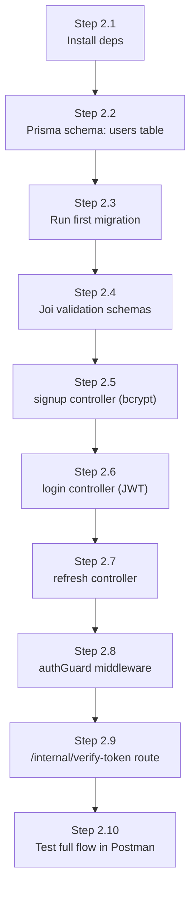

### Step 2.1 — Install dependencies

- `npm install bcrypt jsonwebtoken joi prisma @prisma/client`
- `npx prisma init` → creates `/prisma/schema.prisma` + `.env` with `DATABASE_URL`

### Step 2.2 — Define the schema — `/prisma/schema.prisma`

```prisma
model User {
  id            String   @id @default(uuid())
  email         String   @unique
  passwordHash  String
  createdAt     DateTime @default(now())
}
model RefreshToken {
  id        String   @id @default(uuid())
  userId    String
  token     String
  expiresAt DateTime
}
```

### Step 2.3 — Run the migration

- `npx prisma migrate dev --name init`
- **Checkpoint:** open `auth_db` in a DB tool (TablePlus/pgAdmin) and see real `User` and `RefreshToken` tables

### Step 2.4 — `/src/validation/authSchemas.js`

- Joi schema: `email` (must be valid email), `password` (min length) for both signup and login

### Step 2.5 — `/src/controllers/signupController.js`

- Validate body → `bcrypt.hash(password, 10)` → `prisma.user.create(...)` → publish `user-created` to Redis → respond `{ success: true, userId }`

### Step 2.6 — `/src/controllers/loginController.js`

- Find user by email → `bcrypt.compare` → sign JWT access token (`jwt.sign(..., { expiresIn: '15m' })`) → generate + store refresh token → respond with both tokens

### Step 2.7 — `/src/controllers/refreshController.js`

- Verify refresh token exists in DB and isn't expired → issue new access token

### Step 2.8 — `/src/middleware/authGuard.js`

- Reads `Authorization: Bearer <token>` header → `jwt.verify` → attaches `req.userId` or rejects with 401
- Used by every *other* service too (copy this middleware, don't import it across services)

### Step 2.9 — `/src/routes/internalRoutes.js`

- `GET /internal/verify-token` — same JWT check, returns `{ valid, userId }` as JSON (this is what Room/Signaling will call)
- **Not** exposed through the Gateway — only reachable inside the Docker network

### Step 2.10 — Test in Postman

- `POST /api/auth/signup` → `POST /api/auth/login` → copy access token → `GET /api/users/me` with `Authorization: Bearer <token>` (once Phase 3 exists) or a temp protected test route now
- **Deliverable/Checkpoint:** signup → login → protected route access works end-to-end through the Gateway; `auth_db.users` has a real row with a hashed (not plaintext) password

---

## Phase 3 — User Service

**Goal:** Profile auto-created the moment someone signs up, via an event — not a direct call.
**New concept:** Redis Pub/Sub.

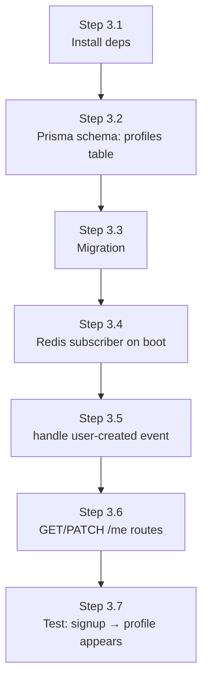

### Step 3.1 — Install dependencies

- `npm install prisma @prisma/client ioredis joi`
- `npx prisma init`

### Step 3.2 — `/prisma/schema.prisma`

```prisma
model Profile {
  id           String @id @default(uuid())
  userId       String @unique
  displayName  String?
  avatarUrl    String?
  preferences  Json?
}
```

### Step 3.3 — Migrate

- `npx prisma migrate dev --name init`

### Step 3.4 — `/src/events/redisSubscriber.js`

- On service boot, subscribe to the `user-created` Redis channel

### Step 3.5 — Handle the event

- Parse the event payload `{ userId }` → `prisma.profile.create({ data: { userId } })`
- **This is the piece from Auth's Step 2.5 (`publish` step) finally being received**

### Step 3.6 — `/src/routes/profileRoutes.js` + `authGuard` (copied, not imported)

- `GET /me` — reads `req.userId` from the guard, fetches matching profile
- `PATCH /me` — validated update (Joi) of `displayName`/`avatarUrl`/`preferences`

### Step 3.7 — Test

- Signup a brand-new user via Auth → check `user_db.profiles` — a row should appear automatically within a second, with no manual API call
- **Deliverable/Checkpoint:** the event pipeline works end-to-end; `GET /api/users/me` (through Gateway, with a valid token) returns the auto-created profile

---

## Phase 4 — Room Service

**Goal:** Authenticated users can create and join rooms, with real relational data (a room has many participants).
**New concept:** service-to-service REST auth; real foreign keys within one database.

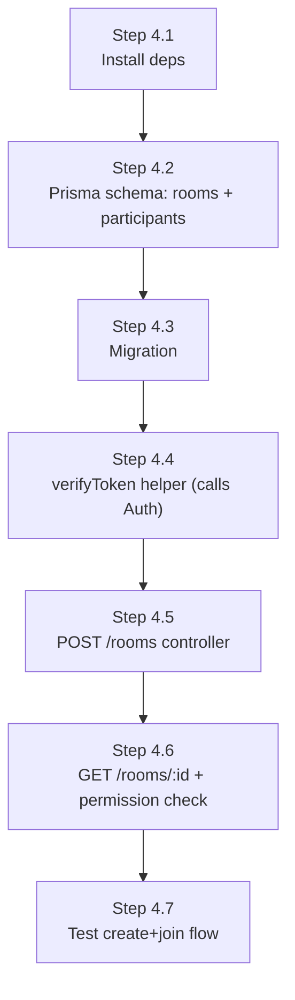

### Step 4.1 — Install dependencies

- `npm install prisma @prisma/client axios nanoid joi`

### Step 4.2 — `/prisma/schema.prisma`

```prisma
model Room {
  id         String   @id @default(uuid())
  roomCode   String   @unique
  hostId     String
  visibility String   @default("public")
  createdAt  DateTime @default(now())
  participants Participant[]
}
model Participant {
  id      String @id @default(uuid())
  roomId  String
  room    Room   @relation(fields: [roomId], references: [id])
  userId  String
  role    String @default("guest")
}
```

- Notice: `Room` → `Participant` is a **real foreign key**, because both tables live in `room_db`

### Step 4.3 — Migrate

- `npx prisma migrate dev --name init`

### Step 4.4 — `/src/utils/verifyToken.js`

- `axios.get('http://auth-service:4001/internal/verify-token', { headers: { Authorization } })`
- Wrap in try/catch → throw 401 if Auth says invalid

### Step 4.5 — `/src/controllers/createRoomController.js`

- Call `verifyToken` → generate `roomCode` with `nanoid()` → **use a Prisma transaction**: create the room AND insert the host as a participant, both-or-neither
- Respond `{ roomId, joinLink }`

### Step 4.6 — `/src/controllers/getRoomController.js`

- Fetch room by ID → if `visibility === 'invite-only'`, check the `participants` table for the requesting `userId`

### Step 4.7 — Test

- Create a room via Postman (with a real token from Phase 2) → confirm both `rooms` and `participants` rows exist
- Try joining as a different user on an invite-only room → confirm it's blocked
- **Deliverable/Checkpoint:** full create → join → permission-check flow works through the Gateway

---

## Phase 5 — Signaling Service

**Goal:** Two browsers can find each other and exchange connection info in real time.
**New concepts:** Socket.io, WebRTC signaling vocabulary (offer/answer/ICE), Redis presence sets.

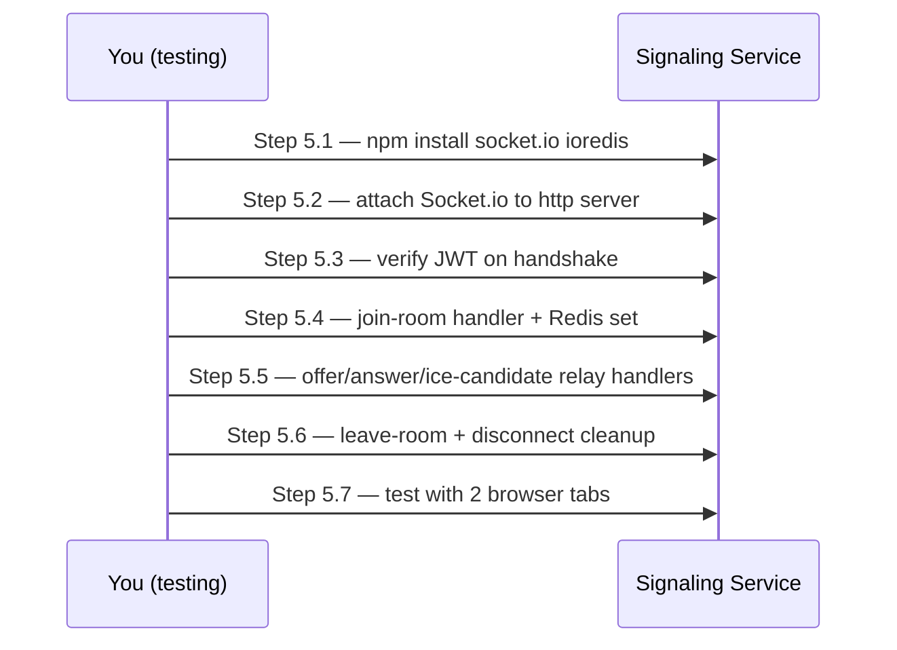

### Step 5.1 — Install dependencies

- `npm install socket.io ioredis axios`

### Step 5.2 — `/src/server.js`

- Create a plain `http.createServer(app)`, attach `socket.io` to it (not to Express directly)
- Listen on port 4004

### Step 5.3 — `/src/middleware/socketAuth.js`

- On `io.use(...)`, read `socket.handshake.auth.token` → call Auth's `/internal/verify-token` → attach `socket.userId` or reject the connection

### Step 5.4 — `/src/handlers/joinRoom.js`

- On `join-room` event → `redis.sadd('room:{roomId}:members', socket.id)` → notify existing members via `peer-joined`

### Step 5.5 — `/src/handlers/relay.js`

- `offer`, `answer`, `ice-candidate` — each handler just does `io.to(targetSocketId).emit(eventName, payload)` — **pure relay, no processing, no storage**

### Step 5.6 — `/src/handlers/leaveRoom.js` + `disconnect`

- Remove from the Redis set, notify remaining members via `peer-left`

### Step 5.7 — Test with 2 browser tabs

- Simple test HTML page (or `socket.io-client` script in devtools console) connecting with two different tokens to the same `roomId`
- Confirm `peer-joined`, `offer`, `answer`, `ice-candidate` events show up correctly in each tab's console
- **Deliverable/Checkpoint:** two clients complete a full signaling handshake (not yet real video — that's Phase 6)

---

## Phase 6 — React Frontend

**Goal:** An actual video call in the browser.
**New concepts:** `getUserMedia()`, `RTCPeerConnection`.

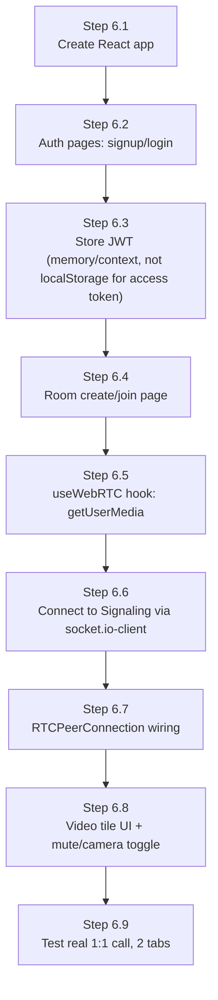

### Step 6.1 — `npx create-react-app frontend` (or Vite, faster)

- `/src/api/apiClient.js` — axios instance pointed at the Gateway (`http://localhost:4000/api`)

### Step 6.2 — Auth pages

- `/src/pages/SignupPage.jsx`, `/src/pages/LoginPage.jsx` — simple forms calling `apiClient.post('/auth/signup' | '/auth/login')`

### Step 6.3 — Token storage

- Store the access token in React context/state (not localStorage, to reduce XSS risk); refresh token handling can wait until this is stable

### Step 6.4 — Room pages

- `/src/pages/CreateRoomPage.jsx`, `/src/pages/JoinRoomPage.jsx` — call `/rooms` endpoints

### Step 6.5 — `/src/hooks/useWebRTC.js`

- `navigator.mediaDevices.getUserMedia({ video: true, audio: true })` → attach the local stream to a `<video>` ref

### Step 6.6 — `/src/hooks/useSignaling.js`

- `socket.io-client` connects to Signaling Service directly (**not** through the Gateway), passing the JWT in `auth`

### Step 6.7 — Wire signaling events to `RTCPeerConnection`

- On `peer-joined` → create offer → `socket.emit('offer', ...)`
- On `offer` received → set remote description → create answer → `socket.emit('answer', ...)`
- On `ice-candidate` received → `pc.addIceCandidate(...)`

### Step 6.8 — `/src/components/VideoTile.jsx` + `/src/components/CallControls.jsx`

- Local + remote `<video>` elements, mute/camera toggle buttons

### Step 6.9 — Test

- Two browser tabs (or two devices on the same network), same room, real camera/mic
- **Deliverable/Checkpoint:** a genuine working 1:1 video call, end to end, in the browser

---

## Phase 7 — TURN/STUN

**Goal:** Calls work off your local network too.
**New concept:** NAT traversal, HMAC-signed short-lived credentials.

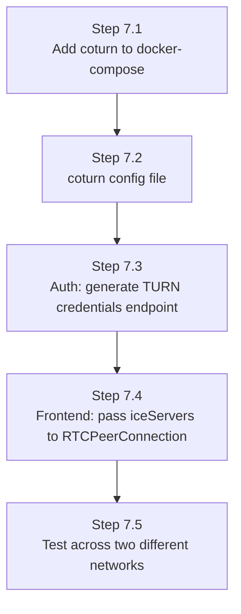

### Step 7.1 — `docker-compose.yml`

- Add a `coturn` service using the `coturn/coturn` image, expose UDP port range

### Step 7.2 — `/infra/coturn/turnserver.conf`

- Set `realm`, `use-auth-secret`, shared secret from `.env`

### Step 7.3 — `/services/auth-service/src/controllers/turnController.js`

- `GET /turn-credentials` (protected route) → HMAC-sign a username/password pair with the shared secret, short expiry (e.g. 10 min)

### Step 7.4 — Frontend

- Fetch TURN credentials before creating `RTCPeerConnection`, pass as `iceServers: [{ urls: 'stun:...' }, { urls: 'turn:...', username, credential }]`

### Step 7.5 — Test

- One device on WiFi, one on mobile data (or a VPN) — confirm the call still connects
- **Deliverable/Checkpoint:** calls succeed across real, separate networks — not just localhost/same-WiFi

---

## Phase 8 — Chat Service

**Goal:** Persistent chat alongside the call.
**New concept:** Mongoose (MongoDB), your first non-relational service.

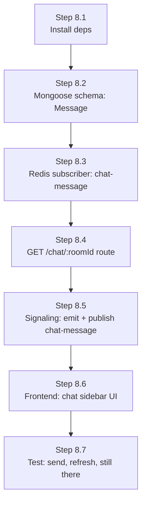

### Step 8.1 — Install dependencies

- `npm install mongoose ioredis`

### Step 8.2 — `/src/models/Message.js`

```js
const messageSchema = new mongoose.Schema({
  roomId: String,
  senderId: String,
  text: String,
  timestamp: { type: Date, default: Date.now }
});
```

### Step 8.3 — `/src/events/redisSubscriber.js`

- Subscribe to `chat-message` channel → `Message.create({ ... })`

### Step 8.4 — `/src/routes/chatRoutes.js`

- `GET /:roomId` (protected) → `Message.find({ roomId }).sort({ timestamp: 1 })`

### Step 8.5 — Back in Signaling Service

- Add a `chat-message` socket handler: relay live to the room via `io.to(roomId).emit(...)`, **and** `redis.publish('chat-message', ...)` so Chat Service persists it

### Step 8.6 — Frontend

- `/src/components/ChatSidebar.jsx` — input box + message list, listens for `chat-message` socket events, and on room load fetches history via `GET /api/chat/:roomId`

### Step 8.7 — Test

- Send messages during a call, refresh the page, confirm history reloads from `chat_db`
- **Deliverable/Checkpoint:** live chat + persistent history both work

---

## Phase 9 — SFU Service (Group Calls)

**Goal:** 3+ participants without everyone's upload bandwidth collapsing.
**New concept:** mediasoup (Router, Producer, Consumer, Transport).

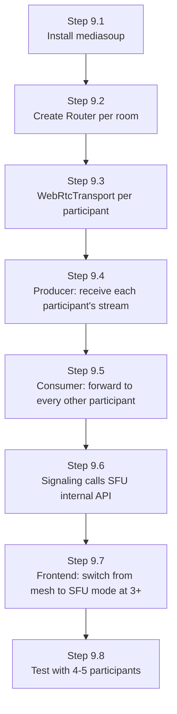

### Step 9.1 — Install

- `npm install mediasoup` in `/services/sfu-service`

### Step 9.2 — `/src/mediasoup/router.js`

- One `mediasoup.Worker` per server process, one `Router` per active room (created on first participant joining)

### Step 9.3 — `/src/mediasoup/transport.js`

- `router.createWebRtcTransport()` per participant — separate transports for sending (produce) and receiving (consume)

### Step 9.4 — `/src/routes/produceRoute.js`

- Internal endpoint Signaling calls: `transport.produce({ kind, rtpParameters })` when a participant starts sending video

### Step 9.5 — `/src/routes/consumeRoute.js`

- Internal endpoint: for every *other* participant already in the room, create a `Consumer` against the new Producer (and vice versa for existing producers)

### Step 9.6 — Back in Signaling Service

- When room size hits 3+, switch coordination logic: instead of relaying offers/answers peer-to-peer, call SFU's internal `/produce` and `/consume` endpoints per participant

### Step 9.7 — Frontend

- `/src/hooks/useSFU.js` — one `RTCPeerConnection` to the SFU instead of one per peer; swap this in once `participants.length >= 3`

### Step 9.8 — Test

- 4–5 browser tabs/devices in one room
- **Deliverable/Checkpoint:** everyone sees everyone, each client uploads exactly once

---

## Phase 10 — Recording Service

**Goal:** Downloadable recordings, without blocking live calls.

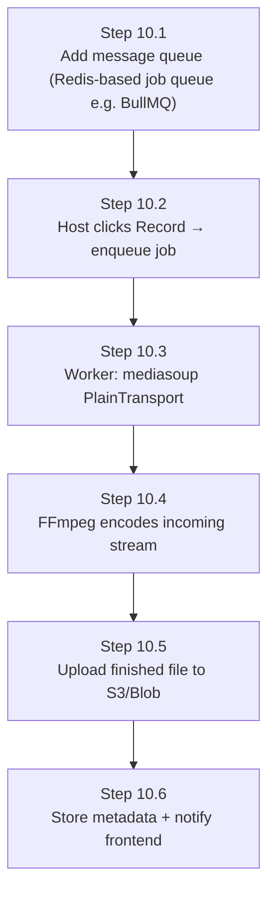

- `npm install bullmq fluent-ffmpeg aws-sdk` (or your storage provider's SDK)
- Worker process is separate from the API process — it only listens to the queue
- **Deliverable/Checkpoint:** clicking "Record" produces a downloadable file after the call ends, and a slow/failed recording never delays or crashes the live call

---

## Phase 11 — Notification Service

**Goal:** Email invites/reminders, fully async.

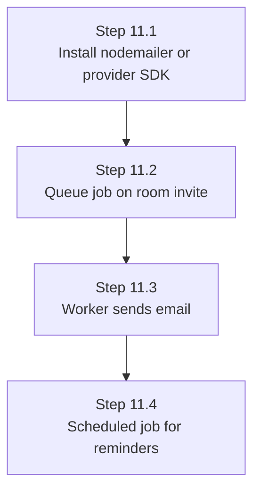

- Room Service publishes an `invite-sent` event → Notification Service's worker picks it up and emails
- **Deliverable/Checkpoint:** inviting someone to a scheduled meeting triggers a real email

---

## Phase 12 — Gateway Hardening

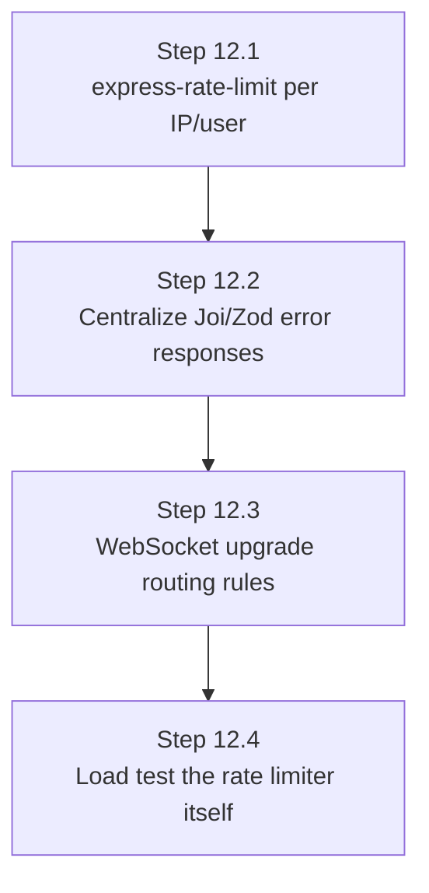

- **Deliverable/Checkpoint:** repeated failed logins get throttled; a single hardened entry point handles both REST and WS routing correctly

---

## Phase 13 — Observability

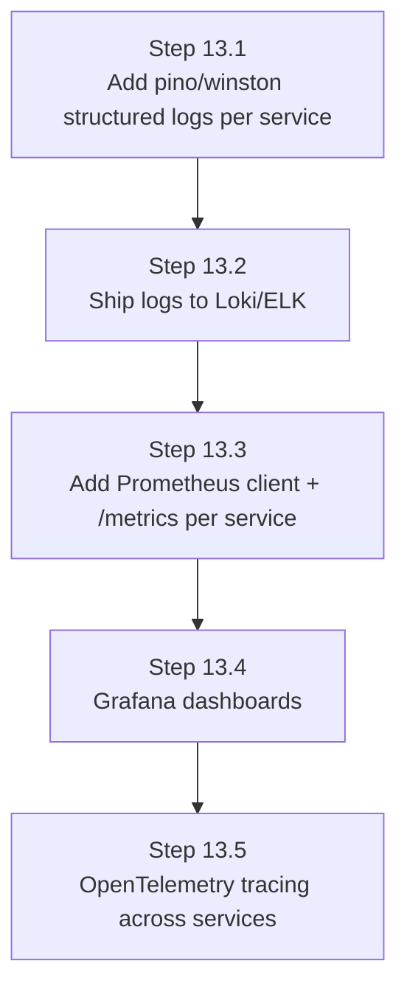

- **Deliverable/Checkpoint:** a dashboard shows live call count, error rate, and DB latency, sourced from real running services

---

## Phase 14 — CI/CD

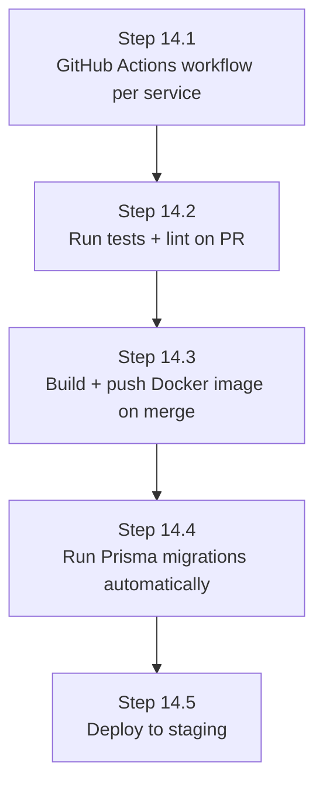

- **Deliverable/Checkpoint:** merging to `main` auto-deploys to staging with zero manual steps

---

## Phase 15 — Kubernetes Deployment

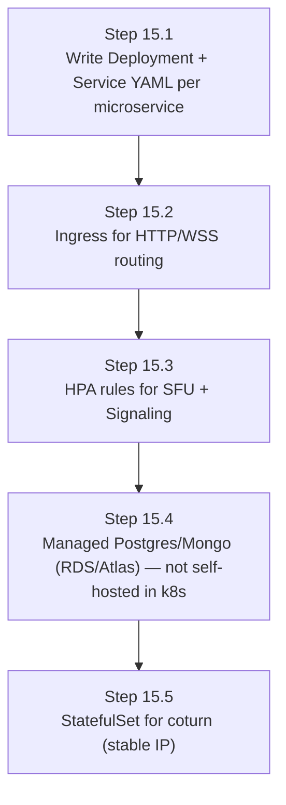

- **Deliverable/Checkpoint:** full stack running on a managed cluster (EKS/GKE/DigitalOcean)

---

## Phase 16 — Load Testing & Security

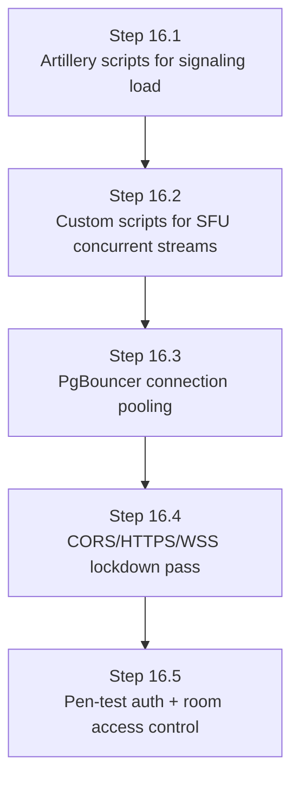

- **Deliverable/Checkpoint:** documented capacity numbers, e.g. "500 concurrent 1:1 calls, 50 rooms of 10"

---

## Full Build Order — One Diagram

```mermaid
flowchart TD
    P0["Phase 0<br/>Skeleton"] --> P1["Phase 1<br/>Gateway"]
    P1 --> P2["Phase 2<br/>Auth"]
    P2 --> P3["Phase 3<br/>User"]
    P3 --> P4["Phase 4<br/>Room"]
    P4 --> P5["Phase 5<br/>Signaling"]
    P5 --> P6["Phase 6<br/>Frontend"]
    P6 --> P7["Phase 7<br/>TURN/STUN"]
    P7 --> P8["Phase 8<br/>Chat"]
    P8 --> P9["Phase 9<br/>SFU"]
    P9 --> P10["Phase 10<br/>Recording"]
    P10 --> P11["Phase 11<br/>Notifications"]
    P11 --> P12["Phase 12<br/>Gateway Hardening"]
    P12 --> P13["Phase 13<br/>Observability"]
    P13 --> P14["Phase 14<br/>CI/CD"]
    P14 --> P15["Phase 15<br/>Kubernetes"]
    P15 --> P16["Phase 16<br/>Load Test & Security"]
    P16 --> Launch(["🚀 Production Launch"])

    style P0 fill:#eef3ff,stroke:#5b7fff
    style P1 fill:#eef3ff,stroke:#5b7fff
    style P2 fill:#eef3ff,stroke:#5b7fff
    style P3 fill:#eef3ff,stroke:#5b7fff
    style P4 fill:#eef3ff,stroke:#5b7fff
    style P5 fill:#eef3ff,stroke:#5b7fff
    style P6 fill:#eef3ff,stroke:#5b7fff
    style P7 fill:#eef3ff,stroke:#5b7fff
    style P8 fill:#eef3ff,stroke:#5b7fff
    style P9 fill:#fff4e0,stroke:#d99a2b
    style P10 fill:#fff4e0,stroke:#d99a2b
    style P11 fill:#fff4e0,stroke:#d99a2b
    style P12 fill:#fff4e0,stroke:#d99a2b
    style P13 fill:#fff4e0,stroke:#d99a2b
    style P14 fill:#fff4e0,stroke:#d99a2b
    style P15 fill:#fff4e0,stroke:#d99a2b
    style P16 fill:#fff4e0,stroke:#d99a2b
    style Launch fill:#e8ffe8,stroke:#3fae3f
```

**Next step:** start Step 0.1. Ready for the actual code for Phase 0's files when you are.
