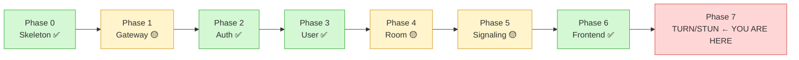
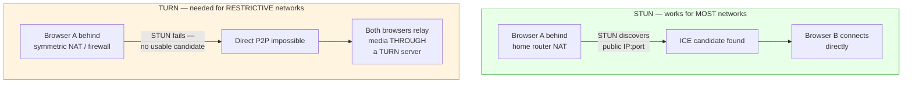
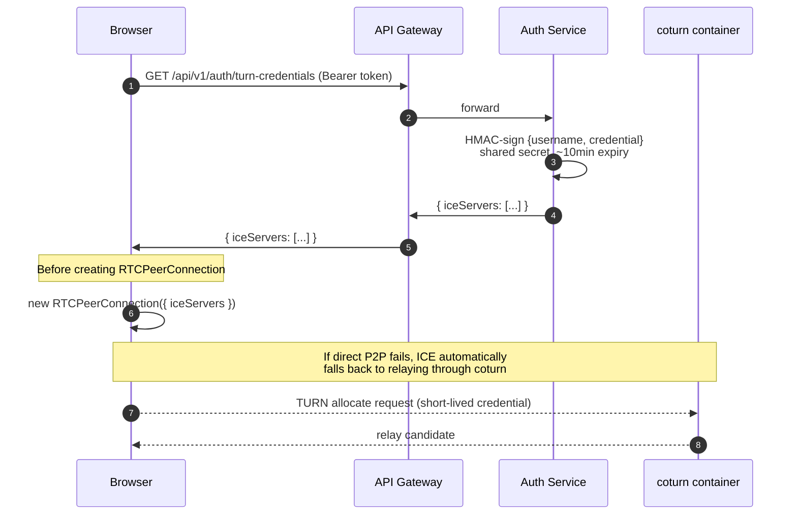
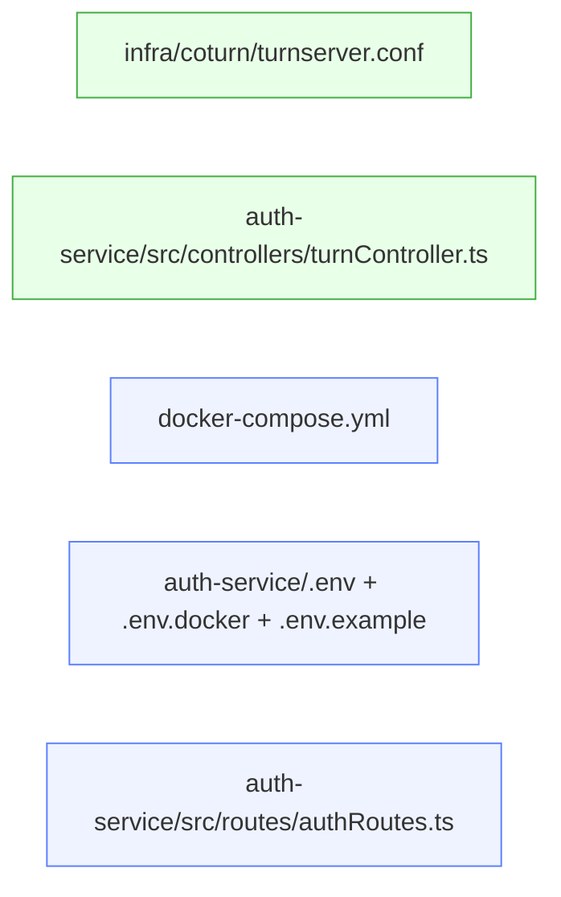
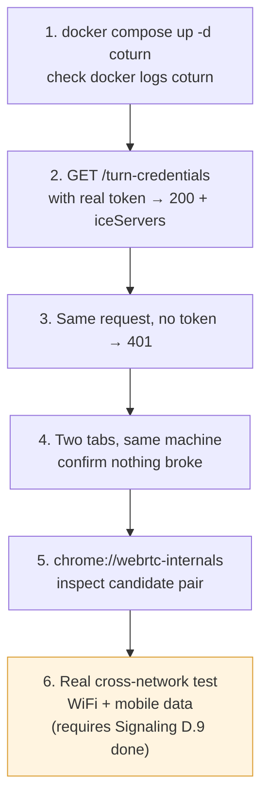

# Video Meet App — Master Status + Phase 7 (TURN/STUN)

> **Stack confirmed across all services:** TypeScript, ES Modules (`"type": "module"`), Express, Prisma (`prisma-client-js` generator, `@prisma/adapter-pg`), PostgreSQL, Redis, Docker (per-service `Dockerfile` + root `docker-compose.yml`).
>
> This file has two parts: **(A)** an accurate roadmap status so nothing gets assumed-done by mistake, and **(B)** Phase 7 — TURN/STUN — rewritten to match your actual TypeScript/ESM pattern (the version you were shown earlier was plain CommonJS JavaScript and does not match your codebase).

---

## Part A — Master Roadmap Status



| Phase | Service           | Status                          | Notes                                                                                                                                                                                                                                                                                                                                       |
| ----- | ----------------- | ------------------------------- | ------------------------------------------------------------------------------------------------------------------------------------------------------------------------------------------------------------------------------------------------------------------------------------------------------------------------------------------- |
| 0     | Skeleton          | ✅ Done                         | All 6 service folders + root`docker-compose.yml` scaffolded                                                                                                                                                                                                                                                                               |
| 1     | API Gateway       | 🟡 In progress                  | `proxyRoutes.ts` has a known bug — `router.use(path, ...)` + `pathFilter` combo strips the path twice, causing 404s on `/api/users/*`. Fix: split `gatewayAuth` into its own `router.use(path, gatewayAuth)` call, mount the proxy separately at root so `pathFilter` sees the full path. **Not yet confirmed fixed.** |
| 2     | Auth Service      | ✅ Done                         | signup/login/refresh/logout/verify-token/me all tested.`onDelete: Cascade` on `RefreshToken → User` applied and migrated.                                                                                                                                                                                                              |
| 3     | User Service      | ✅ Done                         | Redis event pipeline confirmed working (`signup → user-created event → profile auto-created`). GET/PATCH `/me` tested via Postman.                                                                                                                                                                                                    |
| 4     | Room Service      | 🟡 Mostly done                  | Controllers, routes, schema, migration all built and reviewed.**Full Docker build + run test not yet confirmed in this conversation** — `Dockerfile`, `.dockerignore`, and `docker-compose.yml` env_file fix (`.env` → `.env.docker`) need a final check before calling this ✅.                                          |
| 5     | Signaling Service | 🟡 Early stage                  | Only D.1 (folder structure) through D.3 (env files) completed.**D.4 through D.16 still pending** — `env.ts`, `redis.ts`, `roomServiceClient.ts`, `socketAuth.ts`, all three handlers, `socket/index.ts`, `server.ts`, local 2-client test, Dockerfile, compose entry, full Docker test.                                  |
| 6     | Frontend          | ✅ Done (per your confirmation) | Base frontend exists and is wired up.                                                                                                                                                                                                                                                                                                       |
| 7     | TURN/STUN         | 🔴 Not started                  | This is the next phase — see Part B below.                                                                                                                                                                                                                                                                                                 |

**Important gap worth flagging honestly:** Phase 7 (TURN/STUN) is normally only useful once real peer-to-peer video calls are happening end-to-end through Signaling Service — and Signaling Service is only ~20% built. TURN/STUN credentials will generate correctly in isolation (that part can be tested now), but you won't be able to prove the *relay actually works* until Signaling Service's `offer`/`answer`/`ice-candidate` relay (D.9) exists and a real call is attempted. Building Phase 7 now is reasonable — just know Test 6 in Part B (the one that actually matters) has to wait.

---

## Part B — Phase 7: TURN/STUN (TypeScript + ESM Version)

> **Branch:** `phase-7-turn-stun`
> **Touches:** root `docker-compose.yml`, new `infra/coturn/` folder, `auth-service` (new controller + route + env vars)
> **Goal:** calls succeed across two different real networks, not just localhost.

### 1. Why This Phase Exists

Everything that works in local testing works because both sides are on the same machine/network — ICE candidates find each other with zero obstacles. Real users on different WiFi, mobile data, or behind a restrictive firewall will silently fail to connect directly unless a relay fallback exists.



- **STUN** — tells a browser its own public IP/port as seen from outside. Works for most home networks.
- **TURN** — when direct connection can't be established, both browsers relay media *through* a server instead. Slower, uses your server's bandwidth, but it's the only thing that works in restrictive cases.
- **coturn** — the open-source server, added as its own container, that does both STUN and TURN.

---

### 2. Full Flow



**Four pieces, in build order:**

1. `coturn` running as its own container
2. Auth Service — new endpoint that mints short-lived, HMAC-signed credentials (never static — a leaked static credential means free relay bandwidth for anyone)
3. Gateway — once the Phase 1 bug is fixed, confirm this new route rides through the existing `/auth` proxy block with no new code
4. Test client — fetches credentials *before* creating `RTCPeerConnection`

---

### 3. Folder Changes

```
GOOGLE_MEET/
├── infra/                              ← NEW folder
│   └── coturn/                         ← NEW folder
│       └── turnserver.conf             ← NEW file
├── services/
│   └── auth-service/
│       └── src/
│           ├── controllers/
│           │   └── turnController.ts   ← NEW file
│           └── routes/
│               └── authRoutes.ts       ← EDIT (add one route line)
│       ├── .env                        ← EDIT (add TURN_SECRET, TURN_REALM)
│       ├── .env.docker                 ← EDIT (same two vars)
│       └── .env.example                ← EDIT (placeholders)
└── docker-compose.yml                   ← EDIT (add coturn service block)
```



**No new service folder this phase** — unlike Phase 3/4/5, which each got a full `/services/<name>`. This phase only edits `auth-service` (because it already owns JWT/identity logic) and adds one new infra piece.

---

### 4. Step 1 — Create the Branch

```powershell
cd C:\Users\swaru\OneDrive\Desktop\PROJECT\GOOGLE_MEET
git checkout main
git pull
git checkout -b phase-7-turn-stun
```

---

### 5. Step 2 — coturn in `docker-compose.yml`

**Why `network_mode: host`:** coturn needs a wide UDP port range (typically 49152–65535) for actual relayed media. Mapping thousands of individual ports through Docker's normal `ports:` syntax works but adds real overhead per port. `network_mode: host` gives the container direct access to the host's network stack — this is coturn's own documented recommendation for Docker deployments.

Add this block to your existing root `docker-compose.yml`:

```yaml
  coturn:
    image: coturn/coturn:latest
    container_name: coturn
    restart: unless-stopped
    network_mode: host
    volumes:
      - ./infra/coturn/turnserver.conf:/etc/coturn/turnserver.conf
```

**Trade-off to know now:** `network_mode: host` only works cleanly on Linux hosts (including Docker Desktop's Linux VM on Windows, so local dev on your machine is fine). This is not a concern until a much later Kubernetes phase.

**Checkpoint:**

```powershell
docker compose config
```

should run with no syntax errors.

---

### 6. Step 3 — coturn Config File

**Why:** coturn needs to know its own identity (`realm`) and the shared secret it will use to validate HMAC-signed credentials from Auth Service. coturn and Auth Service never talk to each other directly — they both just know the same secret.

```powershell
mkdir infra\coturn
notepad infra\coturn\turnserver.conf
```

```conf
listening-port=3478
fingerprint
lt-cred-mech
use-auth-secret
static-auth-secret=REPLACE_WITH_A_LONG_RANDOM_SECRET
realm=videomeet.local
total-quota=100
stale-nonce=600
no-multicast-peers
```

| Line                                         | What It Does                                                                                                                                        |
| -------------------------------------------- | --------------------------------------------------------------------------------------------------------------------------------------------------- |
| `use-auth-secret` + `static-auth-secret` | Enables the HMAC scheme — coturn doesn't store usernames/passwords, it validates any`username:credential` pair correctly signed with this secret |
| `realm`                                    | Namespace identifier, included in HMAC signing on both sides —**must match** what Auth Service uses                                          |
| `stale-nonce=600`                          | Rejects auth attempts using a nonce older than 10 minutes — replay protection                                                                      |

**Generate the actual secret** (don't leave the placeholder):

```powershell
node -e "console.log(require('crypto').randomBytes(32).toString('hex'))"
```

Paste the output in place of `REPLACE_WITH_A_LONG_RANDOM_SECRET`. Use this exact same value in Step 7.

---

### 7. Step 4 — Auth Service Env Vars

```powershell
cd services\auth-service
notepad .env
```

Add:

```dotenv
TURN_SECRET=<same value generated in Step 3>
TURN_REALM=videomeet.local
```

Repeat in `.env.docker` (same values — this secret doesn't change between local/container, unlike hostnames):

```dotenv
TURN_SECRET=<same value>
TURN_REALM=videomeet.local
```

And in `.env.example` (placeholder, committed to Git):

```dotenv
TURN_SECRET=replace_with_a_long_random_secret
TURN_REALM=videomeet.local
```

Same pattern already used for `JWT_ACCESS_SECRET` across every service — a shared secret both sides know, never transmitted over the network.

**Update `src/config/env.ts`** to export the two new variables:

```typescript
export const TURN_SECRET = process.env.TURN_SECRET as string;
export const TURN_REALM = process.env.TURN_REALM as string;
```

---

### 8. Step 5 — `turnController.ts`

**Why this specific algorithm:** this is coturn's own documented REST API credential scheme. `username` is just an expiry timestamp (plus your `userId`, for traceability); `credential` is an HMAC-SHA1 of that username, base64-encoded. coturn independently recomputes the same HMAC when a client connects — if it matches and the timestamp hasn't passed, access is granted. No credential is ever pre-registered anywhere.

```powershell
notepad src\controllers\turnController.ts
```

```typescript
import { Request, Response, NextFunction } from 'express';
import crypto from 'crypto';
import { TURN_SECRET } from '../config/env.js';
import { successResponse } from '../utils/response.js';
import AppError from '../utils/AppError.js';

/**
 * Generates short-lived TURN credentials (coturn's REST API auth scheme).
 * username = expiry timestamp + userId; credential = HMAC-SHA1(username, sharedSecret)
 */
export const getTurnCredentials = (
    req: Request,
    res: Response,
    next: NextFunction
) => {
    try {
        const ttlSeconds = 600; // 10 minutes
        const expiry = Math.floor(Date.now() / 1000) + ttlSeconds;
        const username = `${expiry}:${req.userId}`;

        const hmac = crypto.createHmac('sha1', TURN_SECRET);
        hmac.update(username);
        const credential = hmac.digest('base64');

        successResponse(res, {
            iceServers: [
                { urls: 'stun:localhost:3478' },
                {
                    urls: 'turn:localhost:3478',
                    username,
                    credential,
                },
            ],
        });
    } catch (err) {
        next(new AppError('Failed to generate TURN credentials', 500));
    }
};
```

**Why `userId` is folded into `username`:** optional per the coturn spec (timestamp alone gives expiry), but it means coturn's own logs can later be traced back to a specific user if you ever need to debug relay abuse.

**Note on `localhost` in the URLs:** correct for local testing only. When you deploy, this becomes your server's real public IP/domain — flag it as a config value to change then, not something to hardcode differently now. You could pull this from an env var (`TURN_SERVER_HOST`) immediately if you want to avoid touching this file again later — optional, not required to make Phase 7 work locally.

---

### 9. Step 6 — Wire the Route

**Why `authGuard`-protected:** anyone with a valid login token can request credentials for themselves, but nobody should mint TURN credentials without being authenticated — otherwise your relay becomes free bandwidth for the entire internet.

```powershell
notepad src\routes\authRoutes.ts
```

Add the import and the route (pattern matches your existing `/me` route exactly):

```typescript
import { getTurnCredentials } from '../controllers/turnController.js';

router.get('/turn-credentials', authGuard, getTurnCredentials);
```

---

### 10. Step 7 — Confirm Gateway Proxy

**This step is blocked until the Phase 1 Gateway bug (Part A above) is fixed.** Once `proxyRoutes.ts` correctly forwards `/auth/*` paths, this new route rides on the exact same proxy block already covering `/auth/logout` and `/auth/me` — **no new gateway code needed.**

**Checkpoint once Gateway is fixed:**

```powershell
curl.exe -H "Authorization: Bearer <a real token>" http://localhost:4000/api/v1/auth/turn-credentials
```

should return the same JSON whether hit through the gateway (`:4000`) or auth-service directly (`:4001`).

---

### 11. Step 8 — Minimal Test (No Frontend Framework Needed)

Since Phase 6 (frontend) already exists, this can either be a small page added there, or — for a fast isolated check — a standalone HTML file that needs no build step at all:

```powershell
notepad test-turn.html
```

```html
<!DOCTYPE html>
<html>
<head><title>TURN/STUN Test</title></head>
<body>
  <button id="fetchBtn">1. Get ICE Servers</button>
  <button id="connectBtn" disabled>2. Create RTCPeerConnection</button>
  <pre id="log"></pre>

  <script>
    const log = (msg) => {
      document.getElementById('log').textContent += msg + '\n';
      console.log(msg);
    };

    let iceServers = null;

    document.getElementById('fetchBtn').onclick = async () => {
      const token = prompt('Paste a valid access token:');
      const res = await fetch('http://localhost:4001/api/v1/auth/turn-credentials', {
        headers: { Authorization: `Bearer ${token}` },
      });
      const json = await res.json();
      iceServers = json.data.iceServers;
      log('iceServers received: ' + JSON.stringify(iceServers, null, 2));
      document.getElementById('connectBtn').disabled = false;
    };

    document.getElementById('connectBtn').onclick = () => {
      const pc = new RTCPeerConnection({ iceServers });
      pc.onicecandidate = (e) => {
        if (e.candidate) log('ICE candidate: ' + e.candidate.candidate);
      };
      pc.onicegatheringstatechange = () => log('Gathering state: ' + pc.iceGatheringState);
      pc.createDataChannel('test'); // forces ICE gathering to start
      pc.createOffer().then((offer) => pc.setLocalDescription(offer));
      log('RTCPeerConnection created — watch for candidates above');
    };
  </script>
</body>
</html>
```

**Note:** points at `:4001` (auth-service direct) so this test works even before the Gateway bug is fixed — switch to `:4000` once Step 10 is confirmed.

Open it directly in a browser — no server needed for this file. It confirms credentials fetch correctly and that ICE gathering produces `host`-type candidates locally (and would produce `relay`-type candidates once tested across real restrictive networks — see Test 6 below).

---

### 12. Testing Plan



| # | Test                              | How                                                       | Expected                                                                                                                    |
| - | --------------------------------- | --------------------------------------------------------- | --------------------------------------------------------------------------------------------------------------------------- |
| 1 | coturn container starts           | `docker compose up -d coturn` → `docker logs coturn` | No fatal errors, listening on port 3478                                                                                     |
| 2 | Credential endpoint works         | `GET /api/v1/auth/turn-credentials` with real token     | `200` with `iceServers` containing both `stun:` and `turn:` entries                                                 |
| 3 | No token → rejected              | Same request, no`Authorization` header                  | `401`                                                                                                                     |
| 4 | Same-network call still works     | Two browser tabs, same machine                            | Still connects — confirms TURN didn't break anything existing                                                              |
| 5 | Forced-relay inspection           | `chrome://webrtc-internals` during the test             | On localhost this likely still shows a direct/host candidate — expected, not a failure                                     |
| 6 | **Real cross-network test** | One device on home WiFi, one on mobile data (WiFi off)    | Call still connects —**this is the actual deliverable, but it needs Signaling Service's relay (D.9) finished first** |

**Why test 6 is the one that actually matters:** tests 1–5 only prove the plumbing is correct — credentials generate, coturn runs, nothing broke. They can't prove the TURN relay *works*, because on localhost a direct connection never fails, so ICE never needs the fallback.

---

### 13. Status Checklist

```
1. Branch: phase-7-turn-stun            [ ]
2. coturn added to docker-compose.yml   [ ]
3. infra/coturn/turnserver.conf         [ ]
4. TURN_SECRET / TURN_REALM env vars    [ ]
5. turnController.ts (TypeScript)       [ ]
6. Route wired in authRoutes.ts         [ ]
7. Gateway proxy confirmed              [ ] ← blocked on Phase 1 bug fix
8. test-turn.html                       [ ]
9. Tests 1–5 (local plumbing)           [ ]
10. Test 6 (real cross-network)         [ ] ← blocked on Signaling D.9
```

**Immediate next action:** Step 2 — add the `coturn` block to `docker-compose.yml`, then Step 3's config file, before touching any application code. The two blockers noted above (Gateway bug, Signaling D.9) don't stop Steps 1–9 from being built and partially tested now — they only stop the final cross-network proof.
