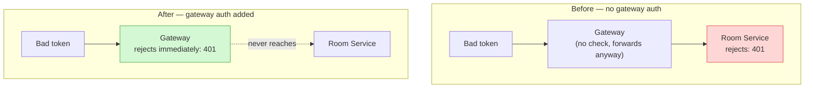

# API Gateway — Adding Authentication & Authorization (Why / How / Code)

> **Scope of this file:** unlike the earlier "remaining work" file (cleanup, testing, Docker), this one is specifically about making the **Gateway itself** verify JWTs and decide which requests are even allowed through — before they ever reach `auth-service`, `user-service`, or `room-service`.
>
> **Note on your existing setup:** every service already has its own copied `authGuard.ts` and verifies tokens independently (a valid "zero trust" pattern). Adding Gateway-level auth **on top of that** is not wasted work — it becomes a first line of defense (reject bad tokens early, before they even hit a backend), while each service's own guard remains the last line of defense. This is a common real-world combination, not an either/or.

---

## Table of Contents

- [1. What Changes, Conceptually](#1-what-changes-conceptually)
- [2. Which Routes Need Auth vs Which Don&#39;t](#2-which-routes-need-auth-vs-which-dont)
- [3. src/middleware/gatewayAuth.ts](#3-srcmiddlewaregatewayauthts)
- [4. Forwarding Identity Downstream](#4-forwarding-identity-downstream)
- [5. Wiring It Into proxyRoutes.ts](#5-wiring-it-into-proxyroutests)
- [6. env.ts Update](#6-envts-update)
- [7. Testing Plan](#7-testing-plan)
- [8. Status Checklist](#8-status-checklist)

---

## 1. What Changes, Conceptually

**Why add this at all, given services already check tokens?** Right now, an invalid or missing token travels all the way from the client, through the Gateway, to (say) Room Service, before Room Service's own `authGuard` finally rejects it with a `401`. That's wasted network hops and wasted backend CPU on a request that was never going to succeed. Gateway-level auth rejects it **immediately**, at the edge, before any backend even sees it.



**What does NOT change:** each service's own `authGuard.ts` stays exactly as it is. This isn't a replacement — a request that passes the Gateway still gets checked again at the service. Removing the service-level guards would mean fully trusting the Gateway and abandoning zero-trust, which is a bigger architectural decision than "add gateway auth" — not part of this file.

---

## 2. Which Routes Need Auth vs Which Don't

**Why this matters:** applying auth blindly to everything breaks signup and login themselves — a user obviously doesn't have a token yet when they're trying to create an account or log in.

| Route (through Gateway)        | Needs a valid token at the Gateway?                         |
| ------------------------------ | ----------------------------------------------------------- |
| `POST /api/auth/signup`      | ❌ No — user has no token yet                              |
| `POST /api/auth/login`       | ❌ No — same reason                                        |
| `POST /api/auth/refresh`     | ❌ No — uses the refresh-token cookie, not an access token |
| `POST /api/auth/logout`      | ✅ Yes (arguably optional, but consistent)                  |
| `GET /api/auth/me`           | ✅ Yes                                                      |
| `GET`/`PATCH /api/users/*` | ✅ Yes — all of User Service                               |
| `POST`/`GET /api/rooms/*`  | ✅ Yes — all of Room Service                               |

**How this is expressed in code:** rather than one blanket rule, the Gateway auth middleware is applied selectively — mounted on `/users` and `/rooms` entirely (every route there needs a token), and only on specific sub-paths of `/auth`.

---

## 3. `src/middleware/gatewayAuth.ts`

**Why a *new* file instead of copying `authGuard.ts` as-is:** the copied `authGuard.ts` in each service attaches `req.userId` and calls Express's `next()` to continue into that service's own routes. The Gateway's version has one extra job the services don't: **forwarding proof of identity downstream** (see Section 4) so a backend doesn't have to re-parse the JWT itself if it doesn't want to (though it still can, and still does, per Section 1).

**How:** create the file.

**Code:**

```typescript
import { Request, Response, NextFunction } from 'express';
import jwt from 'jsonwebtoken';
import { JWT_ACCESS_SECRET } from '../config/env.js';
import AppError from '../utils/AppError.js';

export const gatewayAuth = (req: Request, res: Response, next: NextFunction) => {
  const authHeader = req.headers.authorization;

  if (!authHeader || !authHeader.startsWith('Bearer ')) {
    return next(new AppError('No token provided', 401));
  }

  const token = authHeader.split(' ')[1];

  try {
    const decoded = jwt.verify(token, JWT_ACCESS_SECRET) as { userId: string };
    req.userId = decoded.userId;
    next();
  } catch (err) {
    next(new AppError('Invalid or expired token', 401));
  }
};
```

**Why this needs `JWT_ACCESS_SECRET` at the Gateway too:** the Gateway now needs the exact same secret Auth Service used to sign the token, to verify it independently — the same "must match across services" rule you already follow between Auth, User, and Room's copied guards.

**You'll also need the `types/express/index.d.ts` declaration** (copy from any existing service) so `req.userId` is a recognized property:

```powershell
Copy-Item ..\auth-service\types\express\index.d.ts types\express\index.d.ts
Copy-Item ..\auth-service\src\utils\AppError.ts src\utils\AppError.ts
```

---

## 4. Forwarding Identity Downstream

**Why:** once the Gateway has already verified the token and extracted `userId`, forwarding that as a header lets a backend skip its own JWT verification step if it trusts the Gateway for that specific field — this is optional, not required, but it's the standard way gateways "pass along" what they've already established.

**How:** add one line to `gatewayAuth.ts`, setting a custom header before calling `next()`.

**Code — updated `gatewayAuth.ts`:**

```typescript
export const gatewayAuth = (req: Request, res: Response, next: NextFunction) => {
  const authHeader = req.headers.authorization;

  if (!authHeader || !authHeader.startsWith('Bearer ')) {
    return next(new AppError('No token provided', 401));
  }

  const token = authHeader.split(' ')[1];

  try {
    const decoded = jwt.verify(token, JWT_ACCESS_SECRET) as { userId: string };
    req.userId = decoded.userId;
    req.headers['x-user-id'] = decoded.userId; // forwarded downstream via the proxy
    next();
  } catch (err) {
    next(new AppError('Invalid or expired token', 401));
  }
};
```

**Important — this does NOT replace the `Authorization` header.** The original `Authorization: Bearer <token>` header still passes through the proxy untouched (proxies forward all headers by default), so each backend's own `authGuard` still works exactly as before, independently re-verifying the token. `x-user-id` is purely an **extra, optional convenience** a backend could choose to trust — none of your current backends need to change to use it; this is groundwork, not a requirement.

---

## 5. Wiring It Into `proxyRoutes.ts`

**Why here and not in `app.ts` globally:** applying `gatewayAuth` globally would also block signup/login (Section 2's table). Mounting it per-route-group, right where each proxy is defined, keeps the "which routes need auth" decision visible in one place.

**How:** update `proxyRoutes.ts`, adding `gatewayAuth` before the proxies that need it. For Auth Service, only `logout` and `me` need it, so split that proxy into two `router.use()` calls rather than one blanket rule.

**Code:**

```typescript
import { Router } from 'express';
import { createProxyMiddleware, fixRequestBody } from 'http-proxy-middleware';
import { gatewayAuth } from '../middleware/gatewayAuth.js';
import { AUTH_SERVICE_URL, USER_SERVICE_URL, ROOM_SERVICE_URL } from '../config/env.js';

const router = Router();

// Public — no auth required (signup, login, refresh)
router.use(createProxyMiddleware({
  target: AUTH_SERVICE_URL,
  changeOrigin: true,
  pathFilter: ['/auth/signup', '/auth/login', '/auth/refresh'],
  pathRewrite: { '^/auth': '/api/v1/auth' },
  on: { proxyReq: fixRequestBody },
}));

// Protected — requires a valid token at the Gateway
router.use(
  ['/auth/logout', '/auth/me'],
  gatewayAuth,
  createProxyMiddleware({
    target: AUTH_SERVICE_URL,
    changeOrigin: true,
    pathRewrite: { '^/auth': '/api/v1/auth' },
    on: { proxyReq: fixRequestBody },
  })
);

// User Service — entirely protected
router.use(
  '/users',
  gatewayAuth,
  createProxyMiddleware({
    target: USER_SERVICE_URL,
    changeOrigin: true,
    pathFilter: '/users',
    pathRewrite: { '^/users': '' },
    on: { proxyReq: fixRequestBody },
  })
);

// Room Service — entirely protected
router.use(
  '/rooms',
  gatewayAuth,
  createProxyMiddleware({
    target: ROOM_SERVICE_URL,
    changeOrigin: true,
    pathFilter: '/rooms',
    pathRewrite: { '^/rooms': '/v1/rooms' },
    on: { proxyReq: fixRequestBody },
  })
);

export default router;
```

**Why `pathFilter` is now an array for the public auth block:** `pathFilter` accepts either a single string or an array of exact/glob patterns — using an array here explicitly limits that proxy to just those three sub-paths, so `/auth/logout` and `/auth/me` don't accidentally match this public (no-auth) block instead of the protected one below it. Order matters: Express checks middleware top-to-bottom, so if the public block's filter were too broad, it would catch protected paths before they ever reached the `gatewayAuth`-guarded block.

---

## 6. `env.ts` Update

**Why:** `gatewayAuth.ts` needs `JWT_ACCESS_SECRET`, which the Gateway's `env.ts` doesn't currently export.

**How:** add the line.

**Code — `src/config/env.ts`:**

```typescript
import 'dotenv/config';

export const PORT: string = process.env.PORT || '4000';
export const AUTH_SERVICE_URL: string = process.env.AUTH_SERVICE_URL as string;
export const USER_SERVICE_URL: string = process.env.USER_SERVICE_URL as string;
export const ROOM_SERVICE_URL: string = process.env.ROOM_SERVICE_URL as string;
export const FRONTEND_URL: string = process.env.FRONTEND_URL as string;
export const JWT_ACCESS_SECRET: string = process.env.JWT_ACCESS_SECRET as string;
export const NODE_ENV: string = process.env.NODE_ENV as string;
```

**And add to `.env` / `.env.docker` / `.env.example`:**

```
JWT_ACCESS_SECRET=<exact same value as auth-service, user-service, room-service>
```

---

## 7. Testing Plan

| # | Test                               | Request                                                 | Expected                                                                                     |
| - | ---------------------------------- | ------------------------------------------------------- | -------------------------------------------------------------------------------------------- |
| 1 | Signup still works without a token | `POST /api/auth/signup`                               | `201` — public block, untouched                                                           |
| 2 | Login still works without a token  | `POST /api/auth/login`                                | `200` — public block, untouched                                                           |
| 3 | `/me` with no token              | `GET /api/auth/me` (no header)                        | `401 "No token provided"` — **rejected at the Gateway**, never reaches auth-service |
| 4 | `/me` with a fake token          | `GET /api/auth/me`, `Authorization: Bearer fake123` | `401 "Invalid or expired token"` — rejected at the Gateway                                |
| 5 | `/me` with a real token          | `GET /api/auth/me`, real `Bearer` token             | `200` — passes Gateway, then passes auth-service's own `authGuard` too                  |
| 6 | Rooms with no token                | `POST /api/rooms` (no header)                         | `401` at the Gateway — room-service logs show **no request ever arrived**           |
| 7 | Users with no token                | `GET /api/users/me` (no header)                       | `401` at the Gateway                                                                       |

**How to confirm test 6/7 are actually being blocked at the Gateway (not just returning 401 from the backend as before):** check `docker logs room-service` / `docker logs user-service` right after sending an unauthenticated request — if gateway-level auth is working, **no log entry appears at all** for that request, because it never left the Gateway.

---

## 8. Status Checklist

```
1. gatewayAuth.ts created                    [░░░░░░░░░░]  0%
2. types/express + AppError copied           [░░░░░░░░░░]  0%
3. x-user-id header forwarding added         [░░░░░░░░░░]  0%
4. proxyRoutes.ts split into public/protected [░░░░░░░░░░]  0%
5. env.ts + env files updated with secret    [░░░░░░░░░░]  0%
6. Test 1–2 (public routes still work)       [░░░░░░░░░░]  0%
7. Test 3–5 (auth route protection)          [░░░░░░░░░░]  0%
8. Test 6–7 (users/rooms protection)         [░░░░░░░░░░]  0%
9. Confirm backend logs show zero requests   [░░░░░░░░░░]  0%
   for rejected calls (proves Gateway-level
   blocking, not just backend-level)
```

**Immediate next action:** Section 3 — create `gatewayAuth.ts`, then Section 5's split `proxyRoutes.ts`, then run the Section 7 tests in orde

# API Gateway — Remaining Work (Why / How / Code)

> **Status:** Core proxy logic works — `/api/auth/*` correctly rewrites and forwards to `auth-service`, with the `fixRequestBody` fix applied so POST bodies actually arrive intact. This file covers what's left before the Gateway is genuinely done: cleanup, testing the other two services, and packaging (Dockerfile, compose, docs).

---

## Table of Contents

- [1. Clean Up Debug Code](#1-clean-up-debug-code)
- [2. Verify /users and /rooms Proxies](#2-verify-users-and-rooms-proxies)
- [3. Add a Health Route to Room Service (if missing)](#3-add-a-health-route-to-room-service-if-missing)
- [4. Full Signup → Login → Room Flow, Through the Gateway Only](#4-full-signup--login--room-flow-through-the-gateway-only)
- [5. Dockerfile + .dockerignore](#5-dockerfile--dockerignore)
- [6. docker-compose.yml Entry](#6-docker-composeyml-entry)
- [7. Full Docker Test](#7-full-docker-test)
- [8. README Update](#8-readme-update)
- [9. Status Checklist](#9-status-checklist)

---

## 1. Clean Up Debug Code

**Why:** the temporary path-logging middleware in `app.ts` was only there to diagnose the routing bug — it has no place in code that's about to be committed. Leaving debug `console.log` calls in is exactly the kind of thing that quietly ships to production and clutters real logs later.

**How:** open `src/app.ts`, remove the debug block.

**Code — remove this:**

```typescript
app.use('/api', (req, res, next) => {
  console.log('GATEWAY RECEIVED PATH:', req.path);
  next();
});
```

**`src/app.ts` should now read:**

```typescript
import express from 'express';
import cors from 'cors';
import helmet from 'helmet';
import pinoHttp from 'pino-http';
import proxyRoutes from './routes/proxyRoutes.js';
import { errorHandler } from './middleware/errorHandler.js';
import { FRONTEND_URL } from './config/env.js';
import logger from './utils/logger.js';

const app = express();

app.use(helmet());
app.use(cors({ origin: FRONTEND_URL, credentials: true }));
app.use(pinoHttp({ logger }));

app.get('/health', (req, res) => res.json({ status: 'ok', service: 'api-gateway' }));

app.use('/api', proxyRoutes);

app.use(errorHandler);

export default app;
```

**Confirm `proxyRoutes.ts` has `fixRequestBody` on all three proxies** (not just auth — this was the actual bug fix, and it applies to every proxy that forwards a body, i.e. all three):

```typescript
import { Router } from 'express';
import { createProxyMiddleware, fixRequestBody } from 'http-proxy-middleware';
import { AUTH_SERVICE_URL, USER_SERVICE_URL, ROOM_SERVICE_URL } from '../config/env.js';

const router = Router();

router.use(createProxyMiddleware({
  target: AUTH_SERVICE_URL,
  changeOrigin: true,
  pathFilter: '/auth',
  pathRewrite: { '^/auth': '/api/v1/auth' },
  on: { proxyReq: fixRequestBody },
}));

router.use(createProxyMiddleware({
  target: USER_SERVICE_URL,
  changeOrigin: true,
  pathFilter: '/users',
  pathRewrite: { '^/users': '' },
  on: { proxyReq: fixRequestBody },
}));

router.use(createProxyMiddleware({
  target: ROOM_SERVICE_URL,
  changeOrigin: true,
  pathFilter: '/rooms',
  pathRewrite: { '^/rooms': '/v1/rooms' },
  on: { proxyReq: fixRequestBody },
}));

export default router;
```

---

## 2. Verify `/users` and `/rooms` Proxies

**Why:** only `/auth` has actually been proven end-to-end so far (signup was the one that surfaced the `fixRequestBody` bug). `/users` and `/rooms` use the exact same proxy mechanism, so the same class of bug could exist there too if anything about their config drifted — better to prove it now than discover it later.

**How:** start `user-service` and `room-service` locally (`npm run dev` in each), alongside the Gateway. Then run these through Postman:

**Code — test 1, User Service via Gateway (needs a real access token from login first):**

```
GET http://localhost:4000/api/users/me
Authorization: Bearer <accessToken>
```

Expected: `200` with the profile — same as hitting `localhost:4002/me` directly.

**Code — test 2, Room Service via Gateway:**

```
POST http://localhost:4000/api/rooms
Authorization: Bearer <accessToken>
Content-Type: application/json

{ "title": "Gateway Test Room" }
```

Expected: `201` with `{ room: { code, ... } }` — same as hitting `localhost:4003/rooms` directly. This specifically confirms the `/rooms` → `/v1/rooms` rewrite (the fix from your earlier catch) actually works.

**Checkpoint:** if either of these 404s or drops the body, apply the same diagnostic approach used for `/auth` — check `docker logs`/terminal output for the target service, confirm the rewritten path matches that service's real route.

---

## 3. Add a Health Route to Room Service (if missing)

**Why:** `room-service`'s `app.ts` already has a `/health` route, but it's mounted at the root level, *not* under `/v1`. This means `GET /api/rooms/health` through the Gateway would get rewritten to `/v1/rooms/health` — which doesn't exist, since `/health` lives outside the `/v1` router entirely. This isn't a bug in the Gateway; it's a real gap in what's proxyable for health checks specifically.

**How:** this is optional and only matters if you want a working `/api/rooms/health` through the Gateway for monitoring purposes later (Phase 13, Observability). For now, direct health checks (`http://localhost:4003/health`) remain the correct way to check Room Service — no code change is required unless you want this specific path to work through the Gateway too.

**Code (only if you decide you want it):** in `room-service/src/app.ts`, nothing changes — the fix would actually live in the Gateway's `pathRewrite`, special-casing `/rooms/health`. Given the added complexity for a rarely-hit path, **skip this for now** — flagged here only so it's a known, deliberate gap rather than a surprise later.

---

## 4. Full Signup → Login → Room Flow, Through the Gateway Only

**Why:** every test up to this point has been one request at a time. The real proof the Gateway works is a full realistic sequence — signup, login, create a room, join it — using **only** `localhost:4000`, never touching `4001`/`4002`/`4003` directly. This is the actual behavior a frontend will rely on.

**How:** run this sequence in Postman, in order, updating the token between steps.

**Code — the sequence:**

```
1. POST http://localhost:4000/api/auth/signup
   { "email": "gatewaytest@example.com", "password": "test1234" }

2. POST http://localhost:4000/api/auth/login
   { "email": "gatewaytest@example.com", "password": "test1234" }
   → copy accessToken

3. GET  http://localhost:4000/api/users/me
   Authorization: Bearer <accessToken>

4. POST http://localhost:4000/api/rooms
   Authorization: Bearer <accessToken>
   { "title": "End-to-end Gateway Test" }
   → copy the room's code

5. GET  http://localhost:4000/api/rooms/<code>
   Authorization: Bearer <accessToken>
```

**Checkpoint:** all five succeed with the same status codes/response shapes you'd get hitting each service directly — this is the point where the Gateway is functionally proven, not just individually-tested.

---

## 5. Dockerfile + `.dockerignore`

**Why:** the Gateway has no database and no Prisma dependency — this Dockerfile is intentionally the shortest of the four services.

**How:** create both files in `services/api-gateway/`.

**Code — `Dockerfile`:**

```dockerfile
FROM node:20-alpine
WORKDIR /app
COPY package*.json ./
RUN npm install
COPY tsconfig.json ./
COPY src ./src
COPY server.ts ./
RUN npm run build
EXPOSE 4000
CMD ["node", "dist/server.js"]
```

**Code — `.dockerignore`:**

```
node_modules
.env
.env.docker
dist
.git
md
```

---

## 6. `docker-compose.yml` Entry

**Why:** the root compose file already has a placeholder `api-gateway` block from Phase 0 — it needs `env_file` pointed at `.env.docker`, the exact mistake already caught and fixed in Phase 3 and Phase 4, so it's worth double-checking here too rather than assuming it's already right.

**How:** open the root `docker-compose.yml`, confirm/update the block.

**Code:**

```yaml
api-gateway:
  build: ./services/api-gateway
  container_name: api-gateway
  ports:
    - "4000:4000"
  env_file:
    - ./services/api-gateway/.env.docker
  depends_on:
    - auth-service
    - user-service
    - room-service
```

**Also confirm `.env.docker` exists and uses container names, not `localhost`:**

```
PORT=4000
AUTH_SERVICE_URL=http://auth-service:4001
USER_SERVICE_URL=http://user-service:4002
ROOM_SERVICE_URL=http://room-service:4003
FRONTEND_URL=http://localhost:3000
NODE_ENV=production
```

---

## 7. Full Docker Test

**Why:** everything so far has been tested with the Gateway running locally (`npm run dev`) while talking to other services either locally or in Docker. The final proof is the Gateway **itself** running inside Docker, resolving the other three services purely by container name — this is how it will actually run in the full stack.

**How:**

```powershell
docker compose build api-gateway
docker compose up -d api-gateway auth-service user-service room-service postgres redis
docker logs api-gateway
```

Expected: `API Gateway running on port 4000`, no `ECONNREFUSED`.

**Code — re-run Section 4's full sequence**, this time with everything running as containers, still hitting only `http://localhost:4000`.

**Extra Docker-specific check** — confirm the Gateway container can actually resolve another container by name (not just that it boots):

```powershell
docker exec -it api-gateway wget -qO- http://auth-service:4001/health
```

If this returns a response, `.env.docker` and Docker's internal networking are both genuinely working, not just present in a file.

---

## 8. README Update

**Why:** the Gateway is the entry point a frontend developer (including future-you) will read about first — it deserves an accurate description of what it actually proxies to, since that's non-obvious from the code alone (the `pathRewrite` rules aren't self-documenting to someone reading routes for the first time).

**How:** update `services/api-gateway/README.md` with:

- What the Gateway does (single entry point, path-based routing)
- The three proxy mappings, in a table: client path → real service path
- How to run it (`docker compose up -d api-gateway` vs. `npm run dev` for local)
- Required env vars (from `.env.example`)
- The one deliberate exception: Signaling Service is **not** proxied — the frontend connects to it directly on port 4004

**Code — suggested table for the README:**

```markdown
| Client calls              | Forwards to (real route)         |
|----------------------------|-----------------------------------|
| `/api/auth/*`              | `auth-service:4001/api/v1/auth/*` |
| `/api/users/*`             | `user-service:4002/*`             |
| `/api/rooms/*`             | `room-service:4003/v1/rooms/*`    |
| *(not proxied)*            | `signaling-service:4004` — client connects directly via WebSocket |
```

---

## 9. Status Checklist

```
1. Remove debug logging              [░░░░░░░░░░]  0%
2. Verify /users proxy               [░░░░░░░░░░]  0%
   Verify /rooms proxy               [░░░░░░░░░░]  0%
3. Room Service /health gap noted    [░░░░░░░░░░]  0%  (decision: skip for now)
4. Full signup→login→room sequence   [░░░░░░░░░░]  0%
5. Dockerfile + .dockerignore        [░░░░░░░░░░]  0%
6. docker-compose.yml entry          [░░░░░░░░░░]  0%
7. Full Docker test                  [░░░░░░░░░░]  0%
8. README update                     [░░░░░░░░░░]  0%
```

**Immediate next action:** Section 1 — remove the debug middleware and confirm `fixRequestBody` is applied to all three proxies, then move straight into Section 2's `/users` and `/rooms` tests.
