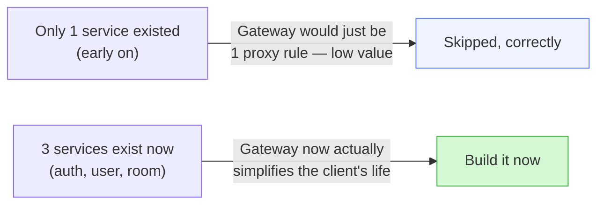
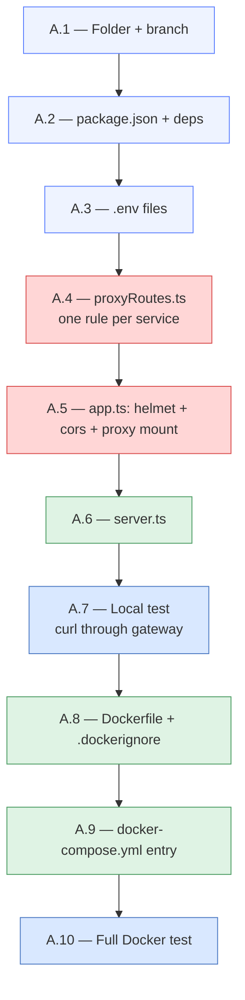
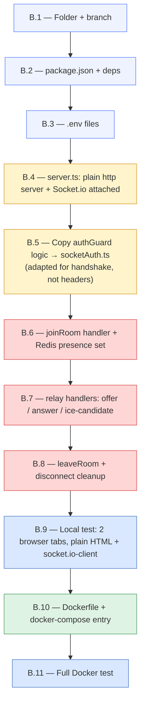
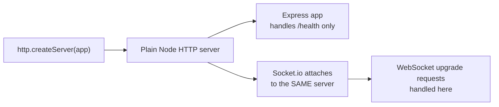

# Video Meet App — Next Steps: API Gateway → Signaling Service

> **Where you are:** Auth ✅, User ✅, Room ✅ — all built, tested, Dockerized, running on ports 4001/4002/4003. Three real services now exist, which is exactly the point the original plan flagged as "build the Gateway now, not before" (a gateway proxying to one backend isn't informative to build in isolation — with three, it actually earns its place).
>
> **This file covers two things:** (A) building the **API Gateway** now, and (B) the **Signaling Service** right after — the "first real call" phase. Frontend (Phase 6) is noted as **Next.js** instead of plain React/Vite, for when you get there.

---

## Table of Contents

- [1. Why Gateway Now](#1-why-gateway-now)
- [2. Part A — API Gateway](#2-part-a--api-gateway)
- [3. Part B — Signaling Service](#3-part-b--signaling-service)
- [4. Note on Frontend — Next.js Instead of Plain React](#4-note-on-frontend--nextjs-instead-of-plain-react)
- [5. Roadmap Position](#5-roadmap-position)

---

## 1. Why Gateway Now



Right now, a frontend would need to know three different ports (`4001`, `4002`, `4003`) and CORS-configure against all three. The Gateway collapses that into **one address** (`localhost:4000`) with path-based routing — the client only ever needs to know `/api/auth/*`, `/api/users/*`, `/api/rooms/*`.

---

## 2. Part A — API Gateway



### A.1 — Folder + branch

```powershell
cd C:\Users\swaru\OneDrive\Desktop\PROJECT\GOOGLE_MEET
git checkout main
git checkout -b phase-1-api-gateway
cd services\api-gateway
mkdir src, src\routes
```

### A.2 — `package.json` + dependencies

```powershell
npm init -y
npm install express http-proxy-middleware cors helmet dotenv pino pino-http
npm install --save-dev typescript tsx @types/node @types/express @types/cors pino-pretty
```

**No Prisma, no database** — the Gateway holds no data of its own, it only routes traffic. This is the simplest service in the whole stack.

Set `"type": "module"` and the usual `scripts` block (`dev`, `build`, `start`) in `package.json`.

### A.3 — Environment files

`.env` (local dev — targets services on `localhost`):

```
PORT=4000
AUTH_SERVICE_URL=http://localhost:4001
USER_SERVICE_URL=http://localhost:4002
ROOM_SERVICE_URL=http://localhost:4003
FRONTEND_URL=http://localhost:3000
NODE_ENV=development
```

`.env.docker` (targets services by their Docker container names):

```
PORT=4000
AUTH_SERVICE_URL=http://auth-service:4001
USER_SERVICE_URL=http://user-service:4002
ROOM_SERVICE_URL=http://room-service:4003
FRONTEND_URL=http://localhost:3000
NODE_ENV=production
```

`.env.example` — same shape, placeholder-safe (these aren't secrets, but keep the pattern consistent with the other services).

**This is the exact `localhost` vs. service-name mistake caught twice already in Phase 3/4 — the Gateway is where it matters *most*, since it talks to three services at once.**

### A.4 — `src/routes/proxyRoutes.ts`

```typescript
import { Router } from 'express';
import { createProxyMiddleware } from 'http-proxy-middleware';
import { AUTH_SERVICE_URL, USER_SERVICE_URL, ROOM_SERVICE_URL } from '../config/env.js';

const router = Router();

router.use('/auth', createProxyMiddleware({
  target: AUTH_SERVICE_URL,
  changeOrigin: true,
  pathRewrite: { '^/auth': '/api/v1/auth' },
}));

router.use('/users', createProxyMiddleware({
  target: USER_SERVICE_URL,
  changeOrigin: true,
  pathRewrite: { '^/users': '' },
}));

router.use('/rooms', createProxyMiddleware({
  target: ROOM_SERVICE_URL,
  changeOrigin: true,
  pathRewrite: { '^/rooms': '/rooms' },
}));

export default router;
```

**Why `pathRewrite` differs per service:** Auth Service's real routes live under `/api/v1/auth/*` (from your versioning work), while Room Service's routes are flat (`/rooms/*`, no version prefix yet), and User Service's are flat too (`/me`). The Gateway's job is to present **one consistent shape** (`/api/auth/*`, `/api/users/*`, `/api/rooms/*`) to the client regardless of how each backend happens to be internally structured — this is one of the real benefits of having a gateway at all.

**Also add `src/config/env.ts`** — same centralized-export pattern as every other service.

### A.5 — `src/app.ts`

```typescript
import express from 'express';
import cors from 'cors';
import helmet from 'helmet';
import pinoHttp from 'pino-http';
import proxyRoutes from './routes/proxyRoutes.js';
import { FRONTEND_URL } from './config/env.js';
import logger from './utils/logger.js';

const app = express();

app.use(helmet());
app.use(cors({ origin: FRONTEND_URL, credentials: true }));
app.use(pinoHttp({ logger }));

app.get('/health', (req, res) => res.json({ status: 'ok', service: 'api-gateway' }));

app.use('/api', proxyRoutes);

export default app;
```

**Two details worth understanding:**

- **No `express.json()` here.** The Gateway doesn't parse the body — it forwards the raw request to the target service, which parses it itself. Adding `express.json()` before a proxy can actually break `http-proxy-middleware` (it consumes the request stream before the proxy can forward it).
- **`credentials: true` in `cors`** — needed because Login sets an `httpOnly` refresh-token cookie; without this, the browser won't send/receive that cookie through cross-origin requests once the frontend is on a different port (`3000`) than the Gateway (`4000`).

**Copy `logger.ts`** from auth-service (same pattern, no changes needed).

### A.6 — `server.ts`

```typescript
import app from './src/app.js';
import { PORT } from './src/config/env.js';
import logger from './src/utils/logger.js';

app.listen(PORT, () => logger.info(`API Gateway running on port ${PORT}`));
```

### A.7 — Local test (before Docker)

Make sure auth/user/room services are running locally (`npm run dev` in each), then:

```powershell
npx tsc --noEmit
npm run dev
```

```powershell
curl http://localhost:4000/api/auth/health
curl http://localhost:4000/api/users/health   # if user-service has a /health route
curl http://localhost:4000/api/rooms/health   # if room-service has one — add if missing
```

**Checkpoint:** each proxied `/health` returns that service's own response, through port `4000` — not `4001`/`4002`/`4003` directly.

Then re-test a couple of real flows through the Gateway instead of hitting the services directly:

```
POST http://localhost:4000/api/auth/signup
POST http://localhost:4000/api/auth/login
POST http://localhost:4000/api/rooms   (with Bearer token from the login above)
```

### A.8 — Dockerfile + `.dockerignore`

```dockerfile
FROM node:20-alpine
WORKDIR /app
COPY package*.json ./
RUN npm install
COPY tsconfig.json ./
COPY src ./src
COPY server.ts ./
RUN npm run build
EXPOSE 4000
CMD ["node", "dist/server.js"]
```

**No `prisma generate` step here** — the Gateway has no database, so no Prisma at all. This Dockerfile is noticeably shorter than the other three.

`.dockerignore` — same content pattern as the other services.

### A.9 — `docker-compose.yml`

Your root file already has this placeholder — confirm the `env_file` points to `.env.docker`:

```yaml
api-gateway:
  build: ./services/api-gateway
  container_name: api-gateway
  ports:
    - "4000:4000"
  env_file:
    - ./services/api-gateway/.env.docker
  depends_on:
    - auth-service
    - user-service
    - room-service
```

### A.10 — Full Docker test

```powershell
docker compose build api-gateway
docker compose up -d api-gateway
docker logs api-gateway
```

Re-run the A.7 curl/Postman tests against `http://localhost:4000` — everything should behave identically to hitting the services directly, just through one address now.

---

## 3. Part B — Signaling Service

**Goal:** two browsers, connected via WebSocket (not through the Gateway), can find each other in a room and exchange WebRTC connection info (offer/answer/ICE candidates). This is the piece that makes an actual call possible — everything before this was account/room bookkeeping.

**New concepts:** Socket.io, WebRTC signaling vocabulary, Redis for ephemeral room presence (no Postgres here at all).



### B.1 — Folder + branch

```powershell
git checkout main
git checkout -b phase-5-signaling-service
cd services\signaling-service
mkdir src, src\config, src\handlers, src\middleware, src\utils
```

**Note:** no `prisma/`, no `types/express/` — this service never touches Postgres and never uses Express's `Request`/`Response` for its core job (Socket.io has its own types).

### B.2 — `package.json` + dependencies

```powershell
npm init -y
npm install express socket.io ioredis jsonwebtoken dotenv pino pino-http
npm install --save-dev typescript tsx @types/node @types/express @types/jsonwebtoken pino-pretty
```

**Why `express` is still here at all:** Socket.io needs an underlying HTTP server to attach to — a minimal Express app (just a `/health` route) provides that, even though almost nothing else in this service is a normal REST route.

### B.3 — Environment files

```
PORT=4004
JWT_ACCESS_SECRET=<exact same value as auth-service>
REDIS_URL=redis://localhost:6379          (.env — local)
REDIS_URL=redis://redis:6379              (.env.docker — container)
NODE_ENV=development
```

**No `DATABASE_URL` at all** — this is the first service in the whole project with zero Postgres/Mongo dependency, by design (per the original architecture doc: "Signaling Service → Redis only, no persistent DB — presence is ephemeral by definition").

### B.4 — `server.ts` — Socket.io attaches to a plain HTTP server, not Express directly



```typescript
import http from 'http';
import { Server } from 'socket.io';
import app from './src/app.js';
import { PORT } from './src/config/env.js';
import { socketAuth } from './src/middleware/socketAuth.js';
import { registerHandlers } from './src/handlers/index.js';
import logger from './src/utils/logger.js';

const httpServer = http.createServer(app);
const io = new Server(httpServer, { cors: { origin: '*' } });

io.use(socketAuth);

io.on('connection', (socket) => {
  logger.info(`Socket connected: ${socket.id}, userId: ${socket.data.userId}`);
  registerHandlers(io, socket);
});

httpServer.listen(PORT, () => logger.info(`Signaling Service running on port ${PORT}`));
```

**Key idea to understand:** `io.use(socketAuth)` runs **once, at connection time** (like an Express middleware, but for the WebSocket handshake) — it's not re-checked on every single event afterward. If the token is valid at connect time, the socket stays authenticated for its whole lifetime (until disconnect).

### B.5 — `src/middleware/socketAuth.ts`

```typescript
import { Socket } from 'socket.io';
import jwt from 'jsonwebtoken';
import { JWT_ACCESS_SECRET } from '../config/env.js';

export const socketAuth = (socket: Socket, next: (err?: Error) => void) => {
  const token = socket.handshake.auth?.token;

  if (!token) {
    return next(new Error('No token provided'));
  }

  try {
    const decoded = jwt.verify(token, JWT_ACCESS_SECRET) as { userId: string };
    socket.data.userId = decoded.userId;
    next();
  } catch (err) {
    next(new Error('Invalid or expired token'));
  }
};
```

**Difference from `authGuard.ts`:** in Express, the token comes from an HTTP header (`Authorization: Bearer ...`) and you call `next()` to continue the request pipeline. In Socket.io, the token comes from `socket.handshake.auth.token` (the client sends it once, at connection time, not per-message), and `next(err)` either allows or rejects the *entire socket connection* — there's no per-event re-authentication step after that.

### B.6 — `src/handlers/joinRoom.ts` — Redis presence

```typescript
import { Server, Socket } from 'socket.io';
import redis from '../config/redis.js';

export const handleJoinRoom = (io: Server, socket: Socket) => {
  socket.on('join-room', async ({ roomId }: { roomId: string }) => {
    socket.join(roomId);
    await redis.sadd(`room:${roomId}:members`, socket.id);

    socket.to(roomId).emit('peer-joined', { peerId: socket.id, userId: socket.data.userId });
  });
};
```

**Why Redis, not just an in-memory JavaScript object:** if you ever run more than one instance of this service (Phase 15/16, Kubernetes autoscaling), an in-memory set only knows about sockets connected to *that one instance*. Redis is shared state every instance can read — this is the exact groundwork the original plan called out ("presence stored in Redis... is what makes scaling possible later without a rewrite").

### B.7 — `src/handlers/relay.ts` — pure forwarding, no logic

```typescript
import { Server, Socket } from 'socket.io';

export const handleRelay = (io: Server, socket: Socket) => {
  socket.on('offer', ({ to, sdp }) => {
    io.to(to).emit('offer', { from: socket.id, sdp });
  });

  socket.on('answer', ({ to, sdp }) => {
    io.to(to).emit('answer', { from: socket.id, sdp });
  });

  socket.on('ice-candidate', ({ to, candidate }) => {
    io.to(to).emit('ice-candidate', { from: socket.id, candidate });
  });
};
```

**This is the whole point of "signaling" as a concept** — the service never looks inside `sdp` or `candidate`, never stores them, never validates their contents. It just relays opaque WebRTC connection data between two specific sockets so the browsers can set up a **direct** peer-to-peer media connection afterward.

### B.8 — `src/handlers/leaveRoom.ts` + disconnect cleanup

```typescript
import { Server, Socket } from 'socket.io';
import redis from '../config/redis.js';

export const handleLeaveRoom = (io: Server, socket: Socket) => {
  const cleanup = async (roomId: string) => {
    await redis.srem(`room:${roomId}:members`, socket.id);
    socket.to(roomId).emit('peer-left', { peerId: socket.id });
  };

  socket.on('leave-room', ({ roomId }) => cleanup(roomId));

  socket.on('disconnect', async () => {
    const rooms = [...socket.rooms].filter((r) => r !== socket.id);
    for (const roomId of rooms) await cleanup(roomId);
  });
};
```

**Why handle `disconnect` separately from `leave-room`:** a user might close the browser tab, lose network, or crash — there's no guarantee `leave-room` is ever explicitly sent. `disconnect` fires automatically from Socket.io itself whenever the underlying connection drops, for any reason — this is your safety net so Redis never accumulates "ghost" members.

**`src/handlers/index.ts`** ties these together:

```typescript
import { Server, Socket } from 'socket.io';
import { handleJoinRoom } from './joinRoom.js';
import { handleRelay } from './relay.js';
import { handleLeaveRoom } from './leaveRoom.js';

export const registerHandlers = (io: Server, socket: Socket) => {
  handleJoinRoom(io, socket);
  handleRelay(io, socket);
  handleLeaveRoom(io, socket);
};
```

### B.9 — Local test with two browser tabs

No frontend exists yet, so test with a minimal static HTML page (or directly in two browser devtools consoles) using `socket.io-client`:

```html
<script src="https://cdn.socket.io/4.7.5/socket.io.min.js"></script>
<script>
  const socket = io('http://localhost:4004', { auth: { token: 'PASTE_REAL_ACCESS_TOKEN' } });
  socket.on('connect', () => console.log('connected', socket.id));
  socket.emit('join-room', { roomId: 'test-room-1' });
  socket.on('peer-joined', (data) => console.log('peer joined', data));
  socket.on('offer', (data) => console.log('offer received', data));
</script>
```

Open this in **two separate tabs**, using **two different real access tokens** (login twice, or use two test users) and the **same `roomId`**. Tab A should log `peer-joined` when Tab B joins.

**Checkpoint:** manually `socket.emit('offer', { to: '<other socket id from console>', sdp: 'fake-sdp-data' })` from one tab, confirm the other tab's console logs `offer received`.

### B.10 — Dockerfile

```dockerfile
FROM node:20-alpine
WORKDIR /app
COPY package*.json ./
RUN npm install
COPY tsconfig.json ./
COPY src ./src
COPY server.ts ./
RUN npm run build
EXPOSE 4004
CMD ["node", "dist/server.js"]
```

Add to `docker-compose.yml` (placeholder already exists — confirm `env_file: .env.docker` and `depends_on: redis`).

### B.11 — Full Docker test

```powershell
docker compose build signaling-service
docker compose up -d signaling-service
docker logs signaling-service
```

Re-run B.9's two-tab test, pointing at the Dockerized instance (same `localhost:4004`, since the port is published).

---

## 4. Note on Frontend — Next.js Instead of Plain React

The original plan's Phase 6 assumed a plain Vite/CRA React app. Since you're using **Next.js**, a few things change when you get there (noted here now so it's not a surprise later):

| Original plan said                                                | Next.js equivalent                                                                                                                                                                                                                                                    |
| ----------------------------------------------------------------- | --------------------------------------------------------------------------------------------------------------------------------------------------------------------------------------------------------------------------------------------------------------------- |
| `create-react-app` / Vite                                       | `npx create-next-app@latest`                                                                                                                                                                                                                                        |
| `/src/pages/SignupPage.jsx` (React Router route)                | `app/signup/page.tsx` (App Router file-based routing — no React Router needed)                                                                                                                                                                                     |
| Axios instance calling the Gateway                                | Same idea, but be deliberate about**Server Components vs Client Components** — anything using `useState`, `useEffect`, or browser-only APIs (`getUserMedia`, `RTCPeerConnection`, `socket.io-client`) needs `"use client"` at the top of that file |
| Store access token in React context                               | Same principle, but Next.js's SSR means you can't rely on`window`/`localStorage` existing during server render — guard those calls, or keep them strictly inside client components                                                                               |
| `getUserMedia()` / `RTCPeerConnection` / `socket.io-client` | All**browser-only APIs** — these must live inside a `"use client"` component; they will throw or silently fail if Next.js tries to run them during server-side rendering                                                                                     |

**Nothing about the backend plan changes** — the Gateway and Signaling Service don't know or care what frontend framework calls them. This is purely a frontend implementation detail to keep in mind when Phase 6 actually starts.

---

## 5. Roadmap Position

```mermaid
flowchart LR
    P0["Phase 0<br/>Skeleton ✅"] --> P1["Phase 1<br/>Gateway ← NOW"]
    P1 --> P2["Phase 2<br/>Auth ✅"]
    P2 --> P3["Phase 3<br/>User ✅"]
    P3 --> P4["Phase 4<br/>Room ✅"]
    P4 --> P5["Phase 5<br/>Signaling ← NEXT"]
    P5 --> P6["Phase 6<br/>Frontend (Next.js)"]
    P6 --> P7["Phase 7<br/>TURN/STUN"]

    style P0 fill:#d4f7d4,stroke:#3fae3f
    style P2 fill:#d4f7d4,stroke:#3fae3f
    style P3 fill:#d4f7d4,stroke:#3fae3f
    style P4 fill:#d4f7d4,stroke:#3fae3f
    style P1 fill:#ffd6d6,stroke:#d94a4a
    style P5 fill:#fff4cc,stroke:#d99a2b
    style P6 fill:#eef3ff,stroke:#5b7fff
    style P7 fill:#eef3ff,stroke:#5b7fff
```



**Immediate next action:** A.1 — create the `phase-1-api-gateway` branch and folder structure, work straight down Part A, then move into Part B (Signaling) once the Gateway is tested and merged.
