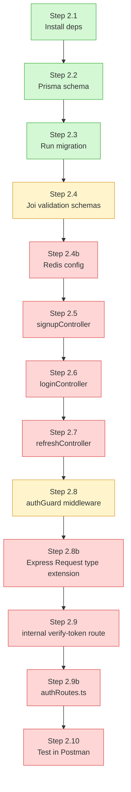

# Auth Service — Progress Tracker (Updated)

> Phase 2 of the Video Meet App build. Branch: `phase-0-auth-service`. Tracks what's done, what's pending, exact file locations, and what to expect while writing each pending file.

---

## 1. Complete Project Structure (including files not yet created)

```
auth-service/
├── prisma/
│   ├── migrations/
│   │   └── 20260815055056_init/
│   │       └── migration.sql
│   └── schema.prisma
├── generated/
│   └── prisma/              (auto-generated, gitignored)
├── src/
│   ├── config/
│   │   ├── db.ts             ✅ Done
│   │   ├── env.ts            ✅ Done
│   │   └── redis.ts          🔴 MISSING — needed for signup's publish call
│   ├── controllers/
│   │   ├── signupController.ts    🔴 Pending
│   │   ├── loginController.ts     🔴 Pending
│   │   └── refreshController.ts   🔴 Pending
│   ├── middleware/
│   │   ├── authGuard.ts      🟡 Verify
│   │   ├── errorHandler.ts   ✅ Done
│   │   └── validate.ts       ✅ Done
│   ├── routes/
│   │   ├── authRoutes.ts       🔴 Pending
│   │   └── internalRoutes.ts   🔴 Pending
│   ├── utils/
│   │   ├── AppError.ts       ✅ Done
│   │   └── logger.ts         ✅ Done
│   ├── validation/
│   │   └── authSchemas.ts    🟡 Verify
│   └── app.ts                 🟡 Verify wiring
├── types/
│   └── express/
│       └── index.d.ts        🔴 MISSING — needed so req.userId doesn't error in TS
├── server.ts                  🟡 Verify (root level, NOT inside src/)
├── prisma.config.ts           ✅ Done
├── tsconfig.json               ✅ Done
├── package.json                 ✅ Done
├── .env                          ✅ Done (gitignored)
├── Dockerfile                    🔴 Pending (Step A.15, later)
└── README.md                     ✅ Done
```

**Two additions to the earlier version of this doc:**
- `src/config/redis.ts` — the doc's own notes for `signupController.ts` require publishing a `user-created` event, but no Redis connection file existed yet to support that.
- `types/express/index.d.ts` — the doc's own notes for `authGuard.ts` mention TypeScript will complain about `req.userId` unless `Request` is extended. This declaration file is where that happens.

---

## 2. Overall Progress Diagram



**Legend:** 🟢 Green = Done | 🟡 Yellow = Partially done / needs verification | 🔴 Red = Not started

---

## 3. Status Table with File Locations

| # | Step | File Location | Status | Notes |
|---|---|---|---|---|
| 2.1 | Install dependencies | `package.json` | ✅ Done | bcrypt, jsonwebtoken, joi, prisma, @prisma/client, ioredis all present |
| 2.2 | Prisma schema | `prisma/schema.prisma` | ✅ Done | `User` + `RefreshToken` models defined |
| 2.3 | Run migration | `prisma/migrations/20260815055056_init/` | ✅ Done | Tables created in Postgres |
| 2.4 | Joi validation schemas | `src/validation/authSchemas.ts` | 🟡 Verify | Confirm `loginSchema` doesn't require a `userName` field that doesn't exist in the `User` model |
| **2.4b** | **Redis config (NEW)** | `src/config/redis.ts` | 🔴 Pending | A connected `ioredis` instance, exported for use in signup's publish call |
| 2.5 | Signup controller | `src/controllers/signupController.ts` | 🔴 Pending | Folder is empty |
| 2.6 | Login controller | `src/controllers/loginController.ts` | 🔴 Pending | Folder is empty |
| 2.7 | Refresh controller | `src/controllers/refreshController.ts` | 🔴 Pending | Folder is empty |
| 2.8 | authGuard middleware | `src/middleware/authGuard.ts` | 🟡 Verify | Confirm it now uses `next(new AppError(...))` instead of raw `res.json` |
| **2.8b** | **Express Request type extension (NEW)** | `types/express/index.d.ts` | 🔴 Pending | Without this, `(req as any).userId` workaround stays forever; this makes `req.userId` a real, typed property |
| 2.9 | Internal verify-token route | `src/routes/internalRoutes.ts` | 🔴 Pending | Folder is empty |
| **2.9b** | **Public auth routes (NEW)** | `src/routes/authRoutes.ts` | 🔴 Pending | Wires signup/login/refresh to Express |
| — | Wire everything together | `src/app.ts` | 🟡 Verify | Confirm `errorHandler` is mounted last, after both route files |
| — | Start server | `server.ts` | 🟡 Verify | Must be at project root, not inside `src/` |
| 2.10 | Test in Postman | — | 🔴 Pending | Blocked until controllers + routes exist |

---

## 4. What's Pending — File by File, With What To Expect

### 🔴 `src/config/redis.ts` (NEW — do this before controllers)

**What it does:** Creates one shared Redis connection that any file can import, instead of every file creating its own connection.

**What to expect while writing it:**
- `import Redis from 'ioredis'`, create `new Redis(REDIS_URL)`, export it.
- Add a small `publishEvent(channel, data)` helper that does `redis.publish(channel, JSON.stringify(data))` — this is what `signupController.ts` will call after creating a user.
- Keep this file dependency-free of anything else (no importing Prisma here) — it should only know about Redis.

---

### 🔴 `src/controllers/signupController.ts`

**What it does:** Takes `email` + `password`, hashes the password, creates a `User` row, publishes `user-created`, responds with success.

**What to expect:**
- `bcrypt.hash(password, 10)` — the `10` is salt rounds, standard default.
- `prisma.user.create({ data: {...} })` from `src/config/db.ts`.
- **Duplicate email:** wrap in `try/catch`; Prisma throws with `code === 'P2002'` on unique constraint violation — catch that specifically and `throw new AppError('Email already exists', 409)` instead of leaking a raw Prisma error.
- After successful creation, call `publishEvent('user-created', { userId: user.id })` from `redis.ts`.
- Response must **never** include `passwordHash` — only `id` and `email`.
- Both `bcrypt.hash` and `prisma.user.create` are async — don't forget `await`.

---

### 🔴 `src/controllers/loginController.ts`

**What it does:** Verifies credentials, issues access + refresh tokens.

**What to expect:**
- `prisma.user.findUnique({ where: { email } })` — if not found, `throw new AppError('Invalid credentials', 401)`.
- **Security detail:** use the *same* error message whether the email doesn't exist or the password is wrong — never reveal which one failed.
- `bcrypt.compare(plainPassword, user.passwordHash)`.
- `jwt.sign({ userId: user.id }, JWT_ACCESS_SECRET, { expiresIn: '15m' })` for access token.
- Generate a refresh token, store it via `prisma.refreshToken.create()` with `expiresAt`.
- Response: `{ accessToken, refreshToken }`.

---

### 🔴 `src/controllers/refreshController.ts`

**What it does:** Verifies a refresh token, issues a new access token.

**What to expect:**
- `prisma.refreshToken.findFirst({ where: { token } })` — not found → `AppError('Invalid refresh token', 401)`.
- Check `expiresAt` vs `new Date()` — expired → `AppError('Refresh token expired', 401)`, optionally delete the row.
- If valid, sign and return a new access token the same way as login.

---

### 🟡 `src/middleware/authGuard.ts` (verify)

**What to expect:**
- Already updated to throw `AppError` via `next()` instead of `res.json` directly — confirm this is saved.
- Once `types/express/index.d.ts` exists (below), replace `(req as any).userId` with plain `req.userId` — the `as any` workaround is no longer needed.

---

### 🔴 `types/express/index.d.ts` (NEW)

**What it does:** Tells TypeScript that Express's `Request` object now has a `userId` field, so `req.userId` works everywhere without `as any`.

**What to expect while writing it:**
```typescript
declare namespace Express {
  export interface Request {
    userId?: string;
  }
}
```
- This file needs `tsconfig.json` to know about it — confirm `"typeRoots"` or `"include"` in `tsconfig.json` covers the `types/` folder, or place it where TS auto-discovers `.d.ts` files (commonly a top-level `types/` folder is picked up automatically if referenced in `include`).

---

### 🔴 `src/routes/internalRoutes.ts`

**What it does:** Exposes `GET /internal/verify-token` for other services to check a token without knowing the JWT secret themselves.

**What to expect:**
- Reuses JWT verification logic, but responds directly instead of calling `next()`: `res.json({ valid: true, userId })` or `res.status(401).json({ valid: false })`.
- Must **not** be reachable through the API Gateway — only inside the Docker network via `http://auth-service:4001/internal/verify-token`.

---

### 🔴 `src/routes/authRoutes.ts`

**What it does:** Wires public endpoints together.

**What to expect:**
```typescript
router.post('/signup', validateMiddleware(signupSchema), signupController);
router.post('/login', validateMiddleware(loginSchema), loginController);
router.post('/refresh', refreshController);
```
- `validateMiddleware` runs before the controller, short-circuiting with an `AppError` (400) on bad input.

---

### 🟡 `src/app.ts` (verify wiring)

**What to expect:**
- `express()` instance, `express.json()` middleware.
- Mount `authRoutes` at `/` and `internalRoutes` at `/internal`.
- `errorHandler` registered **last**, after both route files.

---

### 🟡 `server.ts` (verify — must be at project root)

**What to expect:**
- Imports `app` from `./src/app.js`, `PORT` from `./src/config/env.js`.
- `app.listen(PORT, () => logger.info(...))`.

---

### 🔴 Step 2.10 — Postman Testing (final checkpoint)

1. `POST /signup` → `201` with `{ success: true, userId }`.
2. Check Postgres → password is a bcrypt hash, never plaintext.
3. `POST /login` → `{ accessToken, refreshToken }`.
4. Hit a protected test route with `Authorization: Bearer <token>` → passes through `authGuard`.
5. `GET /internal/verify-token` with valid/invalid tokens → correct `{ valid: true/false }`.
6. Signup with duplicate email → clean `409`, not a raw Prisma stack trace.

---

## 5. Suggested Build Order (Updated)

```mermaid
flowchart LR
    A[1. Verify<br/>authSchemas.ts] --> B[2. Verify<br/>authGuard.ts]
    B --> C[3. Write<br/>redis.ts]
    C --> D[4. Write<br/>types/express/index.d.ts]
    D --> E[5. Write<br/>signupController.ts]
    E --> F[6. Write<br/>loginController.ts]
    F --> G[7. Write<br/>refreshController.ts]
    G --> H[8. Write<br/>authRoutes.ts]
    H --> I[9. Write<br/>internalRoutes.ts]
    I --> J[10. Wire<br/>app.ts]
    J --> K[11. Confirm<br/>server.ts]
    K --> L[12. Test in<br/>Postman]
```



**Why `redis.ts` and the type declaration moved earlier:** both are dependencies the controllers need on day one (signup needs Redis to publish; authGuard/controllers need `req.userId` to be a real typed field) — building them first avoids stopping mid-controller to go build a dependency.

---

## 6. Quick Status Snapshot

```
Setup (2.1–2.3)                [██████████] 100% — DONE
Validation & Guard (2.4, 2.8)   [███████░░░]  70% — verify content
Redis config (2.4b, NEW)        [░░░░░░░░░░]   0% — pending
Express type extension (2.8b)   [░░░░░░░░░░]   0% — pending
Controllers (2.5–2.7)           [░░░░░░░░░░]   0% — pending
Routes (2.9, 2.9b)               [░░░░░░░░░░]   0% — pending
Wiring (app.ts / server.ts)      [███████░░░]  70% — verify content
Testing (2.10)                    [░░░░░░░░░░]   0% — blocked on above
```

---

## 7. Immediate Next Step

Start with **`src/config/redis.ts`** — it's small, self-contained, and unblocks `signupController.ts` right after.