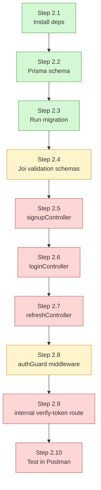
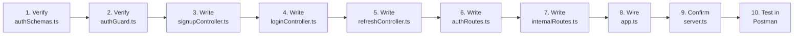

# Auth Service — Progress Tracker

> Phase 2 of the Video Meet App build. Branch: `phase-0-auth-service`. This file tracks what's done, what's pending, exact file locations, and what to expect while writing each pending file.

---

## 1. Overall Progress Diagram



**Legend:** 🟢 Green = Done | 🟡 Yellow = Partially done / needs verification | 🔴 Red = Not started

---

## 2. Status Table with File Locations

| #    | Step                                         | File Location                              | Status                | Notes                                                                |
| ---- | -------------------------------------------- | ------------------------------------------ | --------------------- | -------------------------------------------------------------------- |
| 2.1  | Install dependencies                         | `package.json`                           | ✅ Done               | bcrypt, jsonwebtoken, joi, prisma, @prisma/client all present        |
| 2.2  | Prisma schema                                | `prisma/schema.prisma`                   | ✅ Done               | `User` + `RefreshToken` models defined                           |
| 2.3  | Run migration                                | `prisma/migrations/20260815055056_init/` | ✅ Done               | Migration folder exists, tables created in Postgres                  |
| 2.4  | Joi validation schemas                       | `src/validation/authSchemas.ts`          | 🟡 Needs verification | File exists — confirm`signupSchema` + `loginSchema` are written |
| 2.5  | Signup controller                            | `src/controllers/signupController.ts`    | 🔴 Pending            | Folder is empty                                                      |
| 2.6  | Login controller                             | `src/controllers/loginController.ts`     | 🔴 Pending            | Folder is empty                                                      |
| 2.7  | Refresh controller                           | `src/controllers/refreshController.ts`   | 🔴 Pending            | Folder is empty                                                      |
| 2.8  | authGuard middleware                         | `src/middleware/authGuard.ts`            | 🟡 Needs verification | File exists — confirm JWT verify logic is complete                  |
| 2.9  | Internal verify-token route                  | `src/routes/internalRoutes.ts`           | 🔴 Pending            | Folder is empty                                                      |
| —   | Public auth routes (not in doc but required) | `src/routes/authRoutes.ts`               | 🔴 Pending            | Needed to wire signup/login/refresh to Express                       |
| —   | Wire everything together                     | `src/app.ts`                             | 🟡 Needs verification | Confirm errorHandler + routes are mounted                            |
| —   | Start server                                 | `server.ts`                              | 🟡 Needs verification | Confirm it imports`app.ts` and listens on PORT                     |
| 2.10 | Test in Postman                              | —                                         | 🔴 Pending            | Blocked until controllers + routes exist                             |

**Bonus files already built (not explicitly in the original doc, but good production practice):**

| File Location                      | Purpose                                  | Status  |
| ---------------------------------- | ---------------------------------------- | ------- |
| `src/utils/AppError.ts`          | Custom error class with`statusCode`    | ✅ Done |
| `src/middleware/errorHandler.ts` | Centralized error responses              | ✅ Done |
| `src/middleware/validate.ts`     | Reusable Joi-validation middleware       | ✅ Done |
| `src/utils/logger.ts`            | Pino structured logger                   | ✅ Done |
| `src/config/db.ts`               | Prisma Client + PrismaPg adapter setup   | ✅ Done |
| `src/config/env.ts`              | Centralized environment variable exports | ✅ Done |

---

## 3. What's Pending — File by File, With What To Expect

### 🔴 `src/controllers/signupController.ts`

**What it does:** Takes `email` + `password` from the request body, hashes the password, creates a `User` row, responds with success.

**What to expect while writing it:**

- You'll import `bcrypt` — expect to call `bcrypt.hash(password, 10)`. The `10` is the "salt rounds" — higher = more secure but slower. 10 is the standard default.
- You'll import your `prisma` client from `src/config/db.ts` and call `prisma.user.create({ data: {...} })`.
- **Duplicate email handling:** Prisma will throw an error if you try to insert an email that already exists (because of `@unique` in the schema). You need a `try/catch` — Prisma's error has a `code` property; `P2002` specifically means "unique constraint violation." Catch this and throw your `AppError('Email already exists', 409)` instead of letting a raw Prisma error leak to the client.
- You will **not** publish to Redis yet (that's Phase 3's job to *subscribe* — but you write the *publish* call here). Since `ioredis` is already installed, expect to set up a small Redis publisher.
- Response should never include `passwordHash` — only return safe fields like `id` and `email`.

**Common mistake to avoid:** Forgetting `async/await` around `bcrypt.hash` and `prisma.user.create` — both are asynchronous.

---

### 🔴 `src/controllers/loginController.ts`

**What it does:** Verifies credentials, issues a JWT access token + refresh token.

**What to expect while writing it:**

- `prisma.user.findUnique({ where: { email } })` — if no user found, throw `AppError('Invalid credentials', 401)`. **Important security detail:** use the same error message whether the email doesn't exist OR the password is wrong — don't reveal which one failed (prevents attackers from guessing valid emails).
- `bcrypt.compare(plainPassword, user.passwordHash)` — returns `true`/`false`.
- `jwt.sign({ userId: user.id }, JWT_SECRET, { expiresIn: '15m' })` for the access token. Short-lived on purpose.
- For the refresh token: generate a random long-lived token (can also be a signed JWT with a longer expiry, e.g. 7 days), then **store it in the `RefreshToken` table** via `prisma.refreshToken.create()` along with `expiresAt`.
- Response returns both tokens: `{ accessToken, refreshToken }`.

**Common mistake to avoid:** Storing the refresh token only in memory/response and not in the DB — then `refreshController.ts` has nothing to verify against.

---

### 🔴 `src/controllers/refreshController.ts`

**What it does:** Takes a refresh token, checks it's valid and not expired, issues a new access token.

**What to expect while writing it:**

- `prisma.refreshToken.findFirst({ where: { token } })` — if not found, throw `AppError('Invalid refresh token', 401)`.
- Check `expiresAt` against `new Date()` — if expired, throw `AppError('Refresh token expired', 401)` and ideally delete the expired row.
- If valid, sign a fresh access token the same way as login, and return it.
- **Design decision to think about:** do you rotate the refresh token (issue a new one and delete the old) or reuse the same one until it naturally expires? Rotation is more secure but adds complexity — for now, reusing until expiry is fine for a learning project.

---

### 🟡 `src/middleware/authGuard.ts` (verify existing content)

**What it should do:** Protect routes by checking the `Authorization: Bearer <token>` header.

**What to expect while verifying/completing it:**

- Read `req.headers.authorization`, split on `' '`, take the second part as the token.
- If header is missing entirely, throw `AppError('No token provided', 401)`.
- `jwt.verify(token, JWT_SECRET)` — wrap in try/catch, since an invalid/expired token throws synchronously. Catch and throw `AppError('Invalid or expired token', 401)`.
- On success, attach the decoded `userId` to the request object: `req.userId = decoded.userId`. In TypeScript, this requires extending Express's `Request` type (a small `types/express/index.d.ts` declaration file, or a shared type) — otherwise TypeScript will complain that `userId` doesn't exist on `Request`.

---

### 🔴 `src/routes/internalRoutes.ts`

**What it does:** Exposes `GET /internal/verify-token` — used by *other* services (Room, Signaling) to check if a token is valid, without those services needing the JWT secret themselves.

**What to expect while writing it:**

- Reuses the same JWT verification logic as `authGuard`, but instead of calling `next()`, it directly responds: `res.json({ valid: true, userId })` or `res.status(401).json({ valid: false })`.
- **Important:** this route must NOT be proxied through the API Gateway (per the doc). It should only be reachable inside the Docker network — meaning other services call it using the Docker service name, e.g. `http://auth-service:4001/internal/verify-token`, and the Gateway's proxy rules simply don't include a rule for `/internal/*`.

---

### 🔴 `src/routes/authRoutes.ts` (not explicitly named in the doc, but required)

**What it does:** Wires the public-facing endpoints together.

**What to expect while writing it:**

```typescript
router.post('/signup', validate(signupSchema), signupController);
router.post('/login', validate(loginSchema), loginController);
router.post('/refresh', refreshController);
```

- Notice the `validate(schema)` middleware runs **before** the controller — it should short-circuit with a 400 error if the body fails Joi validation, using your existing `validate.ts` middleware.

---

### 🟡 `src/app.ts` (verify wiring)

**What to expect while completing it:**

- `express()` app instance created.
- `express.json()` middleware so `req.body` parses.
- Mount `authRoutes` under `/` (e.g. `app.use('/', authRoutes)` — since the Gateway already prefixes `/api/auth`, inside this service the routes are just `/signup`, `/login`, etc.)
- Mount `internalRoutes` under `/internal`.
- `errorHandler` middleware must be registered **last**, after all routes — Express only treats a middleware as an error handler if it has 4 parameters `(err, req, res, next)` and is added after everything else.
- Optionally `pinoHttp` logger middleware near the top, before routes.

---

### 🟡 `server.ts` (verify)

**What to expect:**

- Imports `app` from `./src/app.js`, imports `PORT` from `./src/config/env.js`.
- `app.listen(PORT, () => logger.info(\`Auth service running on port ${PORT}\`))`.

---

### 🔴 Step 2.10 — Postman Testing (final checkpoint)

**What to expect when you get here:**

1. `POST /signup` with `{ email, password }` → expect `201` with `{ success: true, userId }`.
2. Check Postgres directly (`docker exec -it postgres psql -U postgres -d postgres`, then `SELECT * FROM "User";`) → password should be a long bcrypt hash, never plaintext.
3. `POST /login` with same credentials → expect `{ accessToken, refreshToken }`.
4. Copy `accessToken`, hit a temporary protected test route with `Authorization: Bearer <token>` → expect it to pass through `authGuard` successfully.
5. Try `GET /internal/verify-token` with a valid and then an invalid token → confirm `{ valid: true/false }` responses.
6. Try signup with a duplicate email → confirm you get a clean `409` error (not a raw Prisma stack trace).

---

## 4. Suggested Build Order (Do Them In This Sequence)



**Reasoning for this order:** validation and the auth guard are dependencies used *inside* the controllers, so they need to be solid first. Controllers come next since routes just wire controllers together. `app.ts` and `server.ts` come last because they assemble everything that now exists. Testing is always the final checkpoint.

---

## 5. Quick Status Snapshot

```
Setup (2.1–2.3)            [██████████] 100% — DONE
Validation & Guard (2.4,2.8) [███████░░░]  70% — verify content
Controllers (2.5–2.7)      [░░░░░░░░░░]   0% — pending
Routes (2.9 + authRoutes)  [░░░░░░░░░░]   0% — pending
Wiring (app.ts/server.ts)  [███████░░░]  70% — verify content
Testing (2.10)             [░░░░░░░░░░]   0% — blocked on above
```
