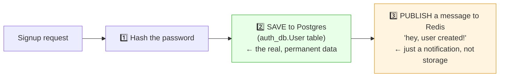
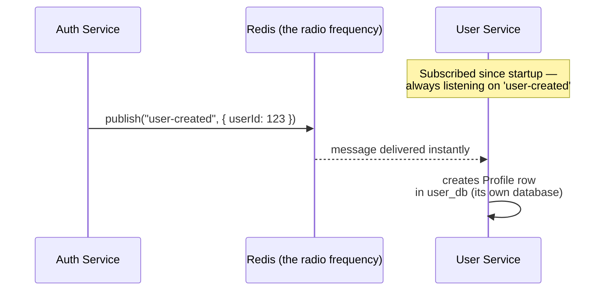
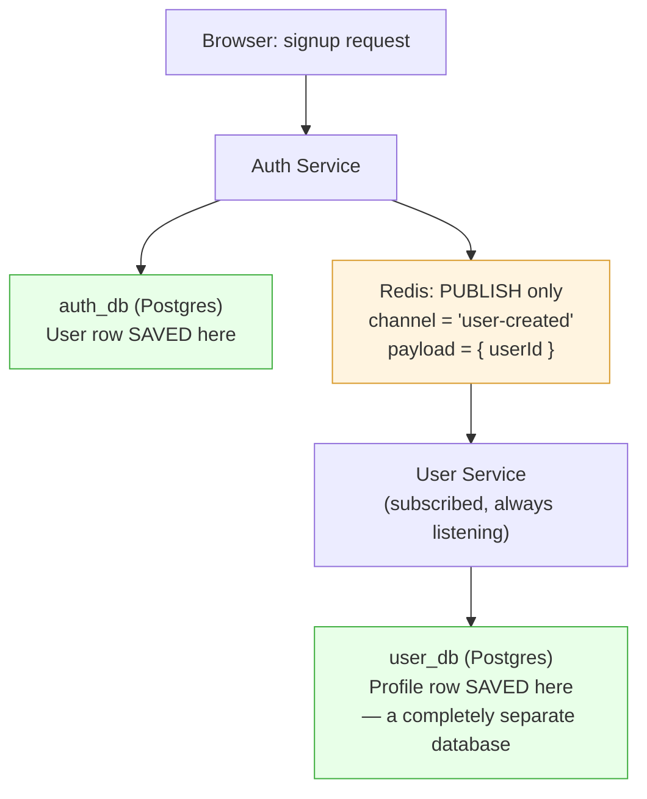

# Redis Pub/Sub — Publish & Subscribe Explained

> Reference notes for the Auth Service ↔ User Service communication pattern. Read this whenever you forget how `publish`/`subscribe` actually works.

---

## 1. The Core Confusion (And The Fix)

**Wrong assumption:** "Data gets saved in Redis."

**Reality:** Data is **always** saved in Postgres (or Mongo). Redis Pub/Sub carries **zero storage** — it only carries a short-lived **notification**. The moment a message is delivered to subscribers, it's gone from Redis forever. If nobody was listening at that exact moment, the message is lost — Redis does not keep a history of it.



---

## 2. Publish vs Subscribe — Plain Definitions

| Term | What it means |
|---|---|
| **Publish** | Drop a message onto a named **channel**. Fire-and-forget — the publisher does not know or care who (if anyone) is listening. |
| **Subscribe** | Continuously listen on a named **channel**, in the background, ready to react the instant a message arrives. |
| **Channel** | Just a string name (e.g. `"user-created"`) that both sides agree on — it's how the message finds its listeners. |

**Key fact:** publisher and subscriber never talk to each other directly. Redis sits in the middle. The publisher has no idea how many subscribers exist, or if there are zero.

---

## 3. Best Mental Model — Radio Station

| Real World | Redis Pub/Sub |
|---|---|
| Radio station broadcasting on 94.3 FM | **Publisher** (Auth Service) calling `redis.publish('user-created', ...)` |
| Frequency "94.3 FM" | The **channel** name (`'user-created'`) |
| Your radio, already tuned to 94.3 FM, always on | **Subscriber** (User Service) that ran `redis.subscribe('user-created')` at startup |
| Anyone tuned to 94.3 FM hears it instantly, at the same time | All active subscribers receive the message instantly |
| If your radio is off, you miss the broadcast — no replay | If User Service is down when Auth publishes, that message is lost forever |

This is different from a phone call (direct, two-way, both sides know each other) — Pub/Sub is a **broadcast**, one-way, anonymous to the publisher.

---

## 4. Sequence Diagram — How The Message Actually Travels



---

## 5. Full Two-Database Flow



**Green boxes** = real, permanent data storage (Postgres).
**Orange box** = a small, disposable message. Nothing is stored inside Redis here.

---

## 6. Why Not Just Let Auth Service Write To `user_db` Directly?

Because that breaks the core microservices rule: **each service only touches its own database.**

If Auth Service directly wrote into `user_db`, it would need to know User Service's schema, connection details, and internal structure — tightly coupling the two services. If User Service's Profile table ever changes shape, Auth Service's code would break too.

Instead:
- Auth Service only knows "I need to announce that a user was created" — it doesn't know or care what happens next.
- User Service owns the decision of what a "profile" looks like and how it's created.

This is called **loose coupling** — services communicate through events, not by reaching into each other's databases.

---

## 7. Code Reference — What Each Side Looks Like

### Publisher side (Auth Service — already built)
Location: `src/events/redisPublisher.ts` (or wherever you placed it)

```typescript
export const publishEvent = async (channel: string, data: string) => {
    await redis.publish(channel, data);
};

// used inside signupController.ts, after prisma.user.create():
await publishEvent('user-created', JSON.stringify({ userId: newUser.id }));
```

### Subscriber side (User Service — built later, in Phase 3)
Location: `src/events/redisSubscriber.ts` (future file)

```typescript
redis.subscribe('user-created');

redis.on('message', (channel, message) => {
    if (channel === 'user-created') {
        const data = JSON.parse(message);
        createProfile(data.userId); // prisma.profile.create(...)
    }
});
```

**Why this file doesn't exist yet:** Auth Service (Phase 2) only needs to *publish*. The *subscribe* side belongs to User Service, which is Phase 3 — a completely different folder/service that hasn't been built yet. That's why searching for "subscribe" inside `auth-service/` won't find anything — it's not supposed to be there.

---

## 8. Quick Self-Check Table

| Question | Answer |
|---|---|
| Does Redis store the user's data long-term? | ❌ No — only Postgres does |
| Does the publisher know who's subscribed? | ❌ No — completely anonymous |
| Can one publish reach multiple subscribers at once? | ✅ Yes — everyone listening gets it simultaneously |
| What happens if no one is subscribed when a message is published? | The message is lost — no replay, no queue (plain Redis Pub/Sub has no persistence) |
| Where does `publish` code live? | Auth Service (the service that *causes* the event) |
| Where does `subscribe` code live? | User Service (the service that *reacts* to the event) |
| Is this a direct connection between the two services? | ❌ No — Redis is the middleman in both directions |

---

## 9. One-Line Summary To Remember

> **Publish = shout into a channel, don't care who hears it. Subscribe = keep your ear on a channel, always ready to react. Redis carries the shout — Postgres holds the actual data.**