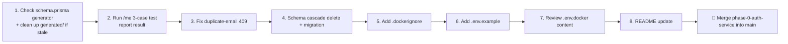

# Auth Service — Progress Tracker (v5)

> Phase 2 of the Video Meet App build. Branch: `phase-0-auth-service`. This version is based on a confirmed `tree /f` output — every file listed below is verified to actually exist. Items that haven't been explicitly confirmed by testing are marked as such rather than assumed done.

---

## 1. Confirmed Project Structure (from `tree /f`)

```
auth-service/
├── .env                          ✅ exists
├── .env.docker                   🟡 exists — content not yet reviewed (should hold Docker-network URLs, e.g. postgres/redis service names instead of localhost)
├── .env.example                  🔴 still missing
├── .dockerignore                 🔴 still missing
├── .gitignore                    ✅ exists
├── Dockerfile                    ✅ exists, confirmed working (image builds & runs)
├── package.json / package-lock   ✅ exist
├── prisma.config.ts              ✅ exists
├── README.md                     🟡 exists, content outdated
├── server.ts                     ✅ exists
├── tsconfig.json                 ✅ exists
│
├── generated/prisma/              ⚠️ STILL EXISTS — see note below
│   ├── client.ts, models.ts, enums.ts, commonInputTypes.ts, browser.ts
│   ├── internal/ (class.ts, prismaNamespace.ts, prismaNamespaceBrowser.ts)
│   └── models/ (RefreshToken.ts, User.ts)
│
├── prisma/
│   ├── schema.prisma              🟡 needs re-check — see note below
│   └── migrations/20260815055056_init/
│
├── src/
│   ├── app.ts                      ✅
│   ├── config/
│   │   ├── db.ts                    ✅
│   │   ├── env.ts                   ✅
│   │   └── redis.ts                 ✅
│   ├── controllers/
│   │   ├── loginController.ts       ✅ tested
│   │   ├── logoutController.ts      ✅ tested (route bug fixed)
│   │   ├── meController.ts          🟡 built — 3-case Postman confirmation still not received
│   │   ├── refreshController.ts     ✅ tested
│   │   ├── signupController.ts      🟡 works — P2002 duplicate-email handling NOT yet added
│   │   └── verifyTokenController.ts ✅ tested
│   ├── middleware/
│   │   ├── authGuard.ts             🟡 written — not confirmed working end-to-end (tied to /me test above)
│   │   ├── errorHandler.ts          ✅
│   │   └── validate.ts              ✅
│   ├── routes/
│   │   ├── authRoutes.ts            ✅ signup, login, refresh, logout all correctly nested under /auth
│   │   ├── internalRoutes.ts        ✅
│   │   └── v1/index.ts              ✅ combines authRoutes + internalRoutes under /api/v1
│   ├── utils/
│   │   ├── AppError.ts              ✅
│   │   ├── logger.ts                ✅
│   │   ├── passwordUtils.ts         ✅
│   │   ├── response.ts              ✅ (successResponse helper)
│   │   └── tokenUtils.ts            ✅
│   └── validation/
│       └── authSchemas.ts           ✅ fixed
│
└── types/express/index.d.ts          ✅
```

---

## 2. ⚠️ Two Things That Need Your Confirmation Before This Doc Can Be Fully Accurate

### A. `generated/prisma/` folder still exists
Earlier in this build, the plan was to switch the Prisma generator from `prisma-client` (experimental, was causing broken imports in the Docker build) to the stable `prisma-client-js`, which generates the client into `node_modules/@prisma/client` instead of a custom `generated/` folder.

`tree /f` shows `generated/prisma/` is **still present** with a full set of files (`client.ts`, `models/User.ts`, etc.). This means one of two things:
- It's a **leftover/stale folder** from before the switch, safe to delete (`Remove-Item -Recurse generated`), **or**
- The switch was never actually completed, and `schema.prisma` still has `provider = "prisma-client"` with an `output` path.

**Action needed:** open `prisma/schema.prisma` and confirm the `generator client { }` block — does it say `provider = "prisma-client-js"` with no `output` line? If yes, the `generated/` folder is just stale and can be deleted. If it still says `prisma-client` with an output path, the earlier fix didn't fully land.

### B. `/me` three-case test — result still not provided
This has been asked twice now and hasn't been answered. Until confirmed, `authGuard` and `meController` are marked 🟡 (built, not verified) rather than ✅.

Needed: run these three and report pass/fail —
1. `GET /api/v1/auth/me` with no token → expect `401`
2. `GET /api/v1/auth/me` with `Authorization: Bearer fake_token_123` → expect `401`
3. Login first, then `GET /api/v1/auth/me` with the real access token → expect `200` with `userId`

---

## 3. What's Confirmed Done

| Area | Status |
|---|---|
| Signup, login, refresh, logout, internal verify-token | ✅ Built and tested via Postman |
| Password hashing (bcrypt) via `passwordUtils.ts` | ✅ |
| Access + refresh token generation via `tokenUtils.ts` | ✅ |
| Refresh token stored in DB + set as `httpOnly` cookie | ✅ |
| Centralized error handling (`AppError` + `errorHandler`) | ✅ |
| Structured logging (`pino`) | ✅ |
| API versioning under `/api/v1` | ✅ |
| Route-mounting bug (logout was on wrong path) | ✅ Fixed |
| Dockerfile builds and the container runs | ✅ Confirmed via `docker logs auth-service` showing the service up and Redis connected |
| Redis connected, publishing `user-created` on signup | ✅ (no subscriber yet — that's Phase 3, User Service) |

---

## 4. What's Still Pending / Unconfirmed

| # | Item | Status | Notes |
|---|---|---|---|
| 1 | Confirm `generated/prisma/` is stale (or finish the generator switch) | 🔴 Needs your check | See section 2A above |
| 2 | `/me` 3-case Postman test | 🔴 Needs your result | See section 2B above |
| 3 | Duplicate email → `409` | 🔴 Not yet added | `signupController.ts` still needs `err.code === 'P2002'` check |
| 4 | `onDelete: Cascade` on User↔RefreshToken relation | 🔴 Not yet added | Prevents orphaned refresh tokens surviving a deleted user |
| 5 | `.dockerignore` | 🔴 Missing | Confirmed absent from root listing |
| 6 | `.env.example` | 🔴 Missing | Confirmed absent from root listing |
| 7 | `.env.docker` content review | 🟡 Exists, not reviewed | Should confirm it uses Docker service names (`postgres`, `redis`) not `localhost`, and that `docker-compose.yml`'s `env_file` for auth-service points to it correctly |
| 8 | README update | 🟡 Outdated | Exists but doesn't reflect current routes/Docker setup |

---

## 5. Suggested Order From Here



---

## 6. Quick Status Snapshot

```
Core auth flow (signup/login/refresh/logout/verify)  [██████████] 100% — DONE & TESTED
Docker containerization                               [██████████] 100% — DONE, confirmed via logs
generated/ folder cleanup                              [░░░░░░░░░░]   0% — needs your check
authGuard / me route                                    [███████░░░]  70% — built, test result pending
Duplicate email handling                                [░░░░░░░░░░]   0% — pending
Schema cascade delete                                   [░░░░░░░░░░]   0% — pending
.dockerignore                                           [░░░░░░░░░░]   0% — pending
.env.example                                            [░░░░░░░░░░]   0% — pending
.env.docker review                                      [░░░░░░░░░░]   0% — pending
README                                                  [███░░░░░░░]  30% — outdated
```

---

## 7. Summary

The core authentication service is functionally complete and Dockerized — signup, login, refresh, logout, and internal token verification all work and are tested. The service now runs via `docker compose up -d auth-service` without needing a local `npm install`, matching how it will operate alongside the other containers in the full stack.

Two items from the last session remain **unconfirmed rather than assumed**: whether the `generated/prisma/` folder is safe to delete (depends on what `schema.prisma`'s generator block currently says), and whether the `/me` route's three test cases actually passed. Everything else — duplicate email handling, the cascade-delete relation, `.dockerignore`, `.env.example`, and the README — is small, well-understood remaining work with no open questions.

**Bottom line: the auth flow works and runs in Docker. What's left is verifying two open items and finishing off documentation/hardening polish before this branch is ready to merge into `main`.**