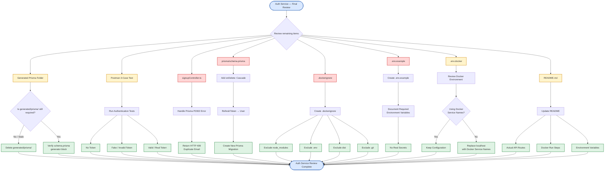
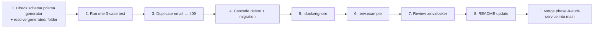

# Auth Service — Pending Items (v5)

> Phase 2 of the Video Meet App build. Core signup/login/refresh/logout flow works and is tested; the service is Dockerized and running as a container. This file lists **only what's left** — confirmed done items are in the full progress tracker, not repeated here.

---

## 1. Pending Items Diagram



---

## 2. Pending Items — Table

| # | Item | Location | What To Do | Why It Matters |
|---|---|---|---|---|
| 1 | Resolve `generated/prisma/` folder | `auth-service/generated/prisma/` | Open `prisma/schema.prisma`, check the `generator client { }` block. If it says `provider = "prisma-client-js"` with **no** `output` line, the folder is stale leftover from before the generator switch — safe to delete (`Remove-Item -Recurse generated`). If it still says `provider = "prisma-client"` with an `output` path, the switch never fully happened — needs to be redone | The switch to `prisma-client-js` was the fix for the Docker "module not found" errors (broken relative imports at depth). If this folder is still active, that bug risk is still present |
| 2 | Confirm `/me` route works | Postman (no code change needed unless it fails) | Run 3 tests: (a) no token → expect `401`, (b) fake token (`Bearer fake_token_123`) → expect `401`, (c) real token from a fresh login → expect `200` with `{ userId }` | This is the only remaining proof that `authGuard` actually protects a route correctly — it was written but never exercised against a real request |
| 3 | Duplicate email → clean `409` | `src/controllers/signupController.ts` | In the `catch` block, add a check before the generic 500: `if (err.code === 'P2002') { return next(new AppError('Email already exists', 409)); }` | Right now a duplicate signup falls into the generic `500` branch — leaks a less useful error and wrong status code |
| 4 | `onDelete: Cascade` on User↔RefreshToken | `prisma/schema.prisma` | Add a real `@relation` between `RefreshToken.userId` and `User.id` with `onDelete: Cascade`, then run `npx prisma migrate dev --name add_user_relation` | Without this, deleting a `User` can leave orphaned `RefreshToken` rows behind — a leftover token could still generate valid access tokens for a user that no longer exists |
| 5 | `.dockerignore` | `auth-service/.dockerignore` | Create it — typically excludes `node_modules`, `.env`, `.env.docker`, `dist`, `.git`, `md/` | Confirmed missing from the root directory listing. Keeps the Docker build context small and avoids accidentally copying secrets or local artifacts into the image |
| 6 | `.env.example` | `auth-service/.env.example` | Create with placeholder values: `PORT`, `DATABASE_URL`, `REDIS_URL`, `JWT_ACCESS_SECRET`, `JWT_REFRESH_SECRET`, `NODE_ENV` — no real secrets | Confirmed missing. Documents what env vars are required for anyone (including future-you) setting this up from scratch |
| 7 | Review `.env.docker` content | `auth-service/.env.docker` | Confirm `DATABASE_URL`/`REDIS_URL` use Docker service names (`postgres`, `redis`) rather than `localhost`, and confirm `docker-compose.yml`'s `env_file` for `auth-service` actually points to this file | File exists but its contents haven't been reviewed yet in this conversation |
| 8 | README update | `auth-service/README.md` | Update to reflect actual routes (`/api/v1/auth/*`, `/api/v1/internal/*`), how to run via Docker, and required env vars | Exists but outdated relative to current implementation |

---

## 3. Suggested Order



**Why this order:** items 1–2 are pure verification (no new code, just confirming existing work is correct) — cheapest to knock out first. Items 3–4 are small, self-contained code changes. Items 5–8 are config/documentation, safe to do last since they don't affect runtime behavior.

---

## 4. Quick Status Snapshot

```
generated/ folder resolution     [░░░░░░░░░░]   0% — needs a check, not new code
/me 3-case test confirmation     [░░░░░░░░░░]   0% — needs to be run
Duplicate email → 409            [░░░░░░░░░░]   0% — pending
Cascade delete relation          [░░░░░░░░░░]   0% — pending
.dockerignore                    [░░░░░░░░░░]   0% — pending
.env.example                     [░░░░░░░░░░]   0% — pending
.env.docker review               [░░░░░░░░░░]   0% — pending
README update                    [███░░░░░░░]  30% — exists, outdated
```