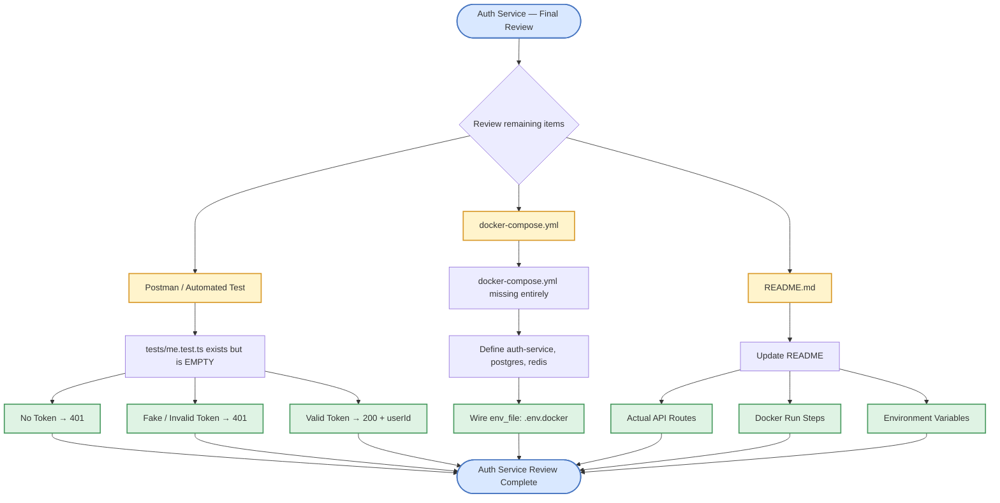
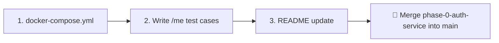

# Auth Service — Pending Items (v6)

> Phase 2 of the Video Meet App build. Core signup/login/refresh/logout flow works and is tested; the service is Dockerized and running as a container. This file lists **only what's left** — confirmed done items are moved to "Resolved" section below.

---

## 1. Resolved (verified against actual code)

| # | Item                                          | Verified                                                                                                                                           |
| - | --------------------------------------------- | -------------------------------------------------------------------------------------------------------------------------------------------------- |
| 1 | `generated/prisma/` folder                  | Deleted — stale folder removed,`schema.prisma` uses `prisma-client-js` with no `output`                                                     |
| 3 | Duplicate email →`409`                     | `signupController.ts` catches `P2002` and returns `AppError('Email already exists', 409)`                                                    |
| 4 | `onDelete: Cascade` on RefreshToken → User | Migration applied via`npx prisma migrate dev`                                                                                                    |
| 5 | `.dockerignore`                             | Created — excludes`node_modules`, `.env`, `.env.docker`, `dist`, `.git`                                                                 |
| 6 | `.env.example`                              | Created — documents`PORT`, `DATABASE_URL`, `REDIS_URL`, `JWT_ACCESS_SECRET`, `JWT_REFRESH_SECRET`, `NODE_ENV` with placeholder values |

---

## 2. Pending Items Diagram

---

## 3. Pending Items — Table

| # | Item                          | Location                     | What To Do                                                                                                                                                                                                                                                | Why It Matters                                                                                                                                          |
| - | ----------------------------- | ---------------------------- | --------------------------------------------------------------------------------------------------------------------------------------------------------------------------------------------------------------------------------------------------------- | ------------------------------------------------------------------------------------------------------------------------------------------------------- |
| 2 | `/me` route — 3 test cases | `tests/me.test.ts`         | File exists but is**empty**. Write tests for: (a) no token → `401`, (b) fake token → `401`, (c) valid token → `200` with `{ userId }`. Route + middleware code already look correct — this is just proving it                           | This is the only remaining proof that`authGuard` actually protects the route correctly — code was written but never exercised against a real request |
| 7 | `docker-compose.yml`        | repo root (missing entirely) | Create it defining`auth-service`, `postgres`, `redis` services. Point `auth-service`'s `env_file` at `.env.docker`. Confirm `.env.docker` uses Docker service names (`postgres`, `redis`) not `localhost` — already verified correct | Without this file, there's no way to confirm`.env.docker` is actually wired up, and no single-command way to spin up the full stack                   |
| 8 | README update                 | `auth-service/README.md`   | Currently only has high-level overview (port, DB, what it does, talks-to). Add: actual routes (`/api/v1/auth/*`, `/api/v1/internal/*`), Docker run steps, required env vars                                                                           | Exists but outdated relative to current implementation                                                                                                  |

---

## 4. Suggested Order

**Why this order:** docker-compose is infrastructure other steps may depend on (e.g. running tests against a containerized DB). Tests next since they validate existing code. README last since it documents the final state.

---

## 5. Quick Status Snapshot

generated/ folder resolution     [██████████] 100% — done, deleted

Duplicate email → 409            [██████████] 100% — done

Cascade delete relation          [██████████] 100% — done, migration applied

.dockerignore                    [██████████] 100% — done, verified content

.env.example                     [██████████] 100% — done, verified content

/me 3-case test                  [░░░░░░░░░░]   0% — file exists but empty

docker-compose.yml               [░░░░░░░░░░]   0% — missing entirely

README update                    [███░░░░░░░]  30% — exists, still outdated

**Overall: 5 of 8 resolved, 3 pending.**
