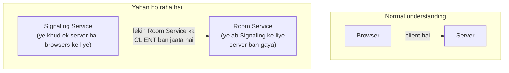
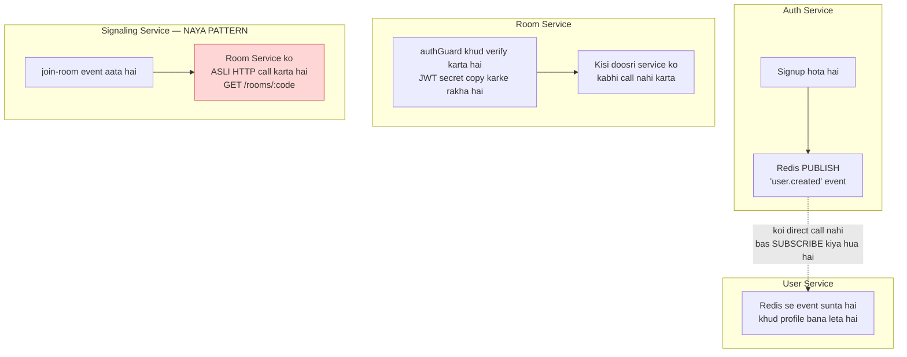
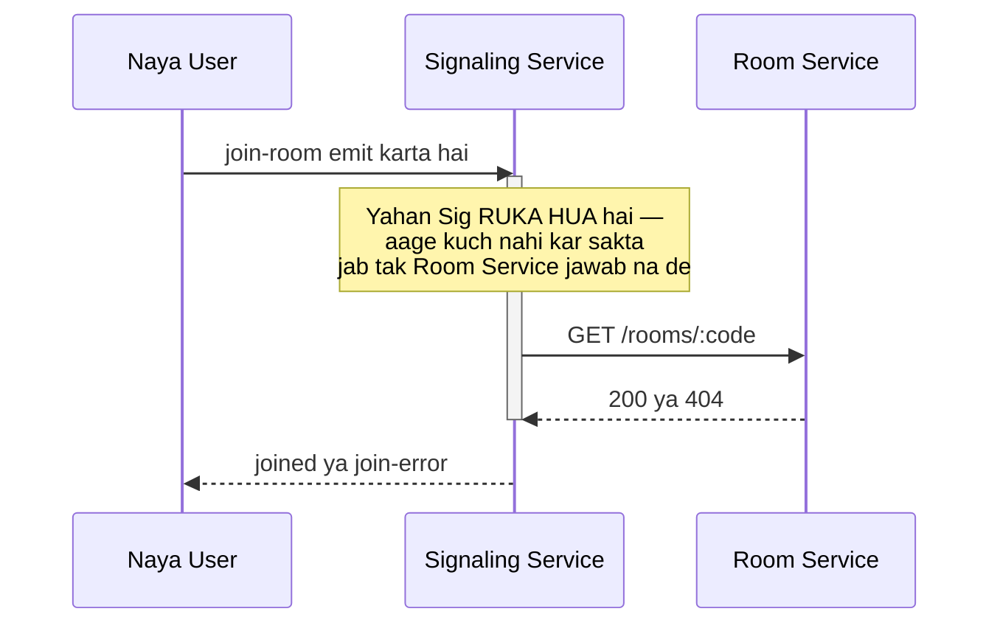
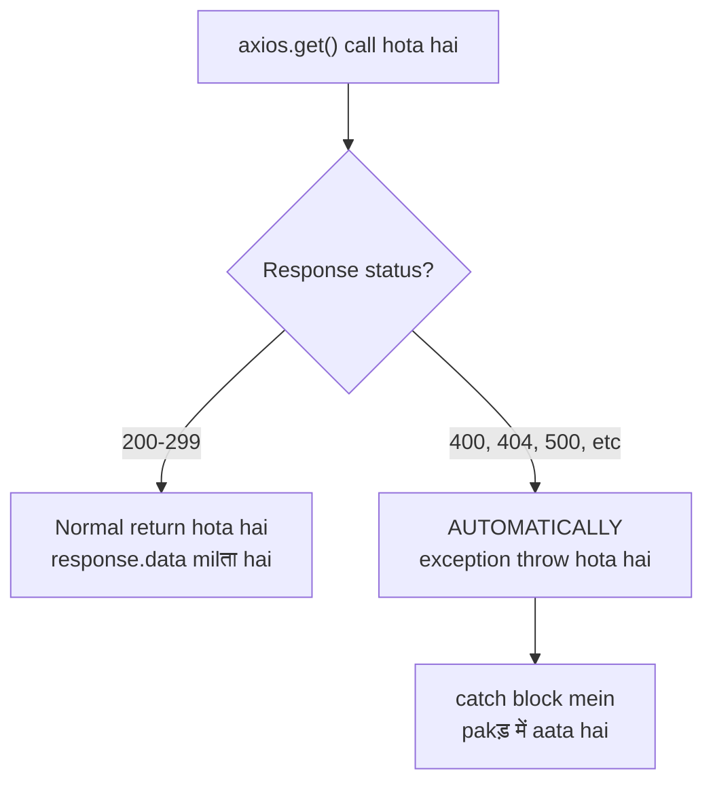
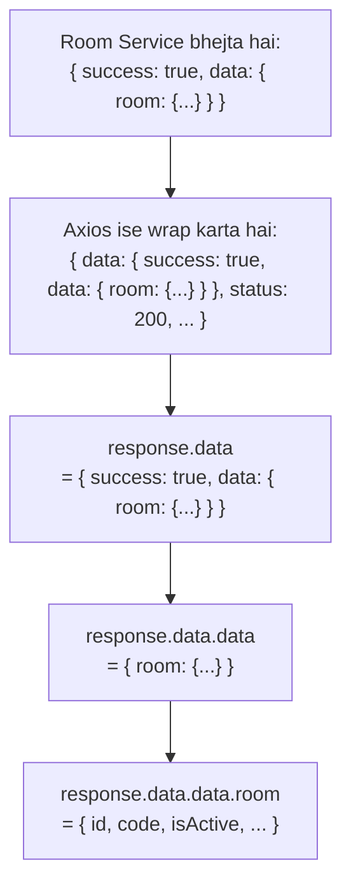
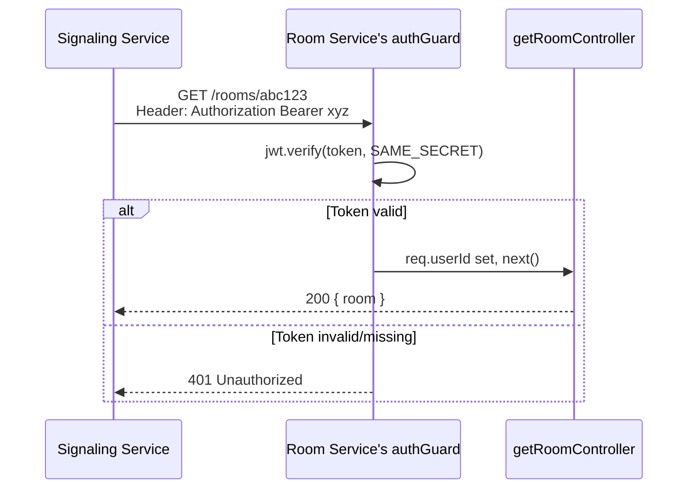
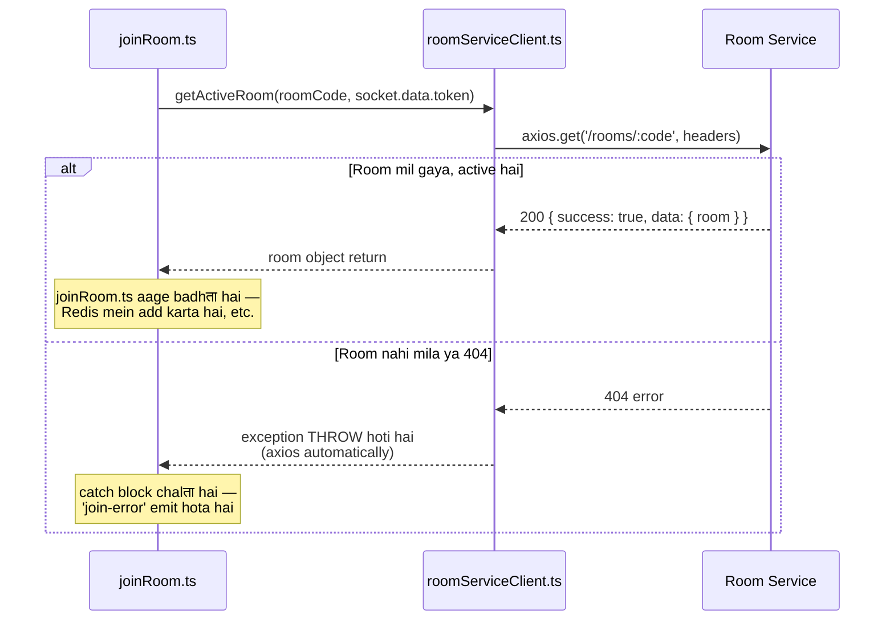
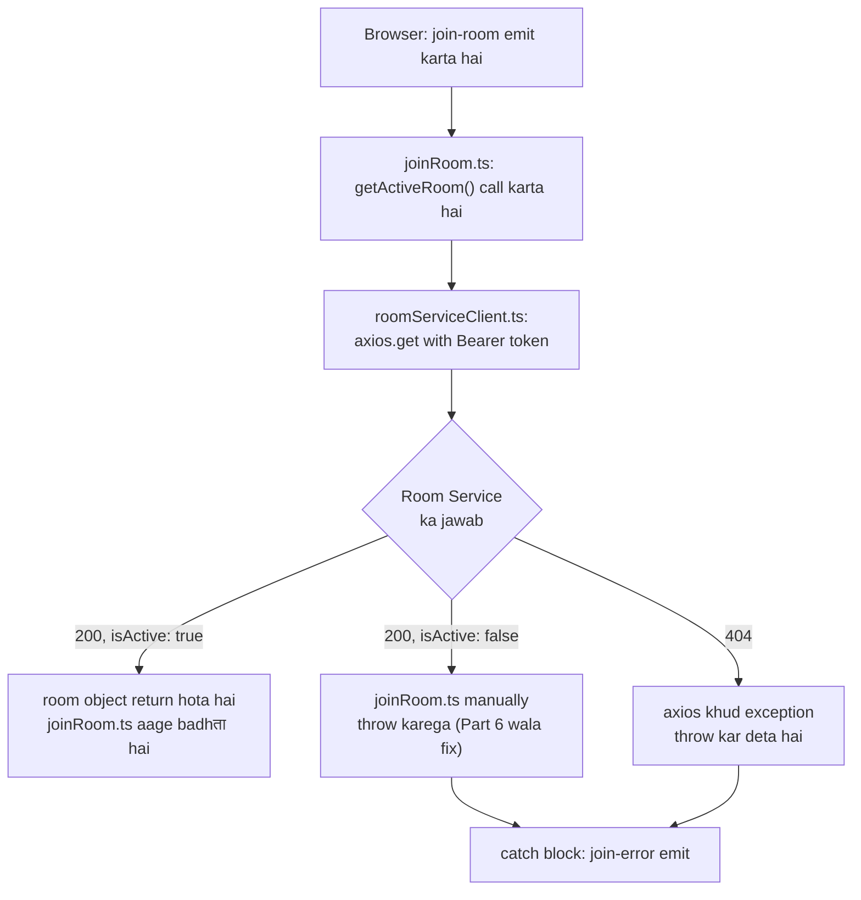

# D.6 — `src/config/roomServiceClient.ts` — Poori Detail Mein

Chalo isko bahut gehraai se samajhte hain — ek-ek concept, ek-ek diagram ke saath.

---

## Part 1 — Sabse Pehle: "Client" Ka Matlab Kya Hai Yahan

Naam mein confusion ho sakta hai — `roomServiceClient.ts` mein "client" ka matlab **browser client nahi hai**. Yahan matlab hai — **Signaling Service khud, Room Service ka ek "client" ban raha hai.**



**Ye samajhna zaroori hai:** Ek hi service, do roles play kar sakti hai — same waqt pe **server bhi ho sakti hai** (browsers ke liye) aur **client bhi ho sakti hai** (Room Service ke liye). Ye microservices architecture ka normal pattern hai.

---

## Part 2 — Poore Project Mein Ye Pehli Baar Kyun Ho Raha Hai

Chalo dekhte hain **teeno pichli services** ne apna kaam kaise kiya, aur Signaling Service kyun alag hai:



**Fark samjho:**

| Pattern                           | Kaun Use Karta Hai        | Kaise Kaam Karta Hai                                                                            |
| --------------------------------- | ------------------------- | ----------------------------------------------------------------------------------------------- |
| **Event-driven (async)**    | Auth → User Service      | "Kuch hua hai, tumhe interested ho toh sun lo" — fire-and-forget, koi response wait nahi karta |
| **Local verification**      | Room Service ka authGuard | Khud ke paas secret hai, kisi se poochta hi nahi                                                |
| **Direct HTTP call (sync)** | Signaling → Room Service | "Mujhe ABHI is second ka jawab chahiye, tabhi aage badhunga"                                    |

**Signaling Service ko event-driven pattern kyun nahi chal sakta:** Socho agar Signaling Service bhi Redis events pe bharosa karti — "jab room banega, Auth Service jaisa Room Service bhi ek event publish kar de, Signaling Service use cache kar le." Problem ye hogi:

> Room create hote waqt "room active hai" event mil gaya. Lekin 10 minute baad host ne room **end** kar diya. Agar Signaling Service ne wo purani cached info pe bharosa kiya, to naya user **ek dead room mein bhi join** ho jayega — kyunki usko "end hua" wala event kabhi mila hi nahi (ya late mila, ya miss ho gaya).

Isliye Signaling Service **har single `join-room` attempt pe fresh, real-time poochta hai** — "abhi is second, ye room active hai kya?" Ye **synchronous, blocking dependency** hai — jab tak Room Service jawab na de, Signaling Service aage nahi badh सकती.



---

## Part 3 — Kyun Axios, Fetch Nahi?

Node.js mein `fetch` bhi available hai (Node 18+ se built-in). Toh axios kyun install kar rahe hain?

| Feature                     | `fetch` (built-in)                                                               | `axios` (jo hum use kar rahe)                                                              |
| --------------------------- | ---------------------------------------------------------------------------------- | -------------------------------------------------------------------------------------------- |
| Non-2xx response (404, 500) | **Error throw nahi karta** — tumhe khud `response.ok` check karna padता | **Automatically throw karta hai** — try/catch mein seedha pakड़ में aa jaata hai |
| JSON parsing                | Manual`await response.json()` likhna padता                                     | Automatic —`response.data` already parsed JSON hai                                        |
| Headers likhna              | Thoda verbose syntax                                                               | Simple object                                                                                |

**Ye humare case mein bahut important hai** — kyunki `joinRoom.ts` mein humara pura logic isi pe depend karta hai:

```typescript
try {
  await getActiveRoom(roomCode, socket.data.token);
  // ... room mila, active hai
} catch (err) {
  // ... room nahi mila YA ended hai
}
```

**Agar `fetch` use karte,** ye code **kaam nahi karega jaisa expect kar rahe ho** — kyunki `fetch` ek 404 response ko bhi "successful fetch" maanta hai (network level pe request toh successfully complete hui na, bhale response ka status code 404 ho). Humein manually likhna padता:

```typescript
// Agar fetch use karte, to ye extra kaam karna padता:
const response = await fetch(url, { headers });
if (!response.ok) {
  throw new Error('Room not found');   // manually throw karna padता
}
const data = await response.json();
```

Axios ye sab **apne aap** kar deta hai — 404/500 aate hi khud exception throw kar deta hai. Isliye humara `joinRoom.ts` ka simple `try/catch` bina extra code ke kaam karta hai.



---

## Part 4 — Response Structure Ka Deep-Dive (`.data.data.room`)

Ye sabse confusing part hota hai beginners ke liye — do baar `.data` kyun likha hai. Chalo layer by layer todते hain.

### Layer 1 — Axios Ka Apna Wrapper

Jab bhi axios koi HTTP call karta hai, wo response ko **apne khud ke object** mein wrap kar deta hai:

```typescript
{
  data: { /* actual server ne jo bheja */ },
  status: 200,
  statusText: "OK",
  headers: { /* response headers */ },
  config: { /* request config */ }
}
```

**Isliye `response.data` likhna padता hai** — ye axios ka apna wrapper hai, isse koi bachaव नहीं. Ye HAR axios call mein hoga, chahe koi bhi API ho.

### Layer 2 — Room Service Ka `successResponse()` Wrapper

Ab yaad karo Room Service mein `response.ts` file mein kya likha tha:

```typescript
// utils/response.ts (Room Service mein)
export const successResponse = (res, data, statusCode = 200) => {
  res.status(statusCode).json({
    success: true,
    data: data,
  });
};
```

Aur `getRoomController.ts` mein:

```typescript
successResponse(res, { room });
```

Iska matlab Room Service **actual bhejta hai** ye JSON:

```json
{
  "success": true,
  "data": {
    "room": {
      "id": "...",
      "code": "abc-defg-hij",
      "isActive": true,
      "participants": [...]
    }
  }
}
```

**Ye Room Service ka apna design choice hai** — har response ko `{ success, data }` shape mein wrap karna, taaki client (chahe frontend ho ya Signaling Service) hamesha ek **consistent, predictable format** expect kar sake.

### Dono Layers Ko Jodo



**Step-by-step nikalte hain:**

| Expression                  | Kya Milता Hai                                                                                        |
| --------------------------- | ------------------------------------------------------------------------------------------------------ |
| `response`                | Poora axios object (`data`, `status`, `headers`, etc.)                                           |
| `response.data`           | Axios ka wrapper hata diya — ab Room Service ka raw JSON:`{ success: true, data: { room: {...} } }` |
| `response.data.data`      | Room Service ka`successResponse` wrapper bhi hata diya — ab `{ room: {...} }`                     |
| `response.data.data.room` | Asli room object —`{ id, code, isActive, hostUserId, ... }`                                         |

**Simple analogy:** socho ye ek **gift box ke andar gift box** jaisa hai —

1. Bahar wala box axios ne khud pack kiya (`response.data`)
2. Andar wala box Room Service ne pack kiya (`data.data`)
3. Tab jaake asli gift (`room`) milta hai

---

## Part 5 — Poora Code, Ab Line-by-Line Aur Bhi Gehraai Se

```typescript
import axios from 'axios';
import { ROOM_SERVICE_URL } from './env.js';

export async function getActiveRoom(code: string, token: string) {
  const response = await axios.get(`${ROOM_SERVICE_URL}/rooms/${code}`, {
    headers: { Authorization: `Bearer ${token}` },
  });
  return response.data.data.room;
}
```

### Har Line Ka Deep Explanation

**Line 1-2 — Imports**

```typescript
import axios from 'axios';
import { ROOM_SERVICE_URL } from './env.js';
```

`ROOM_SERVICE_URL` — yaad karo D.4 mein `env.ts` banaya tha, usme ye export ho raha hai. Local pe `http://localhost:4003`, Docker mein `http://room-service:4003`.

**Line 4 — Function signature**

```typescript
export async function getActiveRoom(code: string, token: string) {
```

- `async` — kyunki andar `await` use ho raha hai (HTTP call synchronously wait karna padता hai)
- `code: string` — kaunsa room check karna hai (jaise `"abc-defg-hij"`)
- `token: string` — kiska access token forward karna hai (browser ne jo bheja tha connection ke time)

**Line 5-7 — Actual call**

```typescript
const response = await axios.get(`${ROOM_SERVICE_URL}/rooms/${code}`, {
  headers: { Authorization: `Bearer ${token}` },
});
```

Ye final URL kuch aisa banega:

```
http://room-service:4003/rooms/abc-defg-hij
```

**`headers: { Authorization: 'Bearer ...' }` kyun zaroori hai:** Room Service ka `GET /rooms/:code` route already `router.use(authGuard)` se protected hai (Room Service ke `roomRoutes.ts` mein yaad karo). Agar header nahi bheja, Room Service ka apna `authGuard` **401 Unauthorized** de dega — chahe room exist bhi karta ho.



**Important insight:** Room Service ka `authGuard` ko koi farak nahi padता ki request **browser se aayi hai ya Signaling Service se** — dono jagah se same tarike se verify karta hai. Isliye Signaling Service ko koi **special/internal route** banane ki zaroorat nahi padi Room Service mein — jo route pehle se public-facing tha, wahi reuse ho gaya.

**Line 8 — Return**

```typescript
return response.data.data.room;
```

Jaisa Part 4 mein samjhaya, teen layers todके asli `room` object return kar rahe hain.

---

## Part 6 — Ye Function Kaise Use Hoga `joinRoom.ts` Mein (Preview)



**Ek subtlety note karo:** `getActiveRoom()` function khud **kabhi `isActive: false` wala case handle nahi karta**. Wo sirf return karta hai jo bhi room mile. Lekin practically, Room Service ka `getRoomController` ye check **karता hi nahi** ki room active hai ya nahi — wo bas room dhoondh ke return kar deta hai (chahe ended ho ya na ho).

**Ye ek chhota gap hai — isko highlight karna zaroori hai:**

Room Service ka `getRoomController.ts`:

```typescript
const room = await prisma.room.findUnique({
  where: { code },
  include: { participants: { where: { leftAt: null } } },
});
if (!room) return next(new AppError('Room not found', 404));
successResponse(res, { room });   // isActive false ho, phir bhi 200 return karta hai!
```

Iska matlab — agar room **ended** hai (`isActive: false`), Room Service phir bhi **200 OK** dega, sirf `room.isActive` field `false` hoga. Axios ise **error nahi manega** (kyunki status 200 hai) — `getActiveRoom()` chupchap ye room return kar dega.

**Fix — `joinRoom.ts` mein manually check karna padега:**

```typescript
const room = await getActiveRoom(roomCode, socket.data.token);
if (!room.isActive) {
  throw new Error('Room has ended');   // khud throw karo taaki catch pakड़े
}
```

Ye important cheez hai jo D.8 (`joinRoom.ts`) banate waqt add karni padegi — abhi ke liye note kar lo.

---

## Part 7 — Kya Galat Ho Sakta Hai (Common Errors, Pehle Se Pata Ho)

| Error                                                     | Wajah                                                | Fix                                                                                                         |
| --------------------------------------------------------- | ---------------------------------------------------- | ----------------------------------------------------------------------------------------------------------- |
| `ECONNREFUSED`                                          | Room Service chal hi nahi raha, ya galat URL         | `.env` mein `ROOM_SERVICE_URL` check karo, Room Service ka container/process chal raha hai confirm karo |
| `401 Unauthorized`                                      | Token forward nahi ho raha, ya expired hai           | `socket.data.token` sahi se set hua hai check karo (`socketAuth.ts` mein)                               |
| `Cannot read property 'room' of undefined`              | Response structure expect se alag aaya               | `console.log(response.data)` daal ke actual shape verify karo                                             |
| Docker mein`ECONNREFUSED` but local mein kaam karta hai | `.env.docker` mein galti se `localhost` reh gaya | `.env.docker` mein `http://room-service:4003` hona chahiye, `localhost` nahi                          |

---

## Summary — Poori Cheez Ek Diagram Mein



Ab samajh mein aaya D.6 kya, kyun, aur kaise? Confirm karo, phir D.7 (`socketAuth.ts`) pe isी level ki detail ke saath badhते hain.
