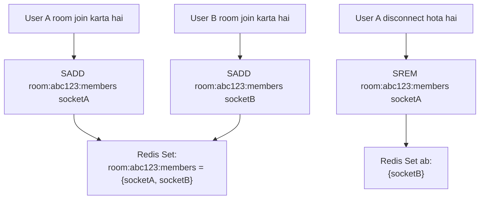
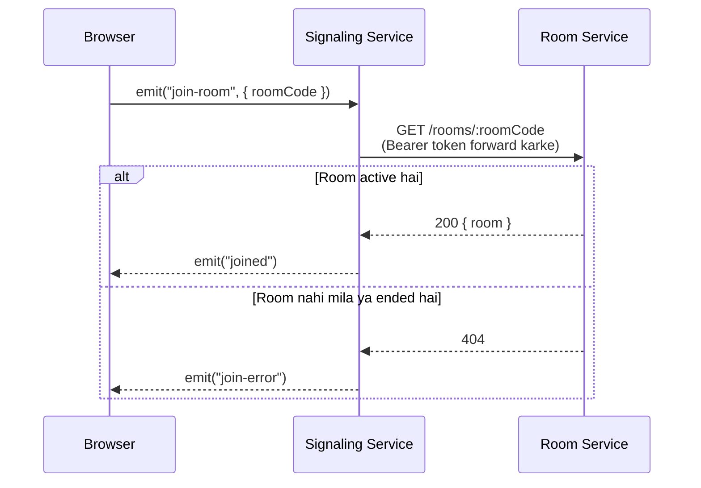
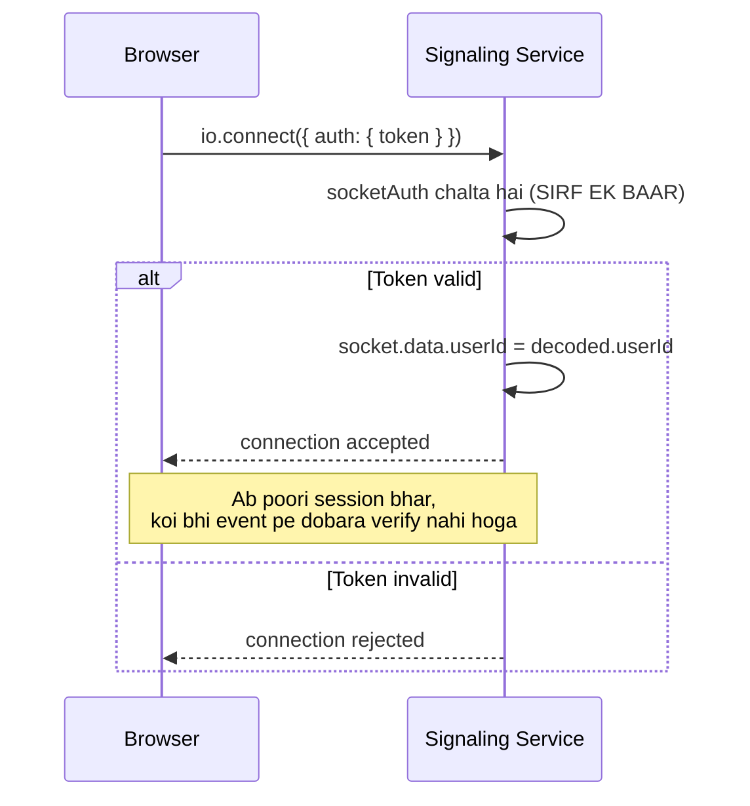
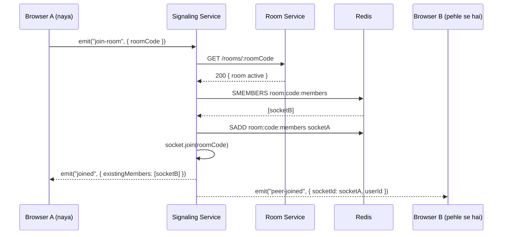
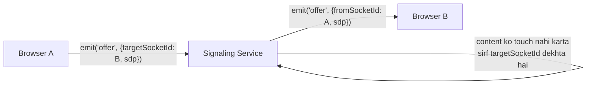
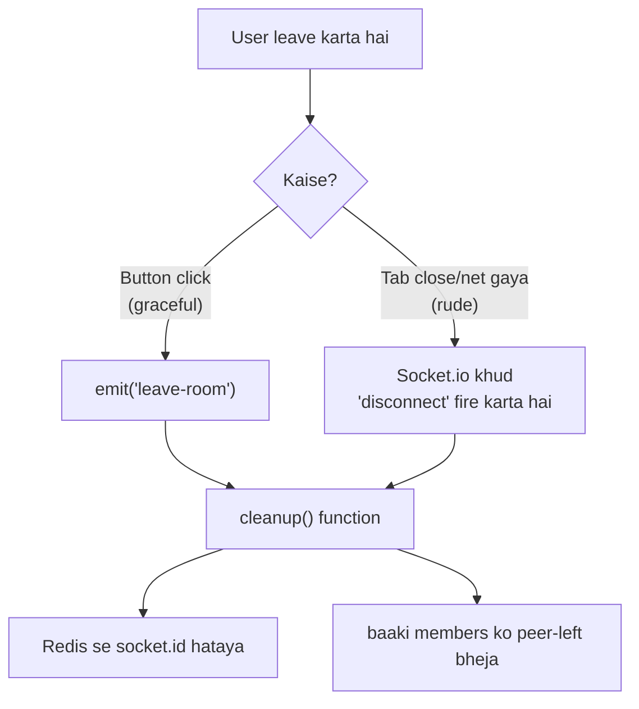
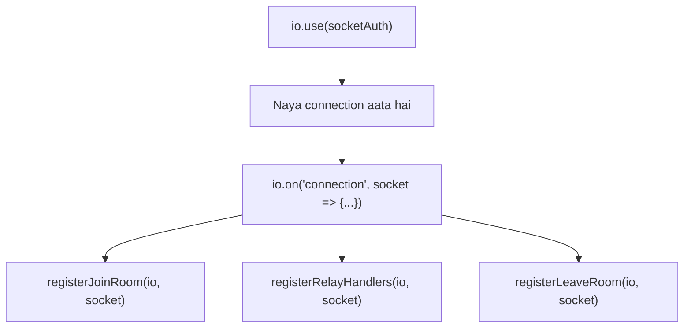
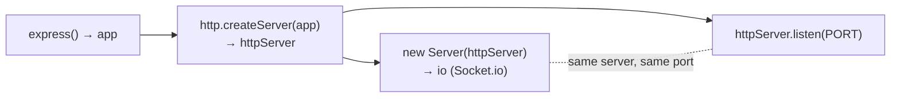
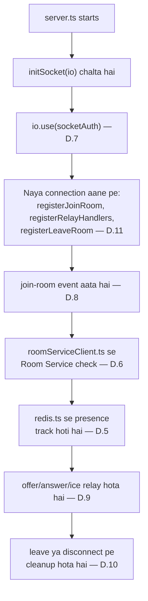

Chalo poora Signaling Service ka core build karte hain — ek-ek step, poora samajh ke. Ye lamba jayega, but end tak poori service samajh mein aa jayegi.

---

# D.5 — `src/config/redis.ts` (Presence Tracking Client)

## Structure — Kahan Banega

```
signaling-service/
└── src/
    └── config/
        └── redis.ts   ← YE NAYA BANEGA
```

## Why — Ye Zaroori Kyun Hai

Yaad karo User Service mein bhi `redis.ts` banaya tha — lekin **uska role bilkul alag tha**. Wahan Redis **Pub/Sub** ke liye use hota tha (Auth Service `publish` karta, User Service `subscribe` karke profile banata — ek-baar wala event).

**Yahan Redis ka role poori tarah different hai:**

Signaling Service ko har waqt ye pata hona chahiye — **"is room mein ABHI kaun-kaun connected hai?"** Ye information:

1. **Bahut fast change hoti hai** — koi bhi second mein join/leave kar sakta hai
2. **Temporary hai** — agar socket disconnect ho jaye, entry turant gayab honi chahiye
3. **Database mein nahi honi chahiye** — Postgres mein isse store karna slow hoga, aur cleanup ka complex logic likhna padega (jaise "agar 5 min tak koi response na aaye toh maan lo disconnect ho gaya")

Isliye Redis ka **Set data structure** use karte hain — `SADD`, `SREM`, `SMEMBERS` commands se.



**Set hi kyun, array/list kyun nahi:** Set automatically **duplicate entries rokta hai** aur add/remove **O(1) speed** (turant) mein hota hai — chahe room mein 2 log ho ya 200, speed same rahegi. List mein "check karo already hai ya nahi, phir add karo" jaisa extra logic likhna padta — Set mein wo built-in hai.

## How — Implementation Plan

Ye file bas ek **Redis connection banayegi aur export karegi** — baaki files (`joinRoom.ts`, `leaveRoom.ts`) isko import karke `sadd`/`srem`/`smembers` call karengi. Isme koi business logic nahi hai, sirf connection setup.

## Code

```powershell
notepad src\config\redis.ts
```

```typescript
import Redis from 'ioredis';
import { REDIS_URL } from './env.js';

const redis = new Redis(REDIS_URL);

redis.on('connect', () => console.log('Redis connected (signaling presence)'));
redis.on('error', (err) => console.error('Redis error:', err));

export default redis;
```

### Line-by-Line

| Line                         | Matlab                                                                                                              |
| ---------------------------- | ------------------------------------------------------------------------------------------------------------------- |
| `new Redis(REDIS_URL)`     | `.env` se `REDIS_URL` (jaise `redis://localhost:6379`) padh kar connection banata hai                         |
| `redis.on('connect', ...)` | Jab connection successful ho, console log — isse`docker logs` mein pata chalega Redis connect hua ya nahi        |
| `redis.on('error', ...)`   | Agar Redis unreachable hai (jaise container start nahi hua), error console mein dikhega — silently crash nahi hoga |
| `export default redis`     | Ye instance baaki files import karke seedha`redis.sadd(...)` jaisa use karengi                                    |

---

# D.6 — `src/config/roomServiceClient.ts` (Room Service Ko HTTP Call)

## Structure — Kahan Banega

```
signaling-service/
└── src/
    └── config/
        └── roomServiceClient.ts   ← YE NAYA BANEGA
```

## Why — Ye Sabse Important Naya Concept Hai Is Phase Mein

Ab tak (Auth → User → Room) **koi bhi service doosri service ko direct HTTP call nahi karti thi.** User Service, Auth Service ka signup event **Redis Pub/Sub se** sunta tha — direct call nahi.

**Signaling Service alag hai** — jab koi user `join-room` bolta hai, Signaling Service ko **turant, live** pata karna hai:

> "Kya ye room abhi bhi real hai? Kya wo active hai (host ne end toh nahi kar diya)?"

Ye information sirf **Room Service ke paas hai** (`room_db` mein) — Signaling Service ke paas apna koi database nahi hai (Section 4 mein document mein likha tha — "no Prisma schema this phase"). Isliye Signaling Service ko **network ke through Room Service se poochna padta hai**, har baar jab koi join karta hai.



**Kyun *fresh* check karte hain, token ke andar cache nahi karte:** Room ka status **kabhi bhi badal sakta hai** — call ke beech mein hi host `end` bol sakta hai. Agar Signaling Service purani/cached info pe bharosa kare, log ek **ended room mein bhi join** ho sakte hain — jo galat hai.

**Token forward karna important hai:** Room Service ka `GET /rooms/:code` route already `authGuard` se protected hai. Signaling Service koi "special internal-only bypass route" nahi banata — wahi token jo browser ne bheja tha, Signaling Service **usी ko aage forward** kar deta hai Room Service ko. Isse Room Service ko lagta hai ki normal client hi request kar raha hai — koi extra security hole nahi banta.

## How — Implementation Plan

`axios` library use karenge (HTTP client) — `ROOM_SERVICE_URL` (env se) + `/rooms/:code` pe GET request bhejenge, `Authorization: Bearer <token>` header ke saath. Agar room nahi milta ya inactive hai, Room Service `404` dega — axios automatically ise **exception (throw)** treat karega, jo calling code (`joinRoom.ts`) mein `catch` block mein pakड़ा jayega.

## Code

```powershell
npm install axios
notepad src\config\roomServiceClient.ts
```

```typescript
import axios from 'axios';
import { ROOM_SERVICE_URL } from './env.js';

export async function getActiveRoom(code: string, token: string) {
  const response = await axios.get(`${ROOM_SERVICE_URL}/rooms/${code}`, {
    headers: { Authorization: `Bearer ${token}` },
  });
  return response.data.data.room;
}
```

### Line-by-Line

| Line                                | Matlab                                                                                                                                                                                               |
| ----------------------------------- | ---------------------------------------------------------------------------------------------------------------------------------------------------------------------------------------------------- |
| `getActiveRoom(code, token)`      | Do parameters lega — kaunsa room code, aur kiska token forward karna hai                                                                                                                            |
| `axios.get(...)`                  | Room Service ke`GET /rooms/:code` route ko hit karega                                                                                                                                              |
| `headers: { Authorization: ... }` | Bina isके Room Service ka`authGuard` `401 Unauthorized` de dega                                                                                                                                |
| `response.data.data.room`         | Yaad karo Room Service ka`successResponse(res, { room })` — wo response `{ success: true, data: { room: {...} } }` shape mein aata hai. Isliye `.data.data.room` — do baar `.data` chahiye |
| `return ... room`                 | Agar sab sahi gaya, poora room object return karega. Agar`404` aaya, `axios` khud ek error **throw** kar dega — isliye is function ko hamesha `try/catch` ke andar call karna hoga      |

**Important note ROOM_SERVICE_URL par:** ye tumhari `env.ts` (D.4) mein already export ho chuka hai — agar route na mile toh check karna `.env.docker` mein `ROOM_SERVICE_URL=http://room-service:4003` sahi likha hai.

---

# D.7 — `src/middleware/socketAuth.ts` (Socket Handshake JWT Verify)

## Structure — Kahan Banega

```
signaling-service/
└── src/
    └── middleware/
        └── socketAuth.ts   ← YE NAYA BANEGA
```

## Why — Ye `authGuard.ts` Ka "Socket Version" Hai

Room/User Service mein `authGuard.ts` HTTP requests pe chalta tha — `req.headers.authorization` se token nikaal ke verify karta tha, phir `req.userId` set karta tha.

**Socket.io mein `req` object exist hi nahi karta** — kyunki ye REST nahi hai, ek **persistent connection** hai jo poore session bhar zinda rehti hai. Isliye equivalent concept:

| REST (Room Service)                        | WebSocket (Signaling Service)                              |
| ------------------------------------------ | ---------------------------------------------------------- |
| `req.headers.authorization`              | `socket.handshake.auth.token`                            |
| `req.userId = ...`                       | `socket.data.userId = ...`                               |
| Middleware chain:`router.use(authGuard)` | `io.use(socketAuth)`                                     |
| Har request pe alag se chalta hai          | **Sirf ek baar** chalta hai — connection bante waqt |

**Important difference samjho:** HTTP mein har request naya hota hai, isliye `authGuard` **har request** pe chalta hai. WebSocket mein connection **ek baar** banta hai aur phir zinda rehta hai (jab tak disconnect na ho) — isliye `socketAuth` bhi **sirf connection ke time ek baar** chalega, uske baad jo bhi events (`join-room`, `offer`, etc.) is socket pe aayenge, unke paas already `socket.data.userId` available hoga — dobara verify karne ki zaroorat nahi.



**Bina isके kya risk hai:** Koi bhi bina login kiye seedhe socket connect kar ke `join-room` bol sakta tha — Signaling Service ko pata hi nahi chalta kaun request kar raha hai. `socketAuth` ye guarantee karta hai ki connection bante hi user verified ho chuka ho.

## How — Implementation Plan

`io.use(middleware)` Socket.io ka pattern hai — Express ke `app.use(middleware)` jaisa hi, bas connection-level pe. Middleware function ko `(socket, next)` milta hai — agar `next()` bina argument ke call karo, connection allow hoti hai; agar `next(new Error(...))` karo, connection **reject** ho jaati hai aur client ko `connect_error` event milta hai.

## Code

```powershell
notepad src\middleware\socketAuth.ts
```

```typescript
import jwt from 'jsonwebtoken';
import { Socket } from 'socket.io';
import { JWT_ACCESS_SECRET } from '../config/env.js';

export function socketAuth(socket: Socket, next: (err?: Error) => void) {
  const token = socket.handshake.auth?.token;

  if (!token) {
    return next(new Error('No token provided'));
  }

  try {
    const payload = jwt.verify(token, JWT_ACCESS_SECRET) as { userId: string };
    socket.data.userId = payload.userId;
    socket.data.token = token;
    next();
  } catch (err) {
    next(new Error('Invalid or expired token'));
  }
}
```

### Line-by-Line

| Line                                        | Matlab                                                                                                                                                        |
| ------------------------------------------- | ------------------------------------------------------------------------------------------------------------------------------------------------------------- |
| `socket.handshake.auth?.token`            | Browser jab connect karta hai (`io.connect(url, { auth: { token: '...' } })`), ye value yahan milti hai                                                     |
| `if (!token) return next(new Error(...))` | Token hi nahi bheja gaya — connection turant reject                                                                                                          |
| `jwt.verify(token, JWT_ACCESS_SECRET)`    | Bilkul same jaisa`authGuard.ts` mein tha — same secret, warna Auth Service ke issue kiye tokens yahan invalid ho jayenge                                   |
| `socket.data.userId = payload.userId`     | Yahan se poori session bhar available rahega —`joinRoom.ts` mein `socket.data.userId` use hoga                                                           |
| `socket.data.token = token`               | **Ye extra hai** — kyunki D.6 wale `getActiveRoom()` ko Room Service call karte waqt yahi token forward karna hai. Isliye ise bhi save kar rahe hain |
| `next()` (bina argument)                  | Sab sahi — connection allow                                                                                                                                  |
| `catch` block                             | Token expired ya tampered —`jwt.verify` khud exception throw karta hai, jo yahan pakड़a jaata hai                                                        |

---

# D.8 — `src/handlers/joinRoom.ts` (`join-room` Event Handle Karega)

## Structure — Kahan Banega

```
signaling-service/
└── src/
    └── handlers/
        └── joinRoom.ts   ← YE NAYA BANEGA
```

## Why — Ye Is Poori Service Ka "Entry Point" Hai

Ye file wo pehla actual kaam hai jo user ke connect hone ke baad hota hai. `join-room` event ka **poora flow** yahan hai:

1. Room Service se poocho — kya ye room real/active hai
2. Redis se poocho — is room mein pehle se kaun-kaun hai
3. Naye socket ko Redis set mein add karo
4. Socket.io ke apne "room" concept mein bhi add karo (taaki future broadcasts easy hon)
5. Naye user ko batao — "ye log pehle se hain" (`joined` event)
6. Purane users ko batao — "koi naya aaya hai" (`peer-joined` event)



**Do "room" concepts hain yahan — confusion na ho isliye clear karte hain:**

| Concept                           | Kya Hai                                                       | Kaun Manage Karta Hai                      |
| --------------------------------- | ------------------------------------------------------------- | ------------------------------------------ |
| Redis Set (`room:code:members`) | Apna khud ka presence tracker — kaun currently connected hai | Humne manually banaya (`SADD`/`SREM`)  |
| `socket.join(roomCode)`         | Socket.io ka**built-in** grouping feature               | Socket.io khud handle karta hai internally |

**Dono alag kyun rakhe:** Redis set humein deta hai **existing members ki exact list** (jise `existingMembers` mein bhejna hai naye user ko). Socket.io ka `room` feature humein deta hai **easy broadcasting** — `socket.to(roomCode).emit(...)` likhne se message **automatically sabko** chala jaata hai jo us room mein hain, bina manually loop chalaye. Dono ek dusre ko complement karte hain, replace nahi karte.

## How — Implementation Plan

`registerJoinRoom(io, socket)` ek function hai jo `socket.on('join-room', async (...) => {...})` register karega. Poora logic **try/catch** ke andar hoga — agar `getActiveRoom` fail ho (room na mile ya ended ho), `catch` mein `join-error` emit karenge.

## Code

```powershell
notepad src\handlers\joinRoom.ts
```

```typescript
import { Server, Socket } from 'socket.io';
import redis from '../config/redis.js';
import { getActiveRoom } from '../config/roomServiceClient.js';

export function registerJoinRoom(io: Server, socket: Socket) {
  socket.on('join-room', async ({ roomCode }: { roomCode: string }) => {
    try {
      await getActiveRoom(roomCode, socket.data.token);

      const setKey = `room:${roomCode}:members`;
      const existingMembers = await redis.smembers(setKey);

      await redis.sadd(setKey, socket.id);
      socket.join(roomCode);
      socket.data.roomCode = roomCode;

      socket.emit('joined', { existingMembers });

      socket.to(roomCode).emit('peer-joined', {
        socketId: socket.id,
        userId: socket.data.userId,
      });
    } catch (err) {
      socket.emit('join-error', 'Room not found or has ended');
    }
  });
}
```

### Line-by-Line

| Line                                                      | Matlab                                                                                                                                            |
| --------------------------------------------------------- | ------------------------------------------------------------------------------------------------------------------------------------------------- |
| `registerJoinRoom(io, socket)`                          | Ye function`socket/index.ts` se call hoga har naye connection pe                                                                                |
| `socket.on('join-room', async ({ roomCode }) => {...})` | Jab browser`socket.emit('join-room', { roomCode: 'abc123' })` bhejega, ye chalega                                                               |
| `await getActiveRoom(roomCode, socket.data.token)`      | Room Service se poochta hai — agar`404` mile, exception throw hoga, `catch` mein chala jayega                                                |
| `const existingMembers = await redis.smembers(setKey)`  | **Important: ye naye member ko add karne SE PEHLE** call kiya hai — warna khud apna hi socket ID `existingMembers` mein aa jaata (galat) |
| `await redis.sadd(setKey, socket.id)`                   | Ab naye socket ko set mein daalo                                                                                                                  |
| `socket.join(roomCode)`                                 | Socket.io ke built-in room mein bhi add karo — future broadcasts ke liye                                                                         |
| `socket.data.roomCode = roomCode`                       | Baad mein`leaveRoom.ts` ke `disconnect` handler ko pata hona chahiye "ye socket kaunse room mein tha" — isliye yahan save kar rahe hain      |
| `socket.emit('joined', { existingMembers })`            | **Sirf isी naye socket ko** bhejta hai — "ye log pehle se hain"                                                                           |
| `socket.to(roomCode).emit('peer-joined', {...})`        | `socket.to()` — matlab **khud ko chhod ke** baaki sab room members ko bhejta hai. `io.to()` hota toh khud ko bhi mil jaata (galat)     |
| `catch (err) { socket.emit('join-error', ...) }`        | Room nahi mila ya koi bhi error — generic message client ko bhej dete hain                                                                       |

---

# D.9 — `src/handlers/relay.ts` (Offer/Answer/ICE-Candidate Relay)

## Structure — Kahan Banega

```
signaling-service/
└── src/
    └── handlers/
        └── relay.ts   ← YE NAYA BANEGA
```

## Why — Ye Poori Service Ka "Asli Maksad" Hai

Yaad karo README mein likha tha: *"Signaling Service ka kaam hai — do browsers ko ek dusre se milwana, phir hat jaana."* Ye file **exactly wahi kaam** karti hai.

WebRTC connection banane ke liye 2 browsers ko teen cheezein exchange karni padti hain:

1. **`offer`** — "mai tumse connect karna chahta hoon, meri capabilities ye hain" (SDP)
2. **`answer`** — "theek hai, meri capabilities ye hain" (SDP)
3. **`ice-candidate`** — "mujhe in networks paths se reach kiya ja sakta hai" (kai baar aata hai, ek-ek karke)

**Signaling Service in teeno ka content kabhi nahi padहता** — sirf dekhta hai `targetSocketId` (kise bhejna hai) aur forward kar deta hai. Ye **jaanbujh kar** kiya gaya hai:



**Kyun 3 alag handlers likhne ki jagah 1 hi function reuse karte hain:** Teeno events (`offer`, `answer`, `ice-candidate`) mein **exact same logic** hai — sirf event ka naam alag hai. Agar 3 baar copy-paste karte, aur kal koi bug fix karna pade (jaise error handling add karni ho), toh 3 jagah change karna padता — aur galti se ek jagah miss ho sakti thi. Isliye ek **factory function** (`relay`) banate hain jo event ka naam leke ek handler return karta hai.

## How — Implementation Plan

`relay(eventName)` ek **higher-order function** hai — ye khud ek function return karta hai jo actual event handler hai. `payload` mein se `targetSocketId` nikaal ke baaki sab data (`sdp` ya `candidate`) as-is, `fromSocketId` tag karke, target ko bhej dete hain.

## Code

```powershell
notepad src\handlers\relay.ts
```

```typescript
import { Server, Socket } from 'socket.io';

export function registerRelayHandlers(io: Server, socket: Socket) {
  const relay = (event: string) => (payload: { targetSocketId: string; [key: string]: any }) => {
    const { targetSocketId, ...rest } = payload;
    io.to(targetSocketId).emit(event, { fromSocketId: socket.id, ...rest });
  };

  socket.on('offer', relay('offer'));
  socket.on('answer', relay('answer'));
  socket.on('ice-candidate', relay('ice-candidate'));
}
```

### Line-by-Line

| Line                                                    | Matlab                                                                                                                                                                                    |
| ------------------------------------------------------- | ----------------------------------------------------------------------------------------------------------------------------------------------------------------------------------------- |
| `const relay = (event: string) => (payload) => {...}` | Ye ek**function jo function return karta hai** — "curry" pattern. `relay('offer')` call karne pe tumhe ek naya function milta hai jo specifically `offer` events handle karega |
| `const { targetSocketId, ...rest } = payload`         | Object destructuring —`targetSocketId` alag nikaal liya, baaki sab (`sdp` ya `candidate`) `rest` mein aa gaya                                                                    |
| `io.to(targetSocketId).emit(event, {...})`            | **`io.to()` note karo, `socket.to()` nahi** — kyunki yahan hume ek **specific socket ID** target karna hai (jo kisi bhi room mein ho sakta hai), na ki poore room ko     |
| `{ fromSocketId: socket.id, ...rest }`                | Receiving browser ko pata hona chahiye "ye kisne bheja" — isliye`fromSocketId` add karte hain                                                                                          |
| `socket.on('offer', relay('offer'))`                  | `relay('offer')` call hote hi ek handler ban gaya, wo `offer` event pe register ho gaya                                                                                               |

**Real-world analogy:** ye function bilkul post office ke jaisa kaam karta hai — envelope pe likha address (`targetSocketId`) padता hai, andar ka letter (`sdp`/`candidate`) khole bina, sender ka naam (`fromSocketId`) stamp kar ke sahi address pe deliver kar deta hai.

---

# D.10 — `src/handlers/leaveRoom.ts` (Leave + Disconnect Cleanup)

## Structure — Kahan Banega

```
signaling-service/
└── src/
    └── handlers/
        └── leaveRoom.ts   ← YE NAYA BANEGA
```

## Why — Do Alag Situations, Ek Hi Cleanup Chahiye

User room chhod sakta hai **do tareekon se:**

1. **Graceful** — "Leave" button click kiya, app ne khud `leave-room` event bheja
2. **Rude** — laptop band kar diya, internet gaya, tab crash hua — koi explicit signal nahi aaya

**Dono cases mein end result same hona chahiye** — Redis se socket hataya jaye, baaki logon ko bataya jaye. Agar sirf `leave-room` handle karte aur `disconnect` ignore karte, toh:

> User apna laptop band kar de → Redis set mein uska socket ID **hamesha ke liye phasa reh jayega** (kyunki koi bhi "leave" event nahi bheja gaya) → dusre users hamesha dekhenge "ye banda room mein hai" jabki wo online hi nahi hai.

Isliye Socket.io ka **built-in `disconnect` event** bhi use karte hain — ye **automatically fire hota hai** jab bhi connection kisi bhi wajah se toot jaye (chahe graceful ho ya na ho).



**Isi wajah se ek hi `cleanup()` function banate hain**, aur dono events (`leave-room` aur `disconnect`) usी ko call karte hain — code duplication bhi nahi hoga, aur guarantee bhi rahegi ki dono paths same result denge.

## How — Implementation Plan

`cleanup(io, socket)` function — pehle check karega socket kis room mein tha (`socket.data.roomCode`, jo `joinRoom.ts` mein set kiya tha). Agar kisi room mein nahi tha (jaise user connect hote hi disconnect ho gaya bina join kiye), `roomCode` undefined hoga — us case mein kuch nahi karna, turant return.

## Code

```powershell
notepad src\handlers\leaveRoom.ts
```

```typescript
import { Server, Socket } from 'socket.io';
import redis from '../config/redis.js';

async function cleanup(io: Server, socket: Socket) {
  const roomCode = socket.data.roomCode;
  if (!roomCode) return;

  await redis.srem(`room:${roomCode}:members`, socket.id);
  socket.to(roomCode).emit('peer-left', { socketId: socket.id });
}

export function registerLeaveRoom(io: Server, socket: Socket) {
  socket.on('leave-room', () => cleanup(io, socket));
  socket.on('disconnect', () => cleanup(io, socket));
}
```

### Line-by-Line

| Line                                            | Matlab                                                                                                         |
| ----------------------------------------------- | -------------------------------------------------------------------------------------------------------------- |
| `const roomCode = socket.data.roomCode`       | `joinRoom.ts` mein set kiya tha, yahan wapas nikaal rahe hain                                                |
| `if (!roomCode) return`                       | Safety check — agar user kabhi kisi room mein joined hi nahi tha, kuch karne ki zaroorat nahi                 |
| `redis.srem(...)`                             | `SADD` ka opposite — set se remove karta hai                                                                |
| `socket.to(roomCode).emit('peer-left', ...)`  | Baaki members ko batao — pehle jaisa hi`socket.to()` (khud ko chhod ke)                                     |
| `socket.on('leave-room', () => cleanup(...))` | Graceful path                                                                                                  |
| `socket.on('disconnect', () => cleanup(...))` | Rude path —**Socket.io built-in event**, humein manually kuch trigger nahi karna, ye khud fire hota hai |

**Note:** `socket.to(roomCode)` disconnect ke case mein bhi kaam karta hai kyunki Socket.io `disconnect` event fire hone se **thodi der pehle tak** socket abhi bhi room mein "technically" registered hota hai — Socket.io internally is timing ko handle karta hai, humein extra kuch nahi karna padता.

---

# D.11 — `src/socket/index.ts` (Wiring Layer)

## Structure — Kahan Banega

```
signaling-service/
└── src/
    └── socket/
        └── index.ts   ← YE NAYA BANEGA
```

## Why — Ye `roomRoutes.ts` Ka Socket-Version Hai

Room Service mein `roomRoutes.ts` ka kaam tha — controllers ko actual HTTP routes se jodना. Yahan bhi wahi zaroorat hai, bas HTTP routes ki jagah **socket event handlers** hain.

Abhi tak humne 3 alag handler files banayi:

- `joinRoom.ts` — `join-room` event
- `relay.ts` — `offer`/`answer`/`ice-candidate` events
- `leaveRoom.ts` — `leave-room`/`disconnect` events

Lekin ye **teeno abhi tak Socket.io se connect nahi hue hain** — koi bhi actual `io.on('connection', ...)` nahi likha. `socket/index.ts` yehi kaam karta hai — sabko ek jagah **wire** karna.



**Kyun alag-alag files mein handlers rakhe, sab ek hi file mein kyun nahi likha:** Agar `joinRoom`, `relay`, `leaveRoom` sab logic ek hi bade file mein hota, wo file 200+ lines ki ho jaati aur samajhna mushkil hota. Alag-alag files (**separation of concerns**) rakhne se har file ka **ek hi zimmedari** hai — `relay.ts` sirf relay ke baare mein sochta hai, `joinRoom.ts` sirf joining ke baare mein. `socket/index.ts` sirf inhe **jodne** ka kaam karta hai — koi business logic khud nahi rakhता.

## How — Implementation Plan

`initSocket(io)` function — pehle `io.use(socketAuth)` lagayega (poore server ke liye ek baar), phir `io.on('connection', ...)` ke andar har naye socket ke liye teeno register-functions call karega.

## Code

```powershell
notepad src\socket\index.ts
```

```typescript
import { Server } from 'socket.io';
import { socketAuth } from '../middleware/socketAuth.js';
import { registerJoinRoom } from '../handlers/joinRoom.js';
import { registerRelayHandlers } from '../handlers/relay.js';
import { registerLeaveRoom } from '../handlers/leaveRoom.js';

export function initSocket(io: Server) {
  io.use(socketAuth);

  io.on('connection', (socket) => {
    registerJoinRoom(io, socket);
    registerRelayHandlers(io, socket);
    registerLeaveRoom(io, socket);
  });
}
```

### Line-by-Line

| Line                                       | Matlab                                                                                                |
| ------------------------------------------ | ----------------------------------------------------------------------------------------------------- |
| `io.use(socketAuth)`                     | Har naye connection attempt pe pehle ye chalega — Room Service ke`router.use(authGuard)` jaisa hi  |
| `io.on('connection', (socket) => {...})` | Jab bhi koi naya socket successfully connect ho (matlab`socketAuth` pass ho gaya), ye block chalega |
| `registerJoinRoom(io, socket)`           | Is specific socket ke liye`join-room` listener register karta hai                                   |
| (baaki 2 lines)                            | Same tareeke se baaki handlers bhi is socket ke liye register hote hain                               |

**Important samjhna:** `io.on('connection', ...)` **har naye user ke liye alag se chalta hai** — agar 5 log connect karein, ye callback **5 baar** chalega, har baar apne alag `socket` object ke saath. Isliye har socket ke apne independent listeners bante hain.

---

# D.12 — `server.ts` (HTTP Server + Socket.io Attach)

## Structure — Kahan Banega

```
signaling-service/
└── server.ts   ← ROOT LEVEL PE (src/ ke bahar, jaisa Room Service mein tha)
```

## Why — `app.listen()` Yahan Kaam Nahi Karta

Room/User/Auth Service mein humne likha tha:

```typescript
app.listen(PORT, () => {...});   // Express ka simple pattern
```

**Yahan ye kaam nahi karega** — kyunki Socket.io ko ek **raw Node.js `http.Server`** instance chahiye hota hai jisse wo "attach" ho sake. `app.listen()` internally ek `http.Server` banata **zaroor** hai, lekin wo instance tumhe **wapas nahi milता** — Express usse apne andar chhupa leta hai.

Isliye humein manually karna padता hai:



Isse **ek hi port (4004) pe do cheezein simultaneously kaam karti hain:**

1. Normal HTTP requests (jaise `/health`) — Express handle karta hai
2. WebSocket upgrade requests — Socket.io handle karta hai

Dono `httpServer` object share karte hain, isliye conflict nahi hota.

## How — Implementation Plan

Step-by-step: `express()` app banao (sirf `/health` route ke liye) → `http.createServer(app)` se raw server banao → `new Server(httpServer, {...})` se Socket.io attach karo → `initSocket(io)` call karo (D.11 wala) → `httpServer.listen(PORT)` se start karo (`app.listen` nahi).

## Code

```powershell
notepad server.ts
```

```typescript
import http from 'http';
import express from 'express';
import { Server } from 'socket.io';
import { PORT } from './src/config/env.js';
import { initSocket } from './src/socket/index.js';

const app = express();
app.get('/health', (req, res) => res.json({ status: 'ok', service: 'signaling-service' }));

const httpServer = http.createServer(app);
const io = new Server(httpServer, { cors: { origin: '*' } });

initSocket(io);

httpServer.listen(PORT, () => console.log(`Signaling Service running on port ${PORT}`));
```

### Line-by-Line

| Line                                                  | Matlab                                                                                                                                                                                     |
| ----------------------------------------------------- | ------------------------------------------------------------------------------------------------------------------------------------------------------------------------------------------ |
| `const app = express()`                             | Normal Express app — but is baar sirf health check ke liye use hoga, poori REST API nahi                                                                                                  |
| `app.get('/health', ...)`                           | Docker health checks / manual browser check ke liye — WebSocket se unrelated                                                                                                              |
| `http.createServer(app)`                            | **Key line** — raw HTTP server banaya, jisme Express app "andar" plugged hai                                                                                                        |
| `new Server(httpServer, { cors: { origin: '*' } })` | Socket.io ko is server se attach kiya.`cors: { origin: '*' }` — abhi ke liye sab origins allow (development ke liye theek, production mein specific frontend domain daalna better hoga) |
| `initSocket(io)`                                    | D.11 wala function call — sab handlers wire ho jate hain                                                                                                                                  |
| `httpServer.listen(PORT, ...)`                      | **`app.listen()` nahi** — `httpServer.listen()`, kyunki ab `httpServer` hi asli server hai jo dono (HTTP + WS) handle karta hai                                               |

---

## Poora Data Flow — Ek Nazar Mein (D.5 se D.12 tak)



---

## Ab Karne Ka Order

```powershell
cd C:\Users\swaru\OneDrive\Desktop\PROJECT\GOOGLE_MEET\services\signaling-service
npm install axios socket.io
```

Phir upar diye order mein sab files banao: `redis.ts` → `roomServiceClient.ts` → `socketAuth.ts` → `joinRoom.ts` → `relay.ts` → `leaveRoom.ts` → `socket/index.ts` → `server.ts`

Sab bana lo, confirm karo, phir `npx tsc --noEmit` chalate hain type-check ke liye — us hisaab se **D.13 (do socket clients se local test)** pe badhenge.
