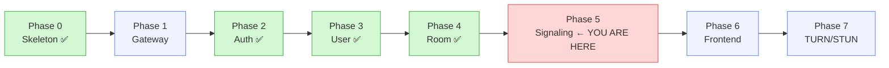
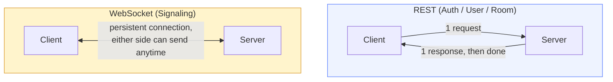
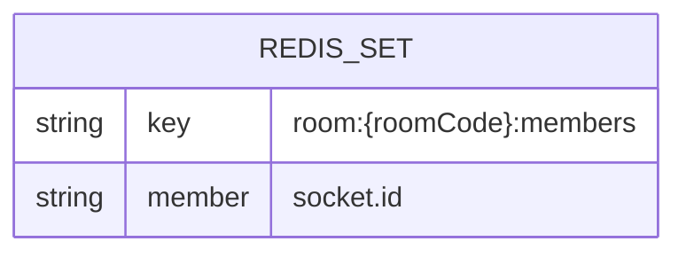
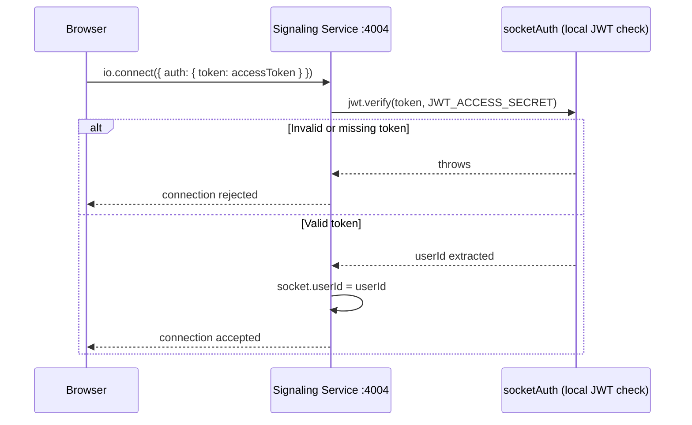
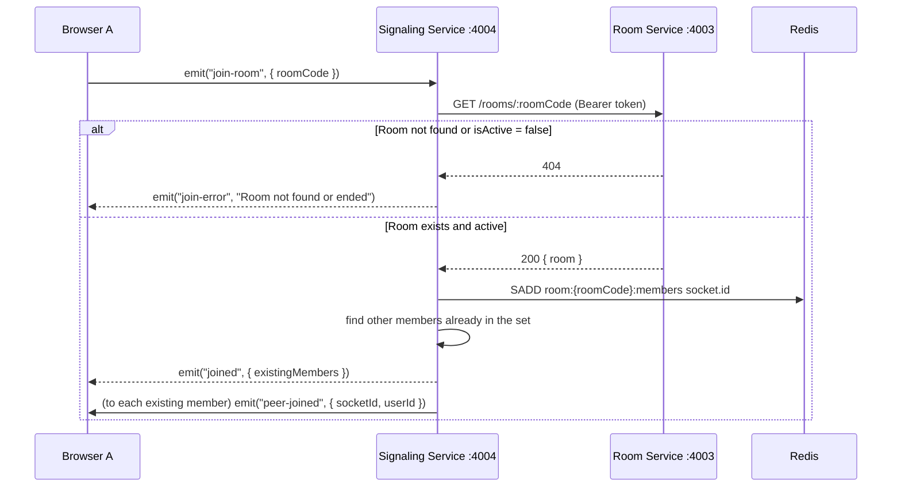
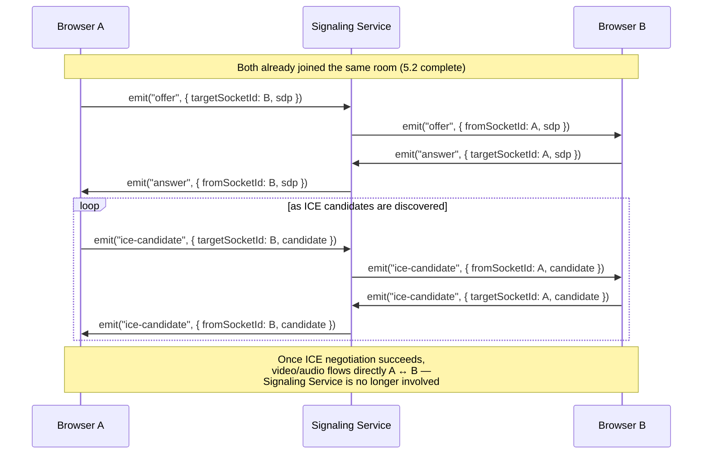
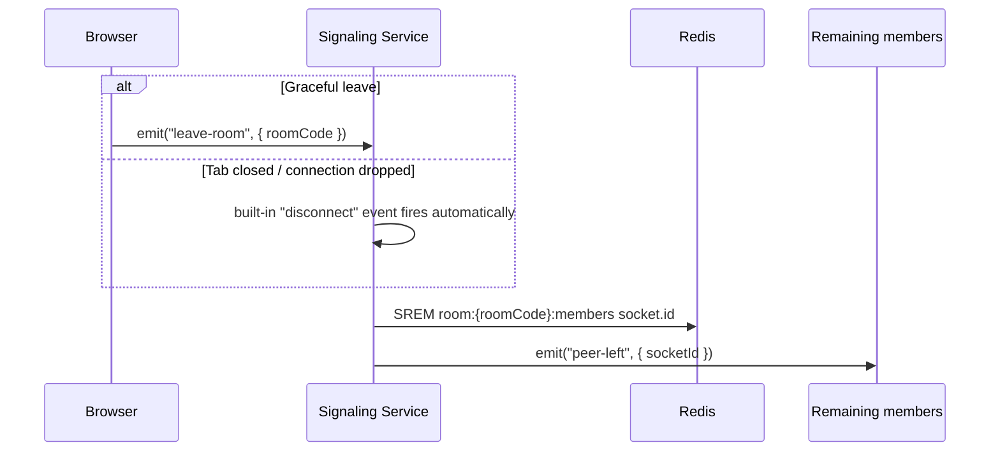
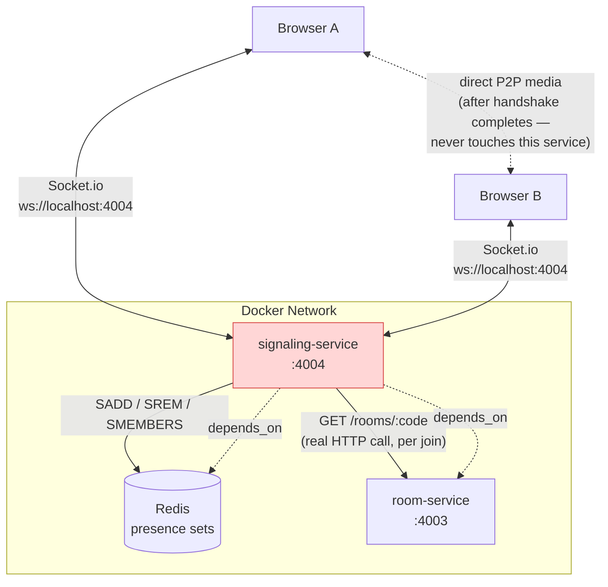

# Video Meet App — Phase 5: Signaling Service (Full Build Plan)

> **Where you are:** Auth Service ✅ Done. User Service ✅ Done. Room Service ✅ Done
> (create/join/leave/end, host-only authorization, all tested via Postman + Docker).
>
> **This phase:** Build **Signaling Service** — the piece that lets two browsers,
> already inside the same room, find each other and exchange the connection
> info WebRTC needs to set up a **direct peer-to-peer** video/audio stream.
> This is the first service in the project that speaks **WebSocket**, not REST.

---

## Table of Contents

- [1. Where This Fits in the Roadmap](#1-where-this-fits-in-the-roadmap)
- [2. What Signaling Service Actually Does](#2-what-signaling-service-actually-does)
- [3. Why WebSocket Instead of REST](#3-why-websocket-instead-of-rest)
- [4. Data Model](#4-data-model)
- [5. Full Request Flow](#5-full-request-flow)
- [6. Build Steps — File by File](#6-build-steps--file-by-file)
- [7. Folder Structure](#7-folder-structure)
- [8. Testing Plan](#8-testing-plan)
- [9. Docker Integration](#9-docker-integration)
- [10. Status Checklist](#10-status-checklist)

---

## 1. Where This Fits in the Roadmap



**Why Signaling comes right after Room:** Room Service answered "is this room
real and active." Signaling Service is the very next question: "okay, given
that this room is real — how do the two people *inside* it actually start
seeing and hearing each other?" Nothing about video happens without this
step existing first.

---

## 2. What Signaling Service Actually Does

In plain terms, it answers one question, repeated for every pair of people
in a room:

> **"Here's my connection info — please pass it to the other person, and
> bring back theirs."**

That's it. It does not:

- Store any video or audio (it never sees the actual stream)
- Persist anything to a database (no service-owned DB this phase)
- Decide who is *allowed* in a room (Room Service already decided that)

It **does**:

- Confirm the room is still real and active (by asking Room Service)
- Track who is *currently connected* via a live Redis set
- Relay three specific message types — `offer`, `answer`, `ice-candidate` —
  from one socket straight to another, unmodified

**Analogy:** think of it as a hotel receptionist connecting two phone calls.
The receptionist doesn't listen to the conversation — they just look up the
right room and patch the call through.

---

## 3. Why WebSocket Instead of REST

Every service so far (Auth, User, Room) was **request → response**: the
client asks a question, the server answers, the connection closes. That
model breaks down here because:

- A room can have **any number of people**, and any of them might join or
  leave at any moment — there's no single "response" to wait for
- Messages need to flow in **both directions**, unprompted — the server
  needs to *push* `peer-joined` to existing members the instant someone new
  connects, without them having to ask



**Socket.io** is the library used here — it's a layer on top of raw
WebSocket that handles reconnection, fallback transports, and a clean
`emit`/`on` event API, so you're not hand-rolling the WebSocket protocol.

---

## 4. Data Model

**There is no Prisma schema this phase.** Signaling Service is deliberately
stateless at the database level — it has no `signaling_db`. The only thing
it tracks is *live presence*, and that lives entirely in Redis, not
Postgres, because:

- It's inherently temporary (a socket disconnecting should vanish
  immediately, not sit in a table waiting for cleanup)
- It needs to be fast and shared across multiple Signaling Service
  instances later (Phase 15, Kubernetes) — Redis sets are built for exactly
  this



Conceptually, for each active room, Redis holds a **set** of socket IDs
currently connected to it:

```
room:abc-defg-hij:members = { "socketA1x9", "socketB2y7" }
```

**Why a Redis *set* and not a list:** a set automatically prevents
duplicate entries and gives O(1) add/remove — perfect for "who's here right
now," where order doesn't matter and duplicates would be a bug.

---

## 5. Full Request Flow

### 5.1 — Connection + Authentication (Socket Handshake)



**Same "copy, don't import" rule as Room/User Service** — this service
carries its own copy of the JWT-verification logic, adapted for
`socket.handshake.auth.token` instead of an `Authorization` header. No
network call to Auth Service.

### 5.2 — Join Room



**Why call Room Service here specifically:** this is the one point where
Signaling Service needs data it doesn't own. "Is this room active" can
change at any moment (the host might call `end` on Room Service mid-call),
so Signaling checks fresh, on every join, rather than trusting a token
claim.

### 5.3 — Offer / Answer / ICE Candidate Relay



**This is the "pure relay" step** — the server does not open, read, or
modify the `sdp`/`candidate` payloads. It only looks at `targetSocketId` to
decide where to forward the message. This is deliberate: WebRTC's SDP
format is not this service's concern, and inspecting it would be adding
complexity with no benefit.

### 5.4 — Leave Room / Disconnect



**Why both paths lead to the same cleanup:** a user can leave "politely"
(clicking a Leave button) or "rudely" (closing the laptop lid). Both must
result in the same Redis cleanup and the same notification to others —
otherwise stale entries pile up in the presence set forever.

---

## 6. Build Steps — File by File

```mermaid
flowchart TD
    D1["D.1 — Folder structure"] --> D2["D.2 — package.json + deps"]
    D2 --> D3["D.3 — .env / .env.docker / .env.example"]
    D3 --> D4["D.4 — Copy JWT-verify logic (adapted for sockets)"]
    D4 --> D5["D.5 — src/config/redis.ts (presence client)"]
    D5 --> D6["D.6 — src/config/roomServiceClient.ts (axios)"]
    D6 --> D7["D.7 — src/middleware/socketAuth.ts"]
    D7 --> D8["D.8 — src/handlers/joinRoom.ts"]
    D8 --> D9["D.9 — src/handlers/relay.ts (offer/answer/ice)"]
    D9 --> D10["D.10 — src/handlers/leaveRoom.ts + disconnect"]
    D10 --> D11["D.11 — src/socket/index.ts (wires handlers to io)"]
    D11 --> D12["D.12 — server.ts (http server + io.attach)"]
    D12 --> D13["D.13 — Local test: 2 socket.io-client scripts"]
    D13 --> D14["D.14 — Dockerfile + .dockerignore"]
    D14 --> D15["D.15 — docker-compose.yml entry"]
    D15 --> D16["D.16 — Full Docker test"]

    style D1 fill:#eef3ff,stroke:#5b7fff
    style D2 fill:#eef3ff,stroke:#5b7fff
    style D3 fill:#eef3ff,stroke:#5b7fff
    style D4 fill:#fff4cc,stroke:#d99a2b
    style D5 fill:#fff4cc,stroke:#d99a2b
    style D6 fill:#fff4cc,stroke:#d99a2b
    style D7 fill:#ffd6d6,stroke:#d94a4a
    style D8 fill:#ffd6d6,stroke:#d94a4a
    style D9 fill:#ffd6d6,stroke:#d94a4a
    style D10 fill:#ffd6d6,stroke:#d94a4a
    style D11 fill:#dff3e4,stroke:#4a9b61
    style D12 fill:#dff3e4,stroke:#4a9b61
    style D13 fill:#d9e8ff,stroke:#4a78c2
    style D14 fill:#dff3e4,stroke:#4a9b61
    style D15 fill:#dff3e4,stroke:#4a9b61
    style D16 fill:#d9e8ff,stroke:#4a78c2
```



### D.1 — Folder + branch

```powershell
cd C:\Users\swaru\OneDrive\Desktop\PROJECT\GOOGLE_MEET
git checkout main
git checkout -b phase-5-signaling-service
cd services\signaling-service
mkdir src, src\config, src\middleware, src\handlers, src\socket, src\utils, types, types\express
```

### D.2 — `package.json` + dependencies

```powershell
npm init -y
npm install express socket.io ioredis axios jsonwebtoken dotenv pino pino-http
npm install --save-dev typescript tsx @types/node @types/express @types/jsonwebtoken pino-pretty
```

**Note what's absent compared to Room Service:** no `prisma`,
`@prisma/client`, or `joi`. This service has no database and — for now — no
request bodies to validate (Socket.io payloads are plain JS objects, not
HTTP request bodies going through a validation middleware chain).

Set in `package.json`:

```json
"type": "module",
"scripts": {
  "dev": "tsx watch server.ts",
  "build": "tsc",
  "start": "node dist/server.js"
}
```

### D.3 — Environment files

**`.env`** (local dev):

```
PORT=4004
JWT_ACCESS_SECRET=<same value as auth-service>
REDIS_URL=redis://localhost:6379
ROOM_SERVICE_URL=http://localhost:4003
NODE_ENV=development
```

**`.env.docker`** (container hostnames — no `localhost`):

```
PORT=4004
JWT_ACCESS_SECRET=<same value as auth-service>
REDIS_URL=redis://redis:6379
ROOM_SERVICE_URL=http://room-service:4003
NODE_ENV=production
```

**`.env.example`**:

```
PORT=4004
JWT_ACCESS_SECRET=replace_with_same_secret_as_auth_service
REDIS_URL=redis://localhost:6379
ROOM_SERVICE_URL=http://localhost:4003
NODE_ENV=development
```

**No `DATABASE_URL` anywhere in this service** — worth double-checking you
didn't copy it out of habit from Room Service's `.env`.

### D.4 — `src/config/env.ts`

```ts
import 'dotenv/config';

export const PORT: string = process.env.PORT || '4004';
export const JWT_ACCESS_SECRET: string = process.env.JWT_ACCESS_SECRET as string;
export const REDIS_URL: string = process.env.REDIS_URL as string;
export const ROOM_SERVICE_URL: string = process.env.ROOM_SERVICE_URL as string;
export const NODE_ENV: string = process.env.NODE_ENV as string;
```

Same trimmed-to-what's-actually-used pattern from Room Service's `env.ts`
fix — only what this service touches.

### D.5 — `src/config/redis.ts`

```ts
import Redis from 'ioredis';
import { REDIS_URL } from './env.js';

const redis = new Redis(REDIS_URL);

redis.on('connect', () => console.log('Redis connected (signaling presence)'));
redis.on('error', (err) => console.error('Redis error:', err));

export default redis;
```

**Different role than User Service's `redis.ts`:** User Service used Redis
for **Pub/Sub** (`subscribe`/`publish`, one-time events). This file uses
Redis purely as a **key-value/set store** (`sadd`/`srem`/`smembers`) — no
subscribing at all. Same library, genuinely different use.

### D.6 — `src/config/roomServiceClient.ts`

```ts
import axios from 'axios';
import { ROOM_SERVICE_URL } from './env.js';

export async function getActiveRoom(code: string, token: string) {
  const response = await axios.get(`${ROOM_SERVICE_URL}/rooms/${code}`, {
    headers: { Authorization: `Bearer ${token}` },
  });
  return response.data.data.room;
}
```

**This is the one real inter-service HTTP call in this entire service.**
Forwarding the same `token` the browser already sent means Room Service's
`authGuard` verifies it exactly like any other client request — no special
internal-only route is needed, since Room Service's `GET /rooms/:code` is
already a normal authenticated endpoint.

### D.7 — `src/middleware/socketAuth.ts`

```ts
import jwt from 'jsonwebtoken';
import { Socket } from 'socket.io';
import { JWT_ACCESS_SECRET } from '../config/env.js';

export function socketAuth(socket: Socket, next: (err?: Error) => void) {
  const token = socket.handshake.auth?.token;

  if (!token) {
    return next(new Error('No token provided'));
  }

  try {
    const payload = jwt.verify(token, JWT_ACCESS_SECRET) as { userId: string };
    socket.data.userId = payload.userId;
    socket.data.token = token; // kept for the Room Service call in D.8
    next();
  } catch (err) {
    next(new Error('Invalid or expired token'));
  }
}
```

**Why `socket.data` instead of `req.userId` (like every other service):**
Socket.io sockets don't have a `req` object — `socket.data` is the
equivalent stash for per-connection state that survives for the socket's
whole lifetime, not just one request/response cycle.

### D.8 — `src/handlers/joinRoom.ts`

```ts
import { Server, Socket } from 'socket.io';
import redis from '../config/redis.js';
import { getActiveRoom } from '../config/roomServiceClient.js';

export function registerJoinRoom(io: Server, socket: Socket) {
  socket.on('join-room', async ({ roomCode }: { roomCode: string }) => {
    try {
      await getActiveRoom(roomCode, socket.data.token);

      const setKey = `room:${roomCode}:members`;
      const existingMembers = await redis.smembers(setKey);

      await redis.sadd(setKey, socket.id);
      socket.join(roomCode);
      socket.data.roomCode = roomCode;

      socket.emit('joined', { existingMembers });

      socket.to(roomCode).emit('peer-joined', {
        socketId: socket.id,
        userId: socket.data.userId,
      });
    } catch (err) {
      socket.emit('join-error', 'Room not found or has ended');
    }
  });
}
```

**Two different "room" concepts appear here, worth telling apart:**
`redis.sadd(setKey, ...)` is *your own* presence tracking, while
`socket.join(roomCode)` is *Socket.io's built-in* room feature (lets you
`io.to(roomCode).emit(...)` without manually looping over socket IDs). They
happen to share the word "room" but are two separate mechanisms working
together.

### D.9 — `src/handlers/relay.ts`

```ts
import { Server, Socket } from 'socket.io';

export function registerRelayHandlers(io: Server, socket: Socket) {
  const relay = (event: string) => (payload: { targetSocketId: string; [key: string]: any }) => {
    const { targetSocketId, ...rest } = payload;
    io.to(targetSocketId).emit(event, { fromSocketId: socket.id, ...rest });
  };

  socket.on('offer', relay('offer'));
  socket.on('answer', relay('answer'));
  socket.on('ice-candidate', relay('ice-candidate'));
}
```

**Why one `relay` factory instead of three near-identical handlers:** all
three events do the exact same thing — forward the payload to
`targetSocketId`, tagging it with `fromSocketId` so the receiver knows who
sent it. The only difference is the event name, so writing it once avoids
copy-pasted logic that could drift out of sync if one gets edited later and
the others don't.

### D.10 — `src/handlers/leaveRoom.ts`

```ts
import { Server, Socket } from 'socket.io';
import redis from '../config/redis.js';

async function cleanup(io: Server, socket: Socket) {
  const roomCode = socket.data.roomCode;
  if (!roomCode) return;

  await redis.srem(`room:${roomCode}:members`, socket.id);
  socket.to(roomCode).emit('peer-left', { socketId: socket.id });
}

export function registerLeaveRoom(io: Server, socket: Socket) {
  socket.on('leave-room', () => cleanup(io, socket));
  socket.on('disconnect', () => cleanup(io, socket));
}
```

**Both events call the same `cleanup` function** — this is the direct
implementation of the "graceful vs. rude exit, same result" rule from
Section 5.4.

### D.11 — `src/socket/index.ts`

```ts
import { Server } from 'socket.io';
import { socketAuth } from '../middleware/socketAuth.js';
import { registerJoinRoom } from '../handlers/joinRoom.js';
import { registerRelayHandlers } from '../handlers/relay.js';
import { registerLeaveRoom } from '../handlers/leaveRoom.js';

export function initSocket(io: Server) {
  io.use(socketAuth);

  io.on('connection', (socket) => {
    registerJoinRoom(io, socket);
    registerRelayHandlers(io, socket);
    registerLeaveRoom(io, socket);
  });
}
```

**This file is the "wiring" layer** — same role as `roomRoutes.ts` in Room
Service, just for socket events instead of HTTP routes. `io.use(socketAuth)`
runs on every incoming connection attempt, before `connection` fires —
exactly analogous to `router.use(authGuard)`.

### D.12 — `server.ts`

```ts
import http from 'http';
import express from 'express';
import { Server } from 'socket.io';
import { PORT } from './src/config/env.js';
import { initSocket } from './src/socket/index.js';

const app = express();
app.get('/health', (req, res) => res.json({ status: 'ok', service: 'signaling-service' }));

const httpServer = http.createServer(app);
const io = new Server(httpServer, { cors: { origin: '*' } });

initSocket(io);

httpServer.listen(PORT, () => console.log(`Signaling Service running on port ${PORT}`));
```

**Why `http.createServer(app)` instead of `app.listen(PORT)`:** Socket.io
needs a raw Node `http.Server` instance to attach to — `app.listen()` under
the hood creates one anyway, but it doesn't hand it back to you. Building
it explicitly here is what lets `io` and `app` share the exact same server
and port, so both the `/health` REST route and the WebSocket upgrade work
side by side.

### D.13 — Local test with two Socket.io clients

Before writing frontend code (Phase 6), verify the handshake works using a
throwaway Node script, run twice in two terminals with two different real
access tokens (from two different logged-in users via Auth Service):

```ts
// test-client.ts (temporary, not part of the service)
import { io } from 'socket.io-client';

const socket = io('http://localhost:4004', {
  auth: { token: 'PASTE_ACCESS_TOKEN_HERE' },
});

socket.on('connect', () => {
  console.log('Connected as', socket.id);
  socket.emit('join-room', { roomCode: 'PASTE_ROOM_CODE_HERE' });
});

socket.on('joined', (data) => console.log('Joined:', data));
socket.on('peer-joined', (data) => console.log('Peer joined:', data));
socket.on('join-error', (msg) => console.log('Join error:', msg));
socket.on('peer-left', (data) => console.log('Peer left:', data));
```

```powershell
npm install --save-dev socket.io-client
npx tsx test-client.ts
```

**Checkpoint:** run this in two terminals, both pointed at the same
`roomCode` (created + still active via Room Service). Terminal 1 should log
`peer-joined` the moment Terminal 2 connects.

### D.14 — Dockerfile (port 4004)

```dockerfile
FROM node:20-alpine
WORKDIR /app
COPY package*.json ./
RUN npm install
COPY tsconfig.json ./
COPY src ./src
COPY server.ts ./
RUN npm run build
EXPOSE 4004
CMD ["node", "dist/server.js"]
```

**Notably simpler than Room/Auth/User's Dockerfile** — no
`COPY prisma ./prisma` or `RUN npx prisma generate`, since there's no
Prisma schema in this service at all.

`.dockerignore` — same content as the other services.

### D.15 — `docker-compose.yml`

```yaml
signaling-service:
  build: ./services/signaling-service
  container_name: signaling-service
  ports:
    - "4004:4004"
  env_file:
    - ./services/signaling-service/.env.docker
  depends_on:
    - redis
    - room-service
```

**`depends_on: room-service` matters more here than it did for Room's
`depends_on: auth-service`** — Signaling Service makes a *real* HTTP call to
Room Service on every `join-room` event, so if Room Service isn't up yet,
joins will genuinely fail, not just be a documentation nicety.

### D.16 — Full Docker test

```powershell
cd ..\..
docker compose build signaling-service
docker compose up -d signaling-service
docker logs signaling-service
```

Expected: `Redis connected (signaling presence)` and
`Signaling Service running on port 4004`, no `ECONNREFUSED` (would mean
Redis or Room Service isn't reachable from inside the container).

Re-run the two-terminal test from D.13, pointed at
`http://localhost:4004` (Docker-exposed port) instead of a local `tsx`
process.

---

## 7. Folder Structure

```
signaling-service/
├── src/
│   ├── config/
│   │   ├── env.ts
│   │   ├── redis.ts
│   │   └── roomServiceClient.ts
│   ├── middleware/
│   │   └── socketAuth.ts
│   ├── handlers/
│   │   ├── joinRoom.ts
│   │   ├── relay.ts
│   │   └── leaveRoom.ts
│   └── socket/
│       └── index.ts
├── server.ts
├── package.json, tsconfig.json
├── .env, .env.docker, .env.example
├── Dockerfile, .dockerignore
```

**Notice what's missing compared to Room Service:** no `prisma/`, no
`controllers/` (handlers replace them), no `routes/` (socket events replace
them), no `validation/` (no Joi schemas — payloads are trusted internal
socket messages, not public-facing form input... a gap worth revisiting
later, noted in Section 10).

---

## 8. Testing Plan

| #  | Test                          | Steps                                                                   | Expected                                                                                          |
| -- | ----------------------------- | ----------------------------------------------------------------------- | ------------------------------------------------------------------------------------------------- |
| 1  | Connect with no token         | `io.connect()` with no `auth.token`                                 | Connection rejected,`connect_error` fires                                                       |
| 2  | Connect with invalid token    | `auth: { token: 'garbage' }`                                          | Connection rejected                                                                               |
| 3  | Connect with valid token      | Real`accessToken` from Auth Service                                   | Connection succeeds                                                                               |
| 4  | Join a real, active room      | `emit('join-room', { roomCode })` for a room created via Room Service | `joined` event fires with `existingMembers: []`                                               |
| 5  | Join a non-existent room      | `emit('join-room', { roomCode: 'fake-code' })`                        | `join-error` fires                                                                              |
| 6  | Join an ended room            | End the room via Room Service first, then try to join                   | `join-error` fires                                                                              |
| 7  | Second client joins same room | Client B joins after Client A                                           | Client A receives`peer-joined`; B receives `joined` with A's socket ID in `existingMembers` |
| 8  | Offer/answer relay            | A emits`offer` targeting B's socket ID                                | B receives`offer` with `fromSocketId` = A's ID                                                |
| 9  | ICE candidate relay           | A emits`ice-candidate` targeting B                                    | B receives it, tagged with`fromSocketId`                                                        |
| 10 | Leave room (graceful)         | A emits`leave-room`                                                   | B receives`peer-left`; Redis set no longer has A                                                |
| 11 | Disconnect (tab closed)       | Kill A's process/connection without emitting`leave-room`              | Same as#10 — `disconnect` handler runs cleanup                                                 |

**Verify Redis state directly, alongside the Socket.io tests:**

```powershell
docker exec -it redis redis-cli SMEMBERS room:<roomCode>:members
```

Should reflect exactly who's currently connected, shrinking/growing in real
time as clients join and leave.

---

## 9. Docker Integration



**The dotted line at the bottom is the entire point of this service** —
once `offer`/`answer`/`ice-candidate` have been exchanged, Signaling Service
steps out of the picture completely. It never sees a single video frame or
audio sample.

---

## 10. Status Checklist

```
D.1  Folder structure               [░░░░░░░░░░]  0%
D.2  package.json + deps            [░░░░░░░░░░]  0%
D.3  Env files                      [░░░░░░░░░░]  0%
D.4  env.ts                         [░░░░░░░░░░]  0%
D.5  redis.ts (presence)            [░░░░░░░░░░]  0%
D.6  roomServiceClient.ts           [░░░░░░░░░░]  0%
D.7  socketAuth.ts                  [░░░░░░░░░░]  0%
D.8  joinRoom.ts                    [░░░░░░░░░░]  0%
D.9  relay.ts                       [░░░░░░░░░░]  0%
D.10 leaveRoom.ts                   [░░░░░░░░░░]  0%
D.11 socket/index.ts                [░░░░░░░░░░]  0%
D.12 server.ts                      [░░░░░░░░░░]  0%
D.13 Local 2-client test            [░░░░░░░░░░]  0%
D.14 Dockerfile                     [░░░░░░░░░░]  0%
D.15 docker-compose.yml entry       [░░░░░░░░░░]  0%
D.16 Full Docker test               [░░░░░░░░░░]  0%
```

**Known gap to revisit later, not blocking for this phase:** socket event
payloads (`join-room`, `offer`, etc.) currently have no schema validation —
unlike Room Service's Joi-validated request bodies. This is acceptable for
now since only your own frontend will emit these events, but if this app
ever accepts third-party clients, add a lightweight payload shape check
(even a manual `typeof` check) before trusting `targetSocketId` and
similar fields.

**Immediate next action:** D.1 — create the branch and folder structure,
then work straight down the table, same as Room Service.
