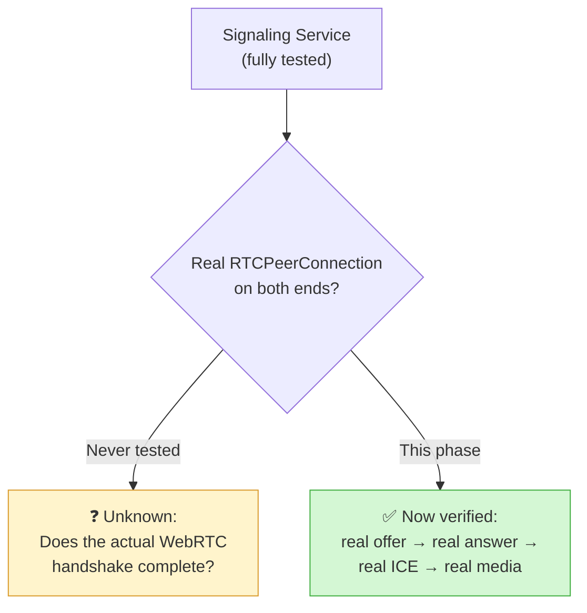
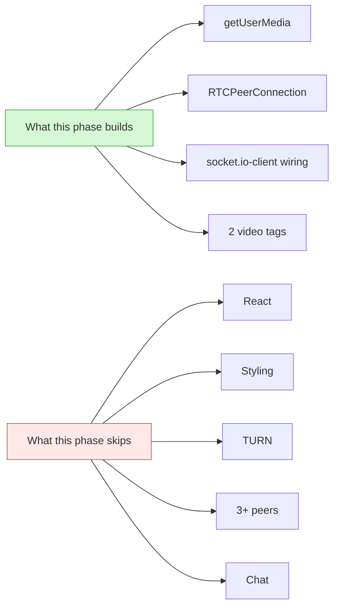
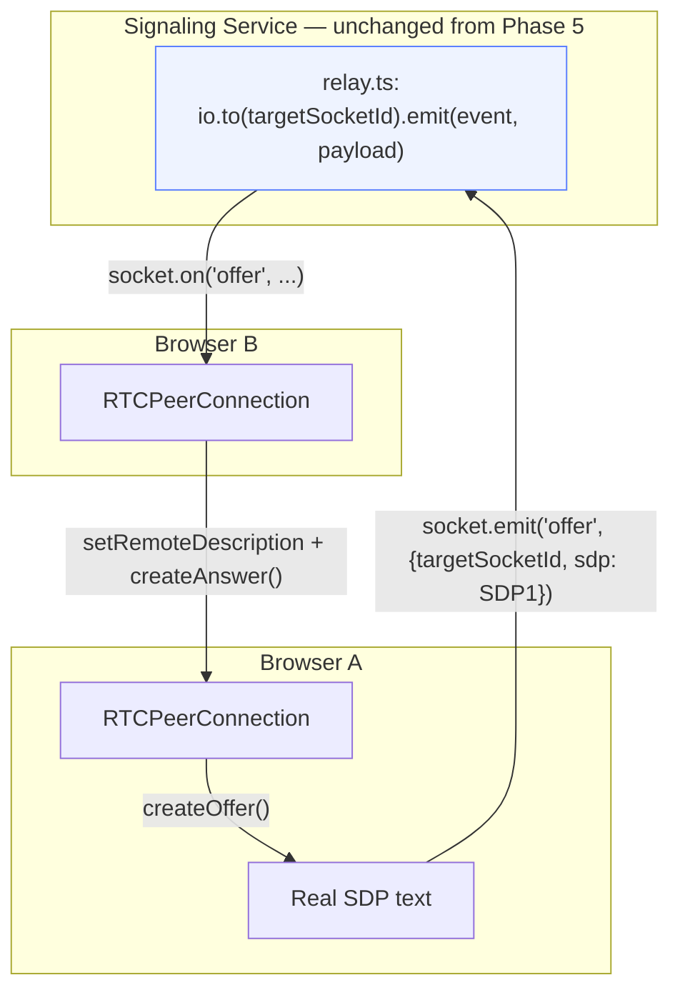
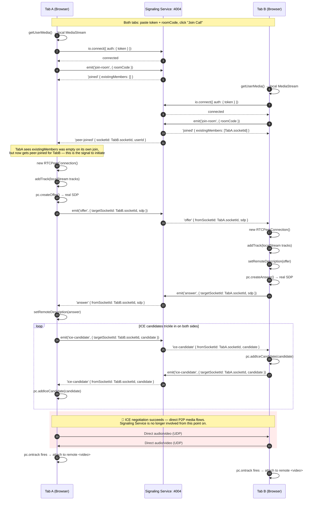
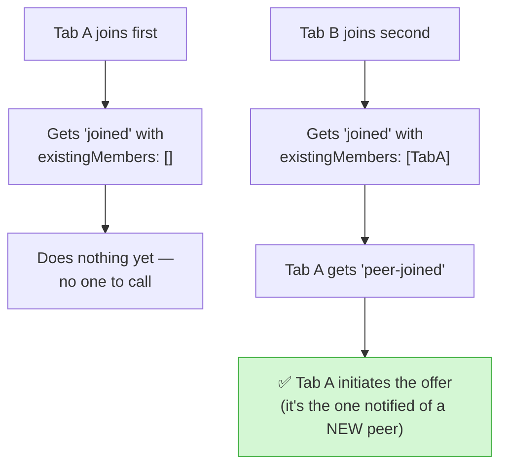
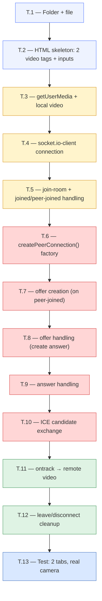
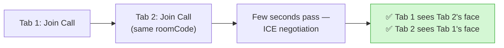
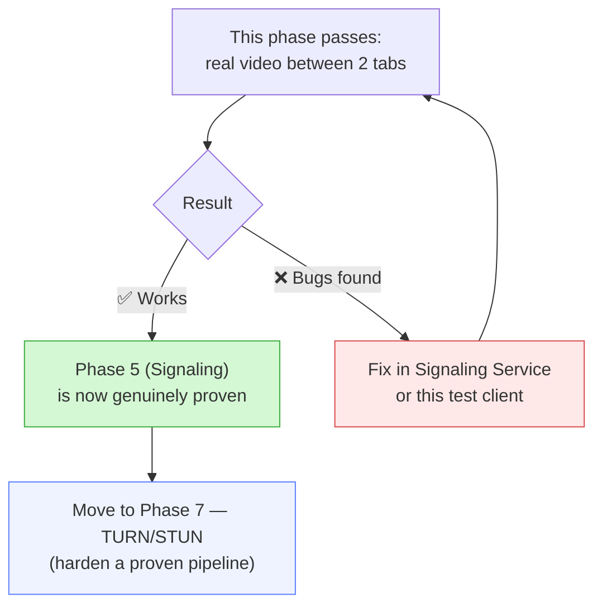

# Video Meet App — Phase 6: Minimal WebRTC Test Client (Full Build Plan)

> **Where you are:** Auth ✅ · User ✅ · Room ✅ · Gateway (with `/v1` versioning) ✅ · Signaling Service ✅
> (`connect`, `join-room`, `peer-joined`, `offer`/`answer`/`ice-candidate` relay, `leave-room`,
> `disconnect` cleanup — all verified via Socket.io test scripts + Postman + `docker logs` + Redis
> `SMEMBERS`).
>
> **What's NOT verified yet:** whether a real `RTCPeerConnection`, fed by the events your Signaling
> Service relays, can actually establish a **working audio/video stream** between two browsers.
> Everything so far proves the *signaling* is correct. Nothing so far proves the *WebRTC* handshake
> built on top of it is correct.
>
> **This phase:** Build the smallest possible thing that can prove that — one plain HTML file, no
> React, no build step, no UI polish. Two browser tabs, two buttons, real camera/mic, real peer
> connection. If this works, Phase 5 is *actually* done, not just "probably done." If it doesn't,
> you find out now, on a throwaway file, instead of after TURN/STUN hardening or a half-built React
> app depend on the same broken assumption.

---

## Table of Contents

- [1. Where This Fits in the Roadmap](#1-where-this-fits-in-the-roadmap)
- [2. Why This Phase Exists — The Actual Reasoning](#2-why-this-phase-exists--the-actual-reasoning)
- [3. What &#34;Minimal&#34; Means Here (and What It Deliberately Skips)](#3-what-minimal-means-here-and-what-it-deliberately-skips)
- [4. WebRTC Concepts You Need Before Writing Code](#4-webrtc-concepts-you-need-before-writing-code)
- [5. Full Connection Flow](#5-full-connection-flow)
- [6. Build Steps — File by File](#6-build-steps--file-by-file)
- [7. Folder Structure](#7-folder-structure)
- [8. Testing Plan](#8-testing-plan)
- [9. Known Failure Modes &amp; How to Read Them](#9-known-failure-modes--how-to-read-them)
- [10. Status Checklist](#10-status-checklist)
- [11. What Happens After This Phase](#11-what-happens-after-this-phase)

---

## 1. Where This Fits in the Roadmap

```mermaid
flowchart LR
    P0["Phase 0<br/>Skeleton ✅"] --> P1["Phase 1<br/>Gateway ✅"]
    P1 --> P2["Phase 2<br/>Auth ✅"]
    P2 --> P3["Phase 3<br/>User ✅"]
    P3 --> P4["Phase 4<br/>Room ✅"]
    P4 --> P5["Phase 5<br/>Signaling ✅"]
    P5 --> P6["Phase 6<br/>Minimal Test Client ← YOU ARE HERE"]
    P6 --> P7["Phase 7<br/>TURN/STUN"]
    P7 --> P8["Phase 8<br/>Chat Service"]
    P8 --> P9["Phase 9<br/>SFU"]
    P9 --> P10["Phase 10+<br/>Recording, Notifications,<br/>Full React Frontend, etc."]

    style P0 fill:#d4f7d4,stroke:#3fae3f
    style P1 fill:#d4f7d4,stroke:#3fae3f
    style P2 fill:#d4f7d4,stroke:#3fae3f
    style P3 fill:#d4f7d4,stroke:#3fae3f
    style P4 fill:#d4f7d4,stroke:#3fae3f
    style P5 fill:#d4f7d4,stroke:#3fae3f
    style P6 fill:#ffd6d6,stroke:#d94a4a
    style P7 fill:#eef3ff,stroke:#5b7fff
    style P8 fill:#eef3ff,stroke:#5b7fff
    style P9 fill:#eef3ff,stroke:#5b7fff
    style P10 fill:#eef3ff,stroke:#5b7fff
```



**This is a deliberate insertion, not in the original numbered roadmap.** The original plan went
Signaling → Frontend → TURN → Chat → SFU. This phase splits "Frontend" into two: a throwaway proof
that the *pipeline* works (this phase), and the *polished* React app (pushed to much later, after
TURN/Chat/SFU are all built against a proven-correct signaling layer).

---

## 2. Why This Phase Exists — The Actual Reasoning

### 2.1 — What "tested" actually meant in Phase 5

Every test you ran in Phase 5 confirmed **event delivery**, not **WebRTC correctness**:

| What you tested                                    | What it proves                              | What it does NOT prove                                                                                                                                                                              |
| -------------------------------------------------- | ------------------------------------------- | --------------------------------------------------------------------------------------------------------------------------------------------------------------------------------------------------- |
| `socket.emit('join-room', ...)` → `joined`    | Room lookup + Redis presence tracking works | Nothing about`offer`/`answer` payload shape                                                                                                                                                     |
| Two clients,`peer-joined` fires                  | Socket.io rooms + broadcast logic works     | Nothing about SDP content                                                                                                                                                                           |
| `offer` sent with dummy `sdp: "test-sdp-data"` | The relay forwards*any* payload untouched | Whether a**real** SDP offer, generated by `RTCPeerConnection.createOffer()`, survives the round trip in a shape the receiving `RTCPeerConnection.setRemoteDescription()` can actually use |
| Redis`SMEMBERS` after disconnect                 | Cleanup logic works                         | Nothing about media                                                                                                                                                                                 |

**The gap, visually:**



### 2.2 — Why not just build TURN/STUN next, per the original plan order

TURN/STUN (Phase 7) exists to help `RTCPeerConnection`s **behind restrictive NAT** find each other.
If you harden TURN before confirming the *basic* (same-network, no-NAT-issues) case works, you're
adding complexity on top of an unverified foundation. Concretely:

- If a bug turns up once you build the real test client (e.g. `offer`/`answer` field names don't
  match what `RTCPeerConnection` expects, or `ice-candidate` timing is off), you'd have to revisit
  Signaling Service code — and now TURN config built against the broken version needs re-checking
  too.
- TURN credentials, `iceServers` config, and coturn container setup are **entirely independent** of
  whether your `offer`/`relay`/`answer` event flow is correct. Testing them together conflates two
  separate failure surfaces.

### 2.3 — Why not just build the full React app next, per the original plan order

Same argument, amplified: a full React app adds **state management, routing, UI components, and
build tooling** on top of the same unverified WebRTC pipeline. If the pipeline is broken, you'll be
debugging through React DevTools, component re-renders, and hook dependency arrays — instead of a
flat HTML file with everything visible in one place. Isolate the variable first.

### 2.4 — The core principle at play

This mirrors the same discipline you followed in Phases 2–5: **verify each layer before building
the next layer on top of it.** Auth wasn't trusted until Postman proved signup→login worked. Room
wasn't trusted until Postman proved create→join worked. Signaling's *event delivery* isn't the same
claim as Signaling's *WebRTC-readiness* — this phase is what actually proves the second claim.

---

## 3. What "Minimal" Means Here (and What It Deliberately Skips)

**In scope for this phase:**

- One `.html` file, vanilla JavaScript, no framework, no build step, no bundler
- Two buttons: paste a token, paste a room code, "Join Call"
- Real `getUserMedia()` — actual camera/mic permission prompt
- Real `RTCPeerConnection` — actual SDP offer/answer, actual ICE candidates
- Local video tile + one remote video tile
- Enough `console.log` to see every step of the handshake as it happens

**Deliberately out of scope — do NOT build these yet:**

| Skipped for now                                     | Why                                                          | Comes back in             |
| --------------------------------------------------- | ------------------------------------------------------------ | ------------------------- |
| React, routing, component structure                 | Adds a variable you don't need yet                           | Phase 10+ (full frontend) |
| Mute/camera toggle buttons                          | UI polish, not a correctness question                        | Phase 10+                 |
| Multiple simultaneous peers (3+)                    | Mesh scaling is a*different* problem (SFU)                 | Phase 9                   |
| TURN credentials /`iceServers` beyond public STUN | Only matters once you're off localhost/same-LAN              | Phase 7                   |
| Chat sidebar                                        | Depends on Signaling, but is additive — not core call setup | Phase 8                   |
| Error UI, reconnection handling, loading states     | Production polish                                            | Phase 10+                 |
| Styling of any kind                                 | Zero value for what this phase is testing                    | Never, in this file       |



---

## 4. WebRTC Concepts You Need Before Writing Code

You already know Socket.io's `emit`/`on` pattern from Phase 5. WebRTC adds a browser-native API on
top — `RTCPeerConnection` — that Signaling Service never touches directly (and never should; that's
the whole "control plane vs. media plane" separation from the architecture doc).

| Concept                    | What it actually is                                                                                | Where it shows up in your code                                                                                                  |
| -------------------------- | -------------------------------------------------------------------------------------------------- | ------------------------------------------------------------------------------------------------------------------------------- |
| `getUserMedia()`         | Browser API that asks the OS for camera/mic access, returns a`MediaStream`                       | Called once, on page load / "Join" click                                                                                        |
| `RTCPeerConnection`      | The actual WebRTC object that does ICE negotiation and media transport                             | One instance per remote peer                                                                                                    |
| SDP (`offer`/`answer`) | A text description of "what media formats/codecs I support" —**not** the video itself       | Generated by`pc.createOffer()` / `pc.createAnswer()`, sent through your existing `offer`/`answer` socket events         |
| ICE candidate              | One possible network path (IP:port pair) this browser could be reached at                          | Generated automatically by the browser as`pc.onicecandidate` fires, sent through your existing `ice-candidate` socket event |
| `addTrack()`             | Attaches your local camera/mic stream to the`RTCPeerConnection` so it gets included in the offer | Called right after`getUserMedia()` resolves                                                                                   |
| `ontrack`                | Fires on the*receiving* side when the remote peer's media arrives                                | This is what you attach to the remote`<video>` element                                                                        |

**Critical distinction — don't let this blur together:** your Signaling Service's `offer`/`answer`/
`ice-candidate` events are just **generic relay pipes**. They don't know or care that SDP/ICE data is
flowing through them — from `relay.ts`'s point of view, it's the same code path as if you were
relaying dummy strings, exactly as you tested in Phase 5. **This phase is where real WebRTC-shaped
data flows through those same pipes for the first time.**



---

## 5. Full Connection Flow

### 5.1 — Full sequence, end to end



### 5.2 — Who initiates the offer, and why it matters

**Only the existing member initiates the offer** — the one who receives `peer-joined`, not the one
who receives `joined`. This is a deliberate, simple convention for a 2-peer test:



**Why this convention, not "whoever clicks first" or "both sides offer simultaneously":** if both
sides tried to create offers at the same time, you'd hit WebRTC's "glare" problem (two competing
offers colliding) — solvable, but unnecessary complexity for a 2-person proof-of-concept. Listening
for `peer-joined` as the offer trigger sidesteps it entirely, and is a pattern you'll keep even in
the full frontend later.

---

## 6. Build Steps — File by File



### T.1 — Folder + file

```powershell
cd C:\Users\swaru\OneDrive\Desktop\PROJECT\GOOGLE_MEET
mkdir test-client
cd test-client
```

A single file lives here: `index.html`. Not inside any service folder — this is a throwaway tool,
not a deployable.

### T.2 — HTML skeleton

```html
<!DOCTYPE html>
<html>
<head>
  <title>WebRTC Test Client</title>
</head>
<body>
  <div>
    <input id="token" placeholder="Access Token" style="width: 400px" />
    <input id="roomCode" placeholder="Room Code" />
    <button id="joinBtn">Join Call</button>
  </div>

  <div>
    <h3>Local</h3>
    <video id="localVideo" autoplay playsinline muted width="300"></video>
    <h3>Remote</h3>
    <video id="remoteVideo" autoplay playsinline width="300"></video>
  </div>

  <script src="https://cdn.socket.io/4.7.2/socket.io.min.js"></script>
  <script src="app.js"></script>
</body>
</html>
```

**Why `muted` on the local video specifically:** without it, you'd hear your own mic through your
own speakers — an instant feedback loop. The remote video is intentionally *not* muted, since
hearing the other side is the actual point.

**Why Socket.io client from a CDN, not `npm install`:** no build step means no bundler — a CDN
`<script>` tag is the simplest way to get `io()` into a plain HTML file.

### T.3 — `app.js`: camera/mic access

```js
const localVideo = document.getElementById('localVideo');
const remoteVideo = document.getElementById('remoteVideo');
let localStream;
let pc; // the one RTCPeerConnection for this 2-person test

async function getMedia() {
  localStream = await navigator.mediaDevices.getUserMedia({ video: true, audio: true });
  localVideo.srcObject = localStream;
}
```

### T.4 — Socket.io connection

```js
let socket;

function connectSocket(token) {
  socket = io('http://localhost:4004', { auth: { token } });

  socket.on('connect', () => console.log('[connected]', socket.id));
  socket.on('connect_error', (err) => console.error('[connect_error]', err.message));
}
```

**Why connect directly to `:4004`, not through the Gateway:** exactly as documented back in the
architecture — WebSocket traffic bypasses the Gateway by design; this was already true in your
Phase 5 tests.

### T.5 — `join-room` + reacting to `joined` / `peer-joined`

```js
function joinRoom(roomCode) {
  socket.emit('join-room', { roomCode });

  socket.on('joined', ({ existingMembers }) => {
    console.log('[joined]', existingMembers);
    // Nothing to do yet if existingMembers is empty — we're first.
  });

  socket.on('peer-joined', async ({ socketId, userId }) => {
    console.log('[peer-joined]', socketId, userId);
    await startCall(socketId); // WE initiate — see Section 5.2
  });
}
```

### T.6 — `RTCPeerConnection` factory

```js
function createPeerConnection(targetSocketId) {
  const peer = new RTCPeerConnection({
    iceServers: [{ urls: 'stun:stun.l.google.com:19302' }],
  });

  localStream.getTracks().forEach((track) => peer.addTrack(track, localStream));

  peer.onicecandidate = (event) => {
    if (event.candidate) {
      socket.emit('ice-candidate', { targetSocketId, candidate: event.candidate });
    }
  };

  peer.ontrack = (event) => {
    remoteVideo.srcObject = event.streams[0];
  };

  return peer;
}
```

**Why a public STUN server here, even though TURN is Phase 7:** STUN (unlike TURN) is free,
public infrastructure with no credentials needed — Google's `stun.l.google.com:19302` is a common
default for exactly this kind of test. It helps on most home networks. TURN is only needed for
*restrictive* NATs (corporate firewalls, some mobile carriers) — out of scope until Phase 7, as
planned.

**Why `event.streams[0]` and not manually reconstructing a `MediaStream` from individual tracks:**
the browser already groups the incoming tracks (audio + video) into a stream on the sender's side;
`event.streams[0]` is that same grouping, arriving intact.

### T.7 — Initiating the offer (`startCall`)

```js
async function startCall(targetSocketId) {
  pc = createPeerConnection(targetSocketId);

  const offer = await pc.createOffer();
  await pc.setLocalDescription(offer);

  socket.emit('offer', { targetSocketId, sdp: offer });
}
```

### T.8 — Handling an incoming offer (creating the answer)

```js
socket.on('offer', async ({ fromSocketId, sdp }) => {
  pc = createPeerConnection(fromSocketId);

  await pc.setRemoteDescription(new RTCSessionDescription(sdp));
  const answer = await pc.createAnswer();
  await pc.setLocalDescription(answer);

  socket.emit('answer', { targetSocketId: fromSocketId, sdp: answer });
});
```

### T.9 — Handling the answer

```js
socket.on('answer', async ({ sdp }) => {
  await pc.setRemoteDescription(new RTCSessionDescription(sdp));
});
```

### T.10 — Handling incoming ICE candidates

```js
socket.on('ice-candidate', async ({ candidate }) => {
  try {
    await pc.addIceCandidate(new RTCIceCandidate(candidate));
  } catch (err) {
    console.error('[ice-candidate error]', err);
  }
});
```

### T.11 — Wire the "Join Call" button

```js
document.getElementById('joinBtn').addEventListener('click', async () => {
  const token = document.getElementById('token').value;
  const roomCode = document.getElementById('roomCode').value;

  await getMedia();
  connectSocket(token);
  socket.on('connect', () => joinRoom(roomCode));
});
```

### T.12 — Leave/disconnect cleanup (minimal)

```js
window.addEventListener('beforeunload', () => {
  if (socket) socket.emit('leave-room', {});
  if (pc) pc.close();
});
```

**Why this is enough for now:** your Signaling Service's `disconnect` handler (Phase 5, D.10)
already runs the same cleanup regardless of whether `leave-room` fires — this is just a courtesy for
faster cleanup, not a requirement.

### T.13 — Test: two real browser tabs

- Open `test-client/index.html` **twice** — two separate tabs (file:// URL is fine, or serve it
  with `npx serve` if the browser blocks `getUserMedia()` over `file://`)
- **Tab 1:** paste User A's access token, paste a real active `roomCode` (from Room Service), click
  "Join Call" → grant camera/mic permission
- **Tab 2:** paste User B's access token, same `roomCode`, click "Join Call" → grant permission
- **Expected:** within a few seconds, **Tab 1's remote video shows Tab 2's camera feed, and vice
  versa**



**If `getUserMedia()` is blocked over `file://`:**

```powershell
cd test-client
npx serve .
```

Then open `http://localhost:3000` (or whatever port `serve` prints) in both tabs instead.

---

## 7. Folder Structure

```
video-meet-app/
├── services/
│   ├── auth-service/
│   ├── user-service/
│   ├── room-service/
│   ├── signaling-service/
│   └── api-gateway/
├── test-client/              ← NEW, this phase
│   ├── index.html
│   └── app.js
```

**Notice this sits outside `/services`** — it's not a microservice, has no `package.json`, no
Dockerfile, no port of its own. It's a diagnostic tool, not a deployable, and should never be
containerized or added to `docker-compose.yml`.

---

## 8. Testing Plan

| #  | Test                               | Steps                                         | Expected                                                                                                    |
| -- | ---------------------------------- | --------------------------------------------- | ----------------------------------------------------------------------------------------------------------- |
| 1  | Camera/mic permission              | Click "Join Call" in one tab                  | Browser prompts for camera/mic access; local video tile shows your own feed                                 |
| 2  | Socket connects                    | Check browser console                         | `[connected] <socket.id>` logged                                                                          |
| 3  | `join-room` succeeds             | Check console                                 | `[joined] []` (if first) logged                                                                           |
| 4  | Second tab triggers`peer-joined` | Open Tab 2, join same room                    | Tab 1 console logs`[peer-joined] <id> <userId>`                                                           |
| 5  | Offer sent                         | Check Tab 1 console (or Network/WS inspector) | `offer` event emitted with real SDP text (starts with `v=0...`)                                         |
| 6  | Answer received                    | Check Tab 1 console                           | `pc.setRemoteDescription` completes without error                                                         |
| 7  | ICE candidates flow                | Check both consoles                           | Multiple`ice-candidate` events logged both directions                                                     |
| 8  | **Remote video renders**     | Watch both video tiles                        | Tab 1's remote tile shows Tab 2's camera; Tab 2's remote tile shows Tab 1's camera                          |
| 9  | Audio works                        | Un-mute system volume, speak into mic         | Other tab's audio plays (careful of feedback if tabs are physically near each other)                        |
| 10 | Clean disconnect                   | Close Tab 2                                   | Tab 1's remote video freezes/goes black (expected — no reconnection logic yet, that's fine for this phase) |

**This is the actual deliverable check for the whole phase:** if Test 8 passes, Phase 5 (Signaling
Service) is now *proven*, not just event-tested. Everything built after this — TURN, Chat, SFU, the
real frontend — now rests on a verified foundation.

---

## 9. Known Failure Modes & How to Read Them

| Symptom                                                                | Likely Cause                                                                                                                                                 | Where to Look                                                                                                                            |
| ---------------------------------------------------------------------- | ------------------------------------------------------------------------------------------------------------------------------------------------------------ | ---------------------------------------------------------------------------------------------------------------------------------------- |
| No camera prompt at all                                                | `getUserMedia()` blocked (usually `file://` without HTTPS/localhost)                                                                                     | Serve via`npx serve` or `http://localhost` instead of opening the file directly                                                      |
| `connect_error` in console                                           | Same auth issues as Phase 5 (token format, missing`/socket.io` path, etc.)                                                                                 | Re-check`socketAuth.ts` — nothing changes here from Phase 5                                                                           |
| `[joined]` fires but `[peer-joined]` never does                    | Both tabs joined the same room? Check`roomCode` typos                                                                                                      | Re-verify with`docker exec -it redis redis-cli SMEMBERS room:<code>:members`                                                           |
| Offer sent, but other tab never logs`[offer received]`-equivalent    | `targetSocketId` mismatch — likely stale/wrong socket ID pasted or captured                                                                               | Log`socket.id` immediately on connect in both tabs, double check which ID is used as `targetSocketId`                                |
| `setRemoteDescription` throws                                        | Malformed SDP — usually means the raw`RTCSessionDescriptionInit` object got mangled somewhere in the relay (e.g. accidentally `JSON.stringify`'d twice) | Log the*exact* `sdp` payload on both send and receive sides, diff them                                                               |
| ICE candidates flow, but video never appears                           | `ontrack` never fired, or `addTrack()` happened *after* `createOffer()`/`createAnswer()`                                                           | Confirm`localStream.getTracks().forEach(...)` runs **before** `createOffer()`/`createAnswer()` in `createPeerConnection()` |
| Works on localhost, silently fails between two different WiFi networks | Expected — this is exactly what Phase 7 (TURN) solves. Not a bug in this phase                                                                              | Move on to Phase 7 as planned                                                                                                            |

---

## 10. Status Checklist

```
T.1  Folder + file                    [░░░░░░░░░░]  0%
T.2  HTML skeleton                    [░░░░░░░░░░]  0%
T.3  getUserMedia + local video       [░░░░░░░░░░]  0%
T.4  socket.io-client connection      [░░░░░░░░░░]  0%
T.5  join-room / joined / peer-joined [░░░░░░░░░░]  0%
T.6  createPeerConnection() factory   [░░░░░░░░░░]  0%
T.7  Offer creation                   [░░░░░░░░░░]  0%
T.8  Offer handling → answer          [░░░░░░░░░░]  0%
T.9  Answer handling                  [░░░░░░░░░░]  0%
T.10 ICE candidate exchange           [░░░░░░░░░░]  0%
T.11 ontrack → remote video           [░░░░░░░░░░]  0%
T.12 Leave/disconnect cleanup         [░░░░░░░░░░]  0%
T.13 Full 2-tab test, real camera     [░░░░░░░░░░]  0%
```

**Immediate next action:** T.1 — create the `test-client/` folder, then work straight down the
table.

---

## 11. What Happens After This Phase



- **This file (`test-client/`) does not get deleted** after this phase — keep it around as a fast,
  no-build-step way to sanity-check Signaling Service after *any* future change to it (e.g. after
  Phase 9's SFU work touches signaling logic again). It's cheaper to re-run this than to spin up the
  full React app every time you want to confirm the WebRTC pipeline still works.
- Once Test 8 (remote video renders) passes reliably on your local network, proceed to **Phase 7 —
  TURN/STUN**, using the same file-by-file, verify-before-moving-on discipline.
